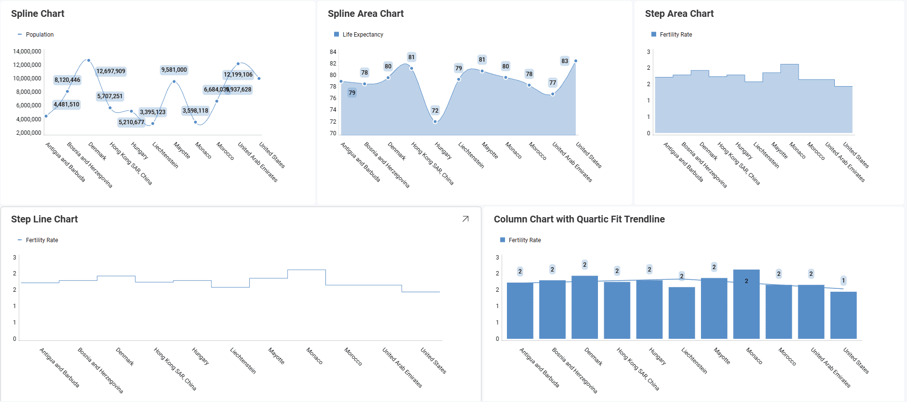
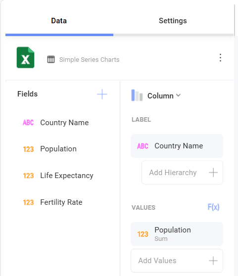

# シンプル シリーズのチャートを作成する方法

このチュートリアルは、サンプル スプレッドシートを使用して**シンプル シリーズ** チャートの表示形式を作成する方法を説明します。

## 重要なコンセプト

チャートを使用する時、表示される情報とともに追加の情報も追加できます。これは以下の機能で追加できます。

  - チャートに折れ線で表示する**チャート近似曲線**。変数間の関係や情報全体の方向性を表す場合に役立ちます。チャートに回帰と呼ばれるいくつかのアルゴリズムを適用できます。回帰は **[チャートの近似曲線]** から選択できます。

  - **軸の構成**: 軸の構成でチャートの最大値と最小値を構成できます。デフォルトで最小値は 0 に設定され、最大値は使用されるデータによって設定されます。

      - **対数軸構成**: [対数] ボックスをチェックする場合、値のスケールは通常のリニア スケールを使用する代わりに大きさを使用するリニア スケール以外で計算されます。

  - **開始位置**: 円チャートおよびドーナツ型チャートでチャートのスライスを回転する開始位置を構成し、データの表示順序を変更できます。

  - **スライス ラベル**: ドーナツ型、ファンネル、および円チャートでは、値やパーセンテージ、またはその両方を同時に表示するスライス ラベルを構成できます。

## サンプル データ ソース

このチュートリアルでは、<a href="/data/Reveal_Visualization_Tutorials.xlsx" download>Reveal Visualization Tutorials</a> の「Simple Series Charts」シートを使用します。

## チャートの作成

1. オーバーフロー メニューで **[編集]** を選択します。

   

2. 右上隅にある **[+ 表示形式]** ボタンを選択します。

   

3. データ ソースのリストからデータ ソースを選択します。

   

4. **Simple Series Charts** シートを選択します。 

   

5. **表示形式ピッカー**を開き、**カテゴリ**の下にある**チャート**表示形式のいずれかを選択します。デフォルトで、表示形式のタイプは**柱状**に設定されています。

    
 
6. たとえば、上の表のチャートには、選択した国のリストの人口が表示されます。*Country Name* フィールドを **[ラベル]** へ、*Population* フィールドを **[値]** へドラッグアンドドロップします。

                                      

## チャートに近似曲線を追加する

情報全体の方向性またチャートの変数の関係を表すためにチャート 近似曲線を追加できます。以下は作業手順です。

|                                     |                                                                        |                                                                  |
| ----------------------------------- | ---------------------------------------------------------------------- | ---------------------------------------------------------------- |
| 1\. **設定を変更する**             |  | 表示形式エディターの **[設定]** セクションに移動します。      |
| 2\. **チャートの近似曲線にアクセスする** |  | 下向き矢印を選択して [チャートの近似曲線] ドロップダウンを展開し、Reveal の定義済み近似曲線のいずれかを選択します。 |

## 軸の構成の変更

[ゲージの範囲](tutorials-gauge.md#ゲージ表示形式に範囲を追加する方法)と同様に、チャート軸構成でチャートの最小と最大値を設定できます。この機能を使用して、特定のデータ含有や除外ができます。

|                                        |                                                                                      |                                                                                                                                       |
| -------------------------------------- | ------------------------------------------------------------------------------------ | ------------------------------------------------------------------------------------------------------------------------------------- |
| 1\. **設定を変更する**                |                | 表示形式エディターの **[設定]** セクションに移動します。                                                                           |
| 2\. **範囲の設定にアクセスする** |                            | [軸範囲] に移動します。最大値または最小値 (または両方) 値を設定するかどうかに基づいて、チャートの開始値または終了値を入力します。 |

## 軸を対数軸として設定

|                                           |                                                                          |                                                             |
| ----------------------------------------- | ------------------------------------------------------------------------ | ----------------------------------------------------------- |
| 1\. **設定を変更する**                   |    | 表示形式エディターの **[設定]** セクションに移動します。 |
| 2\. **軸オプションにアクセスする**            |                | 下矢印を選択して [軸] ドロップダウンを展開し、[対数] を選択します。      |       

## ドーナツ型と円チャートの開始位置の変更

|                                                   |                                                                                |                                                                                           |
| ------------------------------------------------- | ------------------------------------------------------------------------------ | ----------------------------------------------------------------------------------------- |
| 1\. **設定を変更する**                           |          | 表示形式エディターの **[設定]** セクションに移動します。                               |
| 2\. **開始位置セクションにアクセスする**         |                | 下矢印を選択して、[開始位置] ドロップダウンを展開します。チャートに対して、Reveal の事前定義された開始位置 (0°、90°、180°、または 270°) のいずれかを選択します。                          |

## ドーナツ型、ファンネルと円チャートのスライスのラベルの変更

|                                                |                                                                          |                                                                                                        |
| ---------------------------------------------- | ------------------------------------------------------------------------ | ------------------------------------------------------------------------------------------------------ |
| 1\. **設定を変更する**                        |    | 表示形式エディターの **[設定]** セクションに移動します。                                            |
| 2\. **スライス ラベルのセクションにアクセスする**         |                | 下矢印を選択して、スライス ラベル ドロップダウンを展開します。Reveal の事前定義されたラベル付けオプション (パーセント、値、または値とパーセント) のいずれかを選択します。                                       |
