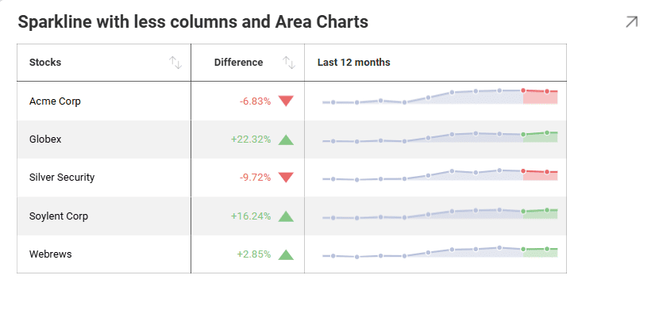

# スパークライン チャートの作成

このチュートリアルは、サンプル スプレッドシートを使用してスパークライン チャートの表示形式を作成する方法を説明します。

## 重要なコンセプト

スパークライン チャートは、指定した日付範囲のトレンドとその進行を表示します。OHLC チャートやローソク足チャートなど、ファイナンシャル シナリオと株の変動の分析のために役立ちます。スパークラインは、グリッドセル内に折れ線チャートを表示します。

  - データ エディターの **[日付]** プレースホルダーにドロップする**フィールド**。

  - **[値]** にドロップする**フィールド**。

  - **[カテゴリ]** にドロップする**フィールド**。

スパークライン チャートを使用する時、表示するデータに対して情報を追加、変更または削除できます。これは以下の機能で追加できます。

  - スパークラインの**チャート タイプ**は、**折れ線**または**エリア** チャートのいずれかを選択できます。

  - チャートの日付**集計**。

  - 同じチャート内に表示される**値の数**。

  - データに**過去 2 か月を含めるかどうか、またそれらの差異など**、スパークラインのグリッドに含める明示的な情報。

:::note
スパークライン チャートには、デフォルトで過去 12 か月間の傾向とその進行状況が表示されます。[スパークライン チャートの日付範囲設定](#日付集計の変更)を使用して日付範囲を調整できます。
:::

## サンプル データ ソース

このチュートリアルでは、<a href="/data/Reveal_Visualization_Tutorials.xlsx" download>Reveal Visualization Tutorials</a> の「Sparkline Charts」シートを使用します。

## スパークライン チャートの作成

1. オーバーフロー メニューで **[編集]** を選択します。

   

2. 右上隅にある **[+ 表示形式]** ボタンを選択します。

   

3. データ ソースのリストからデータ ソースを選択します。

   

4. **Sparkline Charts** シートを選択します。

      
   
5. **表示形式ピッカー**を開き、**スパークライン チャート**を選択します。デフォルトで、表示形式のタイプは**柱状**に設定されています。

  
  
6. *Date* フィールドを **[日付]** に、*Offer* フィールドを **[値]** に、*Stocks* を **[カテゴリ]** にドラッグアンドドロップします。

   

## スパークラインのチャート タイプを変更する方法

スパークライン チャートに使用するチャートのタイプを変更できます。以下は作業手順です。

|                                  |                                                                                        |                                                                     |
| -------------------------------- | -------------------------------------------------------------------------------------- | ------------------------------------------------------------------- |
| 1\. **設定メニューにアクセスする** |                  | 表示形式エディターの **[設定]** セクションに移動します。         |
| 2\. **チャート タイプを変更する**    |  | デフォルトで、チャート タイプは [折れ線] に設定されています。[エリア] に設定します。 |

## 日付集計の変更

デフォルトでは、情報の集計は **12 ヶ月**です。**[表示: 過去]** 設定で変更できます。以下は変更手順です。

|                                  |                                                                                                      |                                                                                                                                                      |
| -------------------------------- | ---------------------------------------------------------------------------------------------------- | ---------------------------------------------------------------------------------------------------------------------------------------------------- |
| 1\. **設定メニューにアクセスする** |                                | 表示形式エディターの **[設定]** セクションに移動します。                                                                                          |
| 2\. **Change the Aggregation**   |  | デフォルトで、[表示: 過去] 設定は **[月]** に設定されます。[月] の横のドロップダウンを選択し、[年] または [日] に変更します。 |

日付の集計の隣にある数値を変更して、表示するデータを増減できます。

## スパークラインの列数を変更する方法

Reveal で、表示形式の列数は、過去 2 か月とそれらの差を表示するかどうかによって定義されます。デフォルトで有効になります。以下は削除方法です。

|                                      |                                                                                    |                                                                                                                                                          |
| ------------------------------------ | ---------------------------------------------------------------------------------- | -------------------------------------------------------------------------------------------------------------------------------------------------------- |
| 1\. **設定メニューにアクセスする**     |              | 表示形式エディターの **[設定]** セクションに移動します。                                                                                              |
| 2\. **Change the Displayed Columns** |  | どちらもスパークラインに表示しない場合は、**[最後の 2 つの値の列を表示] または [差異のある列を表示] ボックスをオフにします**。 |
