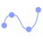

# データ表示形式

Reveal は、さまざまな表示形式を提供することにより、ビジネス データから可能な限り多くの気付きを得るのに役立ちます。

## 表示形式の概要

ビジネス データを理解するために Reveal は情報の表示形式をカスタマイズする複数のオプションを提供します。これらは表示形式といいます。すべてのダッシュボードは 1 つ以上の表示形式で構成されます。

以下に示すダッシュボードには、セールスのさまざまな側面を分析する多様な表示形式が含まれています。

## 適切な表示形式タイプの選択

最適なチャート タイプを選択するには、データを確認し、表示形式で伝えようとしているストーリーを見つけるのに役立つ質問に答える必要があります。

データを比較することか、データの分布を示すことあるいはデータを全体の一部分として提示しようとしていますか? 財務、マーケティング、または販売データのトレンド分析を行っていますか? 日付/時刻軸が必要ですか? データ間の関係を調べていますか? または、読みやすく、簡単なストーリーを伝える KPI とゲージを表示したいだけですか? データを地図上にプロットすることは重要ですか?

データを通じて何を表示したいかについて回答し、以下の表を使用して最適なチャートを選択してください。

|                    |                                                                                                                                                                             |                                                                                                                                                                    |                                                                                             |                                                                                                   |                                                                                                            |                                                                                                            |                                                                                                                  |                                                        |                                                                             |                                                                             |
|:------------------:|:---------------------------------------------------------------------------------------------------------------------------------------------------------------------------:|:------------------------------------------------------------------------------------------------------------------------------------------------------------------:|:-------------------------------------------------------------------------------------------:|:-------------------------------------------------------------------------------------------------:|:----------------------------------------------------------------------------------------------------------:|:----------------------------------------------------------------------------------------------------------:|:----------------------------------------------------------------------------------------------------------------:|:------------------------------------------------------:|:---------------------------------------------------------------------------:|:---------------------------------------------------------------------------:|
| データの比較   |                                           [棒](chart-types/category-charts.md)                                           |                                  [柱状](chart-types/category-charts.md)                                  |  [エリア](chart-types/category-charts.md) |  [スプライン](chart-types/category-charts.md) |  [複合](chart-types/combo-charts.md) |  [円型](chart-types/gauge-charts.md#円形ゲージ) |  [スプライン エリア](chart-types/category-charts.md) |  [OHLC](chart-types/financial-charts.md) |  [ロウソク足](chart-types/financial-charts.md) |  [時系列](chart-types/time-series-charts.md) |
| 部分から全体  |                           [積層型柱状](chart-types/category-charts.md)                          |                           [積層型棒](chart-types/category-charts.md)                          |        [積層型エリア](chart-types/category-charts.md)        |                         [円](chart-types/category-charts.md)                        |                      [ドーナツ型](chart-types/category-charts.md)                     |                         [ファンネル](chart-types/category-charts.md)                        |                          [ツリーマップ](chart-types/treemap-charts.md)                          |                                                        |                                                                             |                                                                             |
| データ分布 |                                  [ステップ エリア](chart-types/category-charts.md)                                  |                      [積層型柱状](chart-types/category-charts.md)                      |                  [散布図](chart-types/scatter-bubble-charts.md)                 |                      [バブル](chart-types/scatter-bubble-charts.md)                      |                                                                                                            |                                                                                                            |                                                                                                                  |                                                        |                                                                             |                                                                             |
| データ トレンド分析 |                                          [折れ線](chart-types/category-charts.md)                                         |                                  [スプライン](chart-types/category-charts.md)                                  |                     [複合](chart-types/combo-charts.md)                    |                         [OHLC](chart-types/financial-charts.md)                         |                   [ロウソク足](chart-types/financial-charts.md)                   |                           [ラジアル](chart-types/radial-charts.md)                          |                      [時系列](chart-types/time-series-charts.md)                      |                                                        |                                                                             |                                                                             |
| データの関係 |                                  [散布図](chart-types/scatter-bubble-charts.md)                                  |                               [バブル](chart-types/scatter-bubble-charts.md)                               |                      [折れ線](chart-types/category-charts.md)                      |                                                                                                   |                                                                                                            |                                                                                                            |                                                                                                                  |                                                        |                                                                             |                                                                             |
| KPI とゲージ |                         [ブレット グラフ](chart-types/gauge-charts.md#ブレット-グラフ)                        |                             [リニア](chart-types/gauge-charts.md#リニア-ゲージ)                             |                      [テキスト](chart-types/gauge-charts.md#テキスト-ゲージ)                      |                              [KPI](chart-types/kpi-gauge.md)                             |                        [円型](chart-types/gauge-charts.md#円形ゲージ)                       |                                                                                                            |                                                                                                                  |                                                        |                                                                             |                                                                             |
| 地理的データ |                                 [階級区分図](chart-types/choropleth-map.md)                                 |                                   [散布マップ](chart-types/scatter-map.md)                                  |                                                                                             |                                                                                                   |                                                                                                            |                                                                                                            |                                                                                                                  |                                                        |                                                                             |                                                                             |

これらの各表示形式の使用方法に関する詳細が必要な場合は、表のハイパーリンクを使用してください。

## 表示形式チュートリアル

このセクションでは、Reveal の表示形式の作成手順を説明します。すべてのセクションで、このリンク<a href="/data/Reveal_Visualization_Tutorials.xlsx" download>を使用してダウンロードできる Data Visualizations データ ソースを使用しています。</a>.

| | | | | |
|:-:|:-:|:-:|:-:|:-:|
|  [エリア](tutorials-simple-charts.md) |  [棒](tutorials-simple-charts.md) |  [ブレット グラフ](tutorials-gauge.md#ブレット-グラフを作成する方法) |  [ローソク足](tutorials-candlestick.md) |  [円型](tutorials-gauge.md#円形ゲージを作成する方法) |
|  [柱状](tutorials-simple-charts.md) |  [ドーナツ型](tutorials-simple-charts.md) |  [ファンネル](tutorials-simple-charts.md) |  [画像](tutorials-image.md) |  [KPI](tutorials-kpi-gauge.md) |
|  [折れ線](tutorials-simple-charts.md) |  [リニア](tutorials-gauge.md#リニア-ゲージを作成する方法) |  [OHLC](tutorials-ohlc.md) |  [円](tutorials-simple-charts.md) |  [ラジアル](tutorials-simple-charts.md) |
|  [スパークライン](tutorials-sparkline-charts.md) |  [スプライン](tutorials-simple-charts.md) |  [スプライン エリア](tutorials-simple-charts.md) |  [積層型エリア](tutorials-stacked-charts.md) |  [積層型棒](tutorials-stacked-charts.md) |
|  [積層型柱状](tutorials-stacked-charts.md) |  [ステップ エリア](tutorials-simple-charts.md) |  [ステップ折れ線](tutorials-simple-charts.md) |  [テキスト](tutorials-gauge.md#テキスト-ゲージを作成する方法) |  [テキスト ビュー](tutorials-text-view.md) |