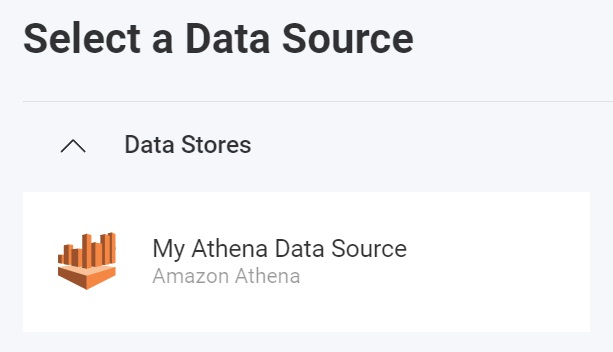
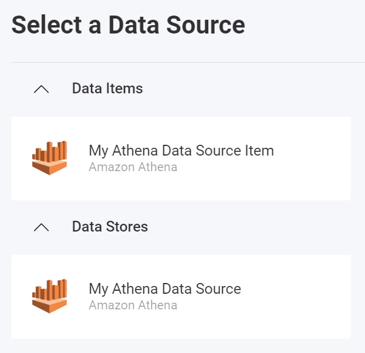

import Tabs from '@theme/Tabs';
import TabItem from '@theme/TabItem';

# Amazon Athena データ ソースの追加

:::danger breaking changes

現在、Reveal SDK は、Reveal SDK core パッケージからデータ ソースを分離する過程にあります。 プロジェクトの継続的な機能を確保するために、プロジェクトに追加のパッケージをインストールすることが必要になる場合があります。 詳細については、[サポートされるデータ ソース](web/datasources.md#サポートされるデータ-ソース) トピックを参照してください。

:::

**手順 1** - `RevealView.onDataSourcesRequested` イベントのイベント ハンドラーを追加します。

```js
var revealView = new $.ig.RevealView("#revealView");
revealView.onDataSourcesRequested = (callback) => {
    //add code here
    callback(new $.ig.RevealDataSources([], [], false));
};
```

**手順 2** - `RevealView.onDataSourcesRequested` イベント ハンドラーで、[RVAthenaDataSource](https://help.revealbi.io/api/javascript/latest/classes/rvathenadatasource.html) オブジェクトの新しいインスタンスを作成します。`Title`、`Subtitle`、`Region`、および `Database` のプロパティを設定します。`RVAthenaDataSource` オブジェクトを作成したら、それをデータ ソース コレクションに追加します。

```js
revealView.onDataSourcesRequested = (callback) => {
    var athenaDS = new $.ig.RVAthenaDataSource();
    athenaDS.title = "My Athena Data Source";
    athenaDS.subtitle = "Amazon Athena";
    athenaDS.region = "region";
    athenaDS.database = "database";

    callback(new $.ig.RevealDataSources([athenaDS], [], false));
};
```

アプリケーションが実行されたら、新しい可視化を作成すると、新しく作成された Amazon Athena データ ソースが [データ ソースの選択] ダイアログにリストされます。



**手順 3** - [RVAthenaDataSourceItem](https://help.revealbi.io/api/javascript/latest/classes/rvathenadatasourceitem.html) オブジェクトの新しいインスタンスを作成して、新しい Amazon Athena データ ソース項目を作成します。`Title`、`Subtitle`、`Table` の各プロパティの値を指定します。`RVAthenaDataSourceItem` オブジェクトを作成したら、それをデータ ソース項目コレクションに追加します。

```js
revealView.onDataSourcesRequested = (callback) => {
    var athenaDS = new $.ig.RVAthenaDataSource();
    athenaDS.title = "My Athena Data Source";
    athenaDS.subtitle = "Amazon Athena";
    athenaDS.region = "region";
    athenaDS.database = "database";

    var athenaDSI = new $.ig.RVAthenaDataSourceItem(athenaDS);
    athenaDSI.title = "My Athena Data Source Item";
    athenaDS.subtitle = "Amazon Athena";
    athenaDSI.table = "table";

    callback(new $.ig.RevealDataSources([athenaDS], [athenaDSI], false));
};
```

アプリケーションが実行されたら、新しい可視化を作成すると、新しく作成された Amazon Athena データ ソース項目が [データ ソースの選択] ダイアログにリストされます。



:::note

Amazon Athena は `RVAmazonWebServicesCredentials` を使用して認証します。詳細については、[認証](../authentication#amazon-web-services)トピックを参照してください。

:::

:::info コードの取得

このサンプルのソース コードは [GitHub](https://github.com/RevealBi/sdk-samples-javascript/tree/main/DataSources/Amazon-Athena) にあります。

:::