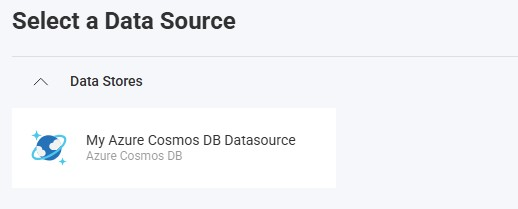
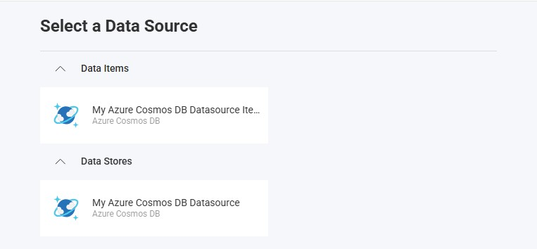

import Tabs from '@theme/Tabs';
import TabItem from '@theme/TabItem';

# Azure Cosmos DB データ ソース

## 概要

Azure Cosmos DB は、グローバルに分散されたデータに低遅延でアクセスできる Azure 上のフルマネージド データベース サービスです。このトピックでは、Reveal アプリケーションで Azure Cosmos DB データ ソースに接続して、データを視覚化および分析する方法について説明します。

## サーバーの構成

### インストール

<Tabs groupId="code" queryString>
  <TabItem value="aspnet" label="ASP.NET" default>

**手順 1** - Reveal Azure Cosmos DB コネクタ パッケージをインストールします。

ASP.NET アプリケーションの場合、Azure Cosmos DB サポートを有効にするには、別の NuGet パッケージをインストールする必要があります。

```bash
dotnet add package Reveal.Sdk.Data.AzureCosmosDB
```

**手順 2** - アプリケーションに Azure Cosmos DB データ ソースを登録します。

```csharp
builder.Services.AddControllers().AddReveal( builder =>
{
    builder.DataSources.RegisterAzureCosmosDB();
});
```

  </TabItem>
  <TabItem value="node" label="Node.js">

Node.js アプリケーションの場合、Azure Cosmos DB データ ソースはメインの Reveal SDK パッケージに既に含まれています。標準の Reveal SDK セットアップ以外に追加のインストールは必要ありません。

  </TabItem>
  <TabItem value="node-ts" label="Node.js - TS">

Node.js TypeScript アプリケーションの場合、Azure Cosmos DB データ ソースはメインの Reveal SDK パッケージに既に含まれています。標準の Reveal SDK セットアップ以外に追加のインストールは必要ありません。

  </TabItem>
  <TabItem value="java" label="Java">

Java アプリケーションの場合、Azure Cosmos DB データ ソースはメインの Reveal SDK パッケージに既に含まれています。標準の Reveal SDK セットアップ以外に追加のインストールは必要ありません。

  </TabItem>
</Tabs>

### 接続の構成

<Tabs groupId="code" queryString>
  <TabItem value="aspnet" label="ASP.NET" default>

```csharp
// Create a data source provider
public class DataSourceProvider : IRVDataSourceProvider
{
    public async Task<RVDataSourceItem> ChangeDataSourceItemAsync(IRVUserContext userContext, string dashboardId,
        RVDataSourceItem dataSourceItem)
    {
        // Required: Update the underlying data source
        await ChangeDataSourceAsync(userContext, dataSourceItem.DataSource);

        if (dataSourceItem is RVAzureCosmosDBDataSourceItem cosmosItem)
        {
            // Configure specific item properties if needed
            if (cosmosItem.Id == "azure_cosmos_orders")
            {
                cosmosItem.Container = "orders";
            }
        }

        return dataSourceItem;
    }

    public Task<RVDashboardDataSource> ChangeDataSourceAsync(IRVUserContext userContext,
        RVDashboardDataSource dataSource)
    {
        if (dataSource is RVAzureCosmosDBDataSource cosmosDataSource)
        {
            // Configure connection properties
            cosmosDataSource.AccountEndpoint = "https://your-account.documents.azure.com:443/";
            cosmosDataSource.Database = "Sales";
            cosmosDataSource.ApplicationRegion = "East US";
            cosmosDataSource.ConnectionMode = "Gateway";
            cosmosDataSource.AcceptAnyServerCertificate = false;
        }

        return Task.FromResult(dataSource);
    }
}
```

  </TabItem>
  <TabItem value="node" label="Node.js">

```javascript
// Create data source providers
const dataSourceItemProvider = async (userContext, dataSourceItem) => {
    // Required: Update the underlying data source
    await dataSourceProvider(userContext, dataSourceItem.dataSource);

    if (dataSourceItem instanceof reveal.RVAzureCosmosDBDataSourceItem) {
        // Configure specific item properties if needed
        if (dataSourceItem.id === "azure_cosmos_orders") {
            dataSourceItem.container = "orders";
        }
    }

    return dataSourceItem;
}

const dataSourceProvider = async (userContext, dataSource) => {
    if (dataSource instanceof reveal.RVAzureCosmosDBDataSource) {
        // Configure connection properties
        dataSource.accountEndpoint = "https://your-account.documents.azure.com:443/";
        dataSource.database = "Sales";
        dataSource.applicationRegion = "East US";
        dataSource.connectionMode = "Gateway";
        dataSource.acceptAnyServerCertificate = false;
    }

    return dataSource;
}
```

  </TabItem>
  <TabItem value="node-ts" label="Node.js - TS">

```ts
// Create data source providers
const dataSourceItemProvider = async (userContext: IRVUserContext | null, dataSourceItem: RVDataSourceItem) => {
    // Required: Update the underlying data source
    await dataSourceProvider(userContext, dataSourceItem.dataSource);

    if (dataSourceItem instanceof RVAzureCosmosDBDataSourceItem) {
        // Configure specific item properties if needed
        if (dataSourceItem.id === "azure_cosmos_orders") {
            dataSourceItem.container = "orders";
        }
    }

    return dataSourceItem;
}

const dataSourceProvider = async (userContext: IRVUserContext | null, dataSource: RVDashboardDataSource) => {
    if (dataSource instanceof RVAzureCosmosDBDataSource) {
        // Configure connection properties
        dataSource.accountEndpoint = "https://your-account.documents.azure.com:443/";
        dataSource.database = "Sales";
        dataSource.applicationRegion = "East US";
        dataSource.connectionMode = "Gateway";
        dataSource.acceptAnyServerCertificate = false;
    }

    return dataSource;
}
```

  </TabItem>
  <TabItem value="java" label="Java">

```java
// Create a data source provider
public class DataSourceProvider implements IRVDataSourceProvider {
    public RVDataSourceItem changeDataSourceItem(IRVUserContext userContext, String dashboardId, RVDataSourceItem dataSourceItem) {
        // Required: Update the underlying data source
        changeDataSource(userContext, dataSourceItem.getDataSource());

        if (dataSourceItem instanceof RVAzureCosmosDBDataSourceItem cosmosItem) {
            // Configure specific item properties if needed
            if ("azure_cosmos_orders".equals(cosmosItem.getId())) {
                cosmosItem.setContainer("orders");
            }
        }

        return dataSourceItem;
    }

    public RVDashboardDataSource changeDataSource(IRVUserContext userContext, RVDashboardDataSource dataSource) {
        if (dataSource instanceof RVAzureCosmosDBDataSource cosmosDataSource) {
            // Configure connection properties
            cosmosDataSource.setAccountEndpoint("https://your-account.documents.azure.com:443/");
            cosmosDataSource.setDatabase("Sales");
            cosmosDataSource.setApplicationRegion("East US");
            cosmosDataSource.setConnectionMode("Gateway");
            cosmosDataSource.setAcceptAnyServerCertificate(false);
        }

        return dataSource;
    }
}
```

  </TabItem>
</Tabs>

:::danger 重要
`ChangeDataSourceAsync` メソッドでデータ ソースに加えた変更は、`ChangeDataSourceItemAsync` メソッドには引き継がれません。両方のメソッドでデータ ソース プロパティを**更新する必要があります**。上記の例に示すように、`ChangeDataSourceItemAsync` メソッド内で、データ ソース項目の基になるデータ ソースをパラメーターとして渡して `ChangeDataSourceAsync` メソッドを呼び出すことをお勧めします。
:::

### 認証

Azure Cosmos DB の認証は、`RVKeyPairDataSourceCredential` を使用してサーバー側で処理されます。Azure Cosmos DB では、資格情報の key がアカウント キーに対応します。認証オプションの詳細については、[認証](../authentication.md) トピックを参照してください。

<Tabs groupId="code" queryString>
  <TabItem value="aspnet" label="ASP.NET" default>

```csharp
public class AuthenticationProvider: IRVAuthenticationProvider
{
    public Task<IRVDataSourceCredential> ResolveCredentialsAsync(IRVUserContext userContext, RVDashboardDataSource dataSource)
    {
        IRVDataSourceCredential userCredential = null;
        if (dataSource is RVAzureCosmosDBDataSource)
        {
            // Use account key
            userCredential = new RVKeyPairDataSourceCredential(null, "your_account_key");
        }
        return Task.FromResult<IRVDataSourceCredential>(userCredential);
    }
}
```

  </TabItem>
  <TabItem value="node" label="Node.js">

```javascript
const authenticationProvider = async (userContext, dataSource) => {
    if (dataSource instanceof reveal.RVAzureCosmosDBDataSource) {
        // Use account key
        return new reveal.RVKeyPairDataSourceCredential(null, "your_account_key");
    }
    return null;
}
```

  </TabItem>
  <TabItem value="node-ts" label="Node.js - TS">

```ts
const authenticationProvider = async (userContext: IRVUserContext | null, dataSource: RVDashboardDataSource) => {
    if (dataSource instanceof RVAzureCosmosDBDataSource) {
        // Use account key
        return new RVKeyPairDataSourceCredential(null, "your_account_key");
    }
    return null;
}
```

  </TabItem>
  <TabItem value="java" label="Java">

```java
public class AuthenticationProvider implements IRVAuthenticationProvider {
    @Override
    public IRVDataSourceCredential resolveCredentials(IRVUserContext userContext, RVDashboardDataSource dataSource) {
        if (dataSource instanceof RVAzureCosmosDBDataSource) {
            // Use account key
            return new RVKeyPairDataSourceCredential(null, "your_account_key");
        }
        return null;
    }
}
```

  </TabItem>
</Tabs>

## クライアント側の実装

クライアント側では、データ ソースの ID、タイトル、サブタイトルなどの基本プロパティのみを指定する必要があります。実際の接続構成はサーバー上で行われます。

### データ ソースの作成

**手順 1** - `RevealView.onDataSourcesRequested` イベントのイベント ハンドラーを追加します。

```js
const revealView = new RevealView("#revealView");
revealView.onDataSourcesRequested = (callback) => {
    // Add data source here
    callback(new RevealDataSources([], [], false));
};
```

**手順 2** - `RevealView.onDataSourcesRequested` イベント ハンドラーで、`RVAzureCosmosDBDataSource` オブジェクトの新しいインスタンスを作成します。`title` と `subtitle` プロパティを設定します。`RVAzureCosmosDBDataSource` オブジェクトを作成したら、それをデータ ソース コレクションに追加します。

```js
revealView.onDataSourcesRequested = (callback) => {
    // Create the data source
    const cosmosDS = new RVAzureCosmosDBDataSource();
    cosmosDS.title = "My Azure Cosmos DB Datasource";
    cosmosDS.subtitle = "Azure Cosmos DB";

    callback(new RevealDataSources([cosmosDS], [], false));
};
```

アプリケーションが実行されたら、新しい可視化を作成すると、新しく作成された Azure Cosmos DB データ ソースが [データ ソースの選択] ダイアログに表示されます。



### データ ソース項目の作成

データ ソース項目は、ユーザーが視覚化のために選択できる Azure Cosmos DB データ ソース内の特定のデータセットを表します。クライアント側では、ID、タイトル、サブタイトルのみを指定する必要があります。

```js
revealView.onDataSourcesRequested = (callback) => {
    // Create the data source
    const cosmosDS = new RVAzureCosmosDBDataSource();
    cosmosDS.title = "My Azure Cosmos DB Datasource";
    cosmosDS.subtitle = "Azure Cosmos DB";

    // Create a data source item
    const cosmosDSI = new RVAzureCosmosDBDataSourceItem(cosmosDS);
    cosmosDSI.title = "My Azure Cosmos DB Datasource Item";
    cosmosDSI.subtitle = "Azure Cosmos DB";

    callback(new RevealDataSources([cosmosDS], [cosmosDSI], false));
};
```

アプリケーションが実行されたら、新しい可視化を作成すると、新しく作成された Azure Cosmos DB データ ソース項目が [データ ソースの選択] ダイアログに表示されます。



## その他のリソース

- [Azure Cosmos DB ドキュメント](https://learn.microsoft.com/azure/cosmos-db/)

## API リファレンス

<Tabs groupId="code" queryString>
<TabItem value="aspnet" label="ASP.NET" default>

* [RVAzureCosmosDBDataSource](https://help.revealbi.io/api/aspnet/latest/Reveal.Sdk.Data.AzureCosmosDB.RVAzureCosmosDBDataSource.html) - Azure Cosmos DB データ ソースを表します
* [RVAzureCosmosDBDataSourceItem](https://help.revealbi.io/api/aspnet/latest/Reveal.Sdk.Data.AzureCosmosDB.RVAzureCosmosDBDataSourceItem.html) - Azure Cosmos DB データ ソース項目を表します

</TabItem>
<TabItem value="node" label="Node.js">

* [RVAzureCosmosDBDataSource](https://help.revealbi.io/api/javascript/latest/classes/rvazurecosmosdbdatasource.html) - Azure Cosmos DB データ ソースを表します
* [RVAzureCosmosDBDataSourceItem](https://help.revealbi.io/api/javascript/latest/classes/rvazurecosmosdbdatasourceitem.html) - Azure Cosmos DB データ ソース項目を表します

</TabItem>
</Tabs>
