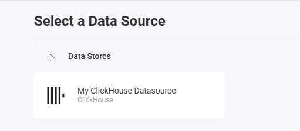
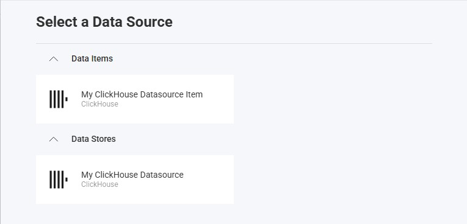

import Tabs from '@theme/Tabs';
import TabItem from '@theme/TabItem';

# ClickHouse データ ソース

## 概要

ClickHouse は、リアルタイム分析と大規模データ処理向けに設計された高性能な列指向データベース管理システムです。このトピックでは、Reveal アプリケーションで ClickHouse データ ソースに接続して、データを視覚化および分析する方法について説明します。

## サーバーの構成

### インストール

<Tabs groupId="code" queryString>
  <TabItem value="aspnet" label="ASP.NET" default>

**手順 1** - Reveal ClickHouse コネクタ パッケージをインストールします。

ASP.NET アプリケーションの場合、ClickHouse サポートを有効にするには、別の NuGet パッケージをインストールする必要があります。

```bash
dotnet add package Reveal.Sdk.Data.ClickHouse
```

**手順 2** - アプリケーションに ClickHouse データ ソースを登録します。

```csharp
builder.Services.AddControllers().AddReveal( builder =>
{
    builder.DataSources.RegisterClickHouse();
});
```

  </TabItem>
  <TabItem value="node" label="Node.js">

Node.js アプリケーションの場合、ClickHouse データ ソースはメインの Reveal SDK パッケージに既に含まれています。標準の Reveal SDK セットアップ以外に追加のインストールは必要ありません。

  </TabItem>
  <TabItem value="java" label="Java">

Java アプリケーションの場合、ClickHouse データ ソースはメインの Reveal SDK パッケージに既に含まれています。標準の Reveal SDK セットアップ以外に追加のインストールは必要ありません。

  </TabItem>
</Tabs>

### 接続の構成

<Tabs groupId="code" queryString>
  <TabItem value="aspnet" label="ASP.NET" default>

```csharp
// Create a data source provider
public class DataSourceProvider : IRVDataSourceProvider
{
    public async Task<RVDataSourceItem> ChangeDataSourceItemAsync(IRVUserContext userContext, string dashboardId, RVDataSourceItem dataSourceItem)
    {
        // Required: Update the underlying data source
        await ChangeDataSourceAsync(userContext, dataSourceItem.DataSource);

        if (dataSourceItem is RVClickHouseDataSourceItem clickHouseItem)
        {
            // Configure specific item properties as needed
            if (clickHouseItem.Id == "clickhouse_sales_data")
            {
                clickHouseItem.Table = "sales_data";
            }
        }

        return dataSourceItem;
    }

    public Task<RVDashboardDataSource> ChangeDataSourceAsync(IRVUserContext userContext, RVDashboardDataSource dataSource)
    {
        if (dataSource is RVClickHouseDataSource clickHouseDS)
        {
            // Configure connection properties
            clickHouseDS.Host = "your-clickhouse-host";
            clickHouseDS.Port = 8443;
            clickHouseDS.Database = "analytics";

            // Optional properties
            clickHouseDS.Protocol = "https";
            clickHouseDS.Path = "/";
            clickHouseDS.Timeout = 30;
            clickHouseDS.SkipServerCertificateValidation = false;
        }

        return Task.FromResult(dataSource);
    }
}
```

  </TabItem>
  <TabItem value="node" label="Node.js">

```javascript
// Create data source providers
const dataSourceItemProvider = async (userContext, dataSourceItem) => {
    // Required: Update the underlying data source
    await dataSourceProvider(userContext, dataSourceItem.dataSource);

    if (dataSourceItem instanceof reveal.RVClickHouseDataSourceItem) {
        // Configure specific item properties if needed
        if (dataSourceItem.id === "clickhouse_sales_data") {
            dataSourceItem.table = "sales_data";
        }
    }

    return dataSourceItem;
}

const dataSourceProvider = async (userContext, dataSource) => {
    if (dataSource instanceof reveal.RVClickHouseDataSource) {
        // Configure connection properties
        dataSource.host = "your-clickhouse-host";
        dataSource.port = 8443;
        dataSource.database = "analytics";

        // Optional properties
        dataSource.protocol = "https";
        dataSource.path = "/";
        dataSource.timeout = 30;
        dataSource.skipServerCertificateValidation = false;
    }

    return dataSource;
}
```

  </TabItem>
  <TabItem value="node-ts" label="Node.js - TS">

```typescript
// Create data source providers
const dataSourceItemProvider = async (userContext: IRVUserContext | null, dataSourceItem: RVDataSourceItem) => {
    // Required: Update the underlying data source
    await dataSourceProvider(userContext, dataSourceItem.dataSource);

    if (dataSourceItem instanceof RVClickHouseDataSourceItem) {
        // Configure specific item properties if needed
        if (dataSourceItem.id === "clickhouse_sales_data") {
            dataSourceItem.table = "sales_data";
        }
    }

    return dataSourceItem;
}

const dataSourceProvider = async (userContext: IRVUserContext | null, dataSource: RVDashboardDataSource) => {
    if (dataSource instanceof RVClickHouseDataSource) {
        // Configure connection properties
        dataSource.host = "your-clickhouse-host";
        dataSource.port = 8443;
        dataSource.database = "analytics";

        // Optional properties
        dataSource.protocol = "https";
        dataSource.path = "/";
        dataSource.timeout = 30;
        dataSource.skipServerCertificateValidation = false;
    }

    return dataSource;
}
```

  </TabItem>
  <TabItem value="java" label="Java">

```java
// Create a data source provider
public class DataSourceProvider implements IRVDataSourceProvider {

    public RVDataSourceItem changeDataSourceItem(IRVUserContext userContext, String dashboardId, RVDataSourceItem dataSourceItem) {
        // Required: Update the underlying data source
        changeDataSource(userContext, dataSourceItem.getDataSource());

        if (dataSourceItem instanceof RVClickHouseDataSourceItem clickHouseItem) {
            // Configure specific item properties if needed
            if ("clickhouse_sales_data".equals(clickHouseItem.getId())) {
                clickHouseItem.setTable("sales_data");
            }
        }

        return dataSourceItem;
    }

    public RVDashboardDataSource changeDataSource(IRVUserContext userContext, RVDashboardDataSource dataSource) {
        if (dataSource instanceof RVClickHouseDataSource clickHouseDS) {
            // Configure connection properties
            clickHouseDS.setHost("your-clickhouse-host");
            clickHouseDS.setPort(8443);
            clickHouseDS.setDatabase("analytics");

            // Optional properties
            clickHouseDS.setProtocol("https");
            clickHouseDS.setPath("/");
            clickHouseDS.setTimeout(30);
            clickHouseDS.setSkipServerCertificateValidation(false);
        }

        return dataSource;
    }
}
```

  </TabItem>
</Tabs>

:::danger 重要
`ChangeDataSourceAsync` メソッドでデータ ソースに加えた変更は、`ChangeDataSourceItemAsync` メソッドには引き継がれません。両方のメソッドでデータ ソース プロパティを**更新する必要があります**。上記の例に示すように、`ChangeDataSourceItemAsync` メソッド内で、データ ソース項目の基になるデータ ソースをパラメーターとして渡して `ChangeDataSourceAsync` メソッドを呼び出すことをお勧めします。
:::

### 認証

ClickHouse の認証は、ユーザー名とパスワードの資格情報を使用してサーバー側で処理されます。一般的な認証の詳細については、[認証](../authentication.md) トピックを参照してください。

<Tabs groupId="code" queryString>
  <TabItem value="aspnet" label="ASP.NET" default>

```csharp
public class AuthenticationProvider: IRVAuthenticationProvider
{
    public Task<IRVDataSourceCredential> ResolveCredentialsAsync(IRVUserContext userContext, RVDashboardDataSource dataSource)
    {
        IRVDataSourceCredential userCredential = null;
        if (dataSource is RVClickHouseDataSource)
        {
            // Use Username/Password
            userCredential = new RVUsernamePasswordDataSourceCredential("your_username", "your_password");
        }
        return Task.FromResult<IRVDataSourceCredential>(userCredential);
    }
}
```

  </TabItem>
  <TabItem value="node" label="Node.js">

```javascript
const authenticationProvider = async (userContext, dataSource) => {
    if (dataSource instanceof reveal.RVClickHouseDataSource) {
        // Use Username/Password
        return new reveal.RVUsernamePasswordDataSourceCredential("username", "password");
    }
    return null;
}
```

  </TabItem>
  <TabItem value="node-ts" label="Node.js - TS">

```ts
const authenticationProvider = async (userContext: IRVUserContext | null, dataSource: RVDashboardDataSource) => {
    if (dataSource instanceof RVClickHouseDataSource) {
        // Use Username/Password
        return new RVUsernamePasswordDataSourceCredential("username", "password");
    }
    return null;
}
```

  </TabItem>
  <TabItem value="java" label="Java">

```java
public class AuthenticationProvider implements IRVAuthenticationProvider {
    @Override
    public IRVDataSourceCredential resolveCredentials(IRVUserContext userContext, RVDashboardDataSource dataSource) {
        if (dataSource instanceof RVClickHouseDataSource) {
            // Use Username/Password
            return new RVUsernamePasswordDataSourceCredential("username", "password");
        }
        return null;
    }
}
```

  </TabItem>
</Tabs>

## クライアント側の実装

クライアント側では、データ ソースの ID、タイトル、サブタイトルなどの基本プロパティのみを指定する必要があります。実際の接続構成はサーバー上で行われます。

### データ ソースの作成

**手順 1** - `RevealView.onDataSourcesRequested` イベントのイベント ハンドラーを追加します。

```js
const revealView = new RevealView("#revealView");
revealView.onDataSourcesRequested = (callback) => {
    // Add data source here
    callback(new RevealDataSources([], [], false));
};
```

**手順 2** - `RevealView.onDataSourcesRequested` イベント ハンドラーで、`RVClickHouseDataSource` オブジェクトの新しいインスタンスを作成します。`title` と `subtitle` プロパティを設定します。`RVClickHouseDataSource` オブジェクトを作成したら、それをデータ ソース コレクションに追加します。

```js
revealView.onDataSourcesRequested = (callback) => {
    const clickHouseDS = new RVClickHouseDataSource();
    clickHouseDS.title = "My ClickHouse Datasource";
    clickHouseDS.subtitle = "ClickHouse";

    callback(new RevealDataSources([clickHouseDS], [], false));
};
```

アプリケーションが実行されたら、新しい可視化を作成すると、新しく作成された ClickHouse データ ソースが [データ ソースの選択] ダイアログに表示されます。



### データ ソース項目の作成

データ ソース項目は、ユーザーが視覚化のために選択できる ClickHouse データ ソース内の特定のデータセットを表します。クライアント側では、ID、タイトル、サブタイトルのみを指定する必要があります。

```js
revealView.onDataSourcesRequested = (callback) => {
    // Create the data source
    const clickHouseDS = new RVClickHouseDataSource();
    clickHouseDS.title = "My ClickHouse Datasource";
    clickHouseDS.subtitle = "ClickHouse";

    // Create a data source item
    const clickHouseDSI = new RVClickHouseDataSourceItem(clickHouseDS);
    clickHouseDSI.id = "clickhouse_sales_data";
    clickHouseDSI.title = "My ClickHouse Datasource Item";
    clickHouseDSI.subtitle = "ClickHouse";

    callback(new RevealDataSources([clickHouseDS], [clickHouseDSI], false));
};
```

アプリケーションが実行されたら、新しい可視化を作成すると、新しく作成された ClickHouse データ ソース項目が [データ ソースの選択] ダイアログに表示されます。



## その他のリソース

- [ClickHouse ドキュメント](https://clickhouse.com/docs)
- [ClickHouse SQL リファレンス](https://clickhouse.com/docs/sql-reference)

## API リファレンス

<Tabs groupId="code" queryString>
<TabItem value="aspnet" label="ASP.NET" default>

* [RVClickHouseDataSource](https://help.revealbi.io/api/aspnet/latest/Reveal.Sdk.Data.ClickHouse.RVClickHouseDataSource.html) - ClickHouse データ ソースを表します
* [RVClickHouseDataSourceItem](https://help.revealbi.io/api/aspnet/latest/Reveal.Sdk.Data.ClickHouse.RVClickHouseDataSourceItem.html) - ClickHouse データ ソース項目を表します

</TabItem>
<TabItem value="node" label="Node.js">

* [RVClickHouseDataSource](https://help.revealbi.io/api/javascript/latest/classes/rvclickhousedatasource.html) - ClickHouse データ ソースを表します
* [RVClickHouseDataSourceItem](https://help.revealbi.io/api/javascript/latest/classes/rvclickhousedatasourceitem.html) - ClickHouse データ ソース項目を表します

</TabItem>
</Tabs>
