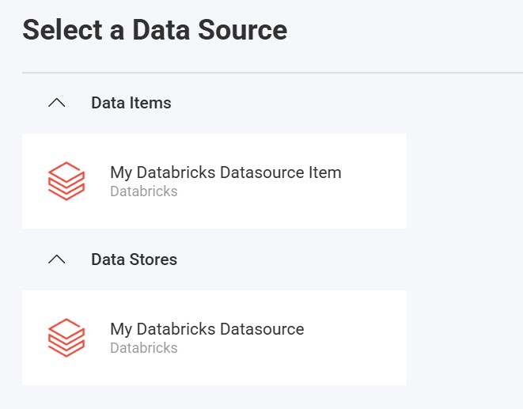

import Tabs from '@theme/Tabs';
import TabItem from '@theme/TabItem';

# Databricks データ ソース

## 概要

Databricks は、データ エンジニアリング チームとデータ サイエンス チームが大規模なデータ処理、機械学習、分析を共同で行うことができる統合分析プラットフォームです。このトピックでは、Reveal アプリケーションで Databricks データ ソースに接続して、データを視覚化および分析する方法について説明します。

:::important Prerequisites
Reveal で Databricks データ ソースを構成する前に、適切なデータベース ドライバーをインストールする必要があります。
- Windows/.NET の場合: [Databricks ODBC ドライバー](https://www.databricks.com/spark/odbc-drivers-download)
- Node.js の場合: [Databricks ODBC ドライバー](https://www.databricks.com/spark/odbc-drivers-download)
- Java の場合: JDBC ドライバーは Maven 経由で自動的にインストールされます。

これらのドライバーは、Databricks データ ソースへの接続を確立するために不可欠です。インストール後、Databricks のドキュメントに従ってドライバーが適切に構成されていることを確認します。
:::

## サーバーの構成

### インストール

<Tabs groupId="code" queryString>
  <TabItem value="aspnet" label="ASP.NET" default>

**手順 1** - Reveal Databricks コネクタ パッケージをインストールします。

ASP.NET アプリケーションの場合、Databricks サポートを有効にするには、別の NuGet パッケージをインストールする必要があります。

```bash
dotnet add package Reveal.Sdk.Data.Databricks
```

**手順 2** - アプリケーションに Databricks データ ソースを登録します。

```csharp
builder.Services.AddControllers().AddReveal( builder =>
{
    builder.DataSources.RegisterDatabricks();
});
```

  </TabItem>
  <TabItem value="node" label="Node.js">

Node.js アプリケーションの場合、Databricks データ ソースはメインの Reveal SDK パッケージに既に含まれています。標準の Reveal SDK セットアップ以外に追加のインストールは必要ありません。

  </TabItem>
  <TabItem value="java" label="Java">

Java アプリケーションの場合、Databricks データ ソースはメインの Reveal SDK パッケージに既に含まれています。標準の Reveal SDK セットアップ以外に追加のインストールは必要ありません。

:::danger Important
The Databricks JDBC Driver supports Apache Arrow. When using a Java JVM version 11 or higher, add the line --add-opens java.base/java.nio=ALL-UNNAMED to the JVM arguments. Without this JVM argument, the driver will not work.
:::

  </TabItem>
</Tabs>

### 接続の構成

<Tabs groupId="code" queryString>
  <TabItem value="aspnet" label="ASP.NET" default>

```csharp
// Create a data source provider
public class DataSourceProvider : IRVDataSourceProvider
{
    public async Task<RVDataSourceItem> ChangeDataSourceItemAsync(IRVUserContext userContext, string dashboardId, RVDataSourceItem dataSourceItem)
    {
        // Required: Update the underlying data source
        await ChangeDataSourceAsync(userContext, dataSourceItem.DataSource);

        if (dataSourceItem is RVDatabricksDataSourceItem databricksItem)
        {            
            // Configure specific item properties as needed
            if (databricksItem.Id == "databricks_sales_data")
            {
                databricksItem.Table = "sales_data";
            }
        }
        
        return dataSourceItem;
    }

    public Task<RVDashboardDataSource> ChangeDataSourceAsync(IRVUserContext userContext, RVDashboardDataSource dataSource)
    {
        if (dataSource is RVDatabricksDataSource databricksDS)
        {
            // Configure connection properties
            databricksDS.Host = "your-databricks-instance.cloud.databricks.com";
            databricksDS.HttpPath = "/sql/1.0/warehouses/abc123";
            databricksDS.Port = 443;
            databricksDS.Database = "default";
            databricksDS.Schema = "public";
        }
        
        return dataSource;
    }
}
```

  </TabItem>
  <TabItem value="node" label="Node.js">

```javascript
// Create data source providers
const dataSourceItemProvider = async (userContext, dataSourceItem) => {
    // Required: Update the underlying data source
    await dataSourceProvider(userContext, dataSourceItem.dataSource);

    if (dataSourceItem instanceof reveal.RVDatabricksDataSourceItem) {        
        // Configure specific item properties if needed
        if (dataSourceItem.id === "databricks_sales_data") {
            dataSourceItem.table = "sales_data";
        }
    }
    
    return dataSourceItem;
}

const dataSourceProvider = async (userContext, dataSource) => {
    if (dataSource instanceof reveal.RVDatabricksDataSource) {
        // Configure connection properties
        dataSource.host = "your-databricks-instance.cloud.databricks.com";
        dataSource.httpPath = "/sql/1.0/warehouses/abc123";
        dataSource.port = 443;
        dataSource.database = "default";
        dataSource.schema = "public";
    }
    
    return dataSource;
}
```

  </TabItem>
    <TabItem value="node-ts" label="Node.js - TS">

```typescript
// Create data source providers
const dataSourceItemProvider = async (userContext: IRVUserContext | null, dataSourceItem: RVDataSourceItem) => {
    // Required: Update the underlying data source
    await dataSourceProvider(userContext, dataSourceItem.dataSource);

    if (dataSourceItem instanceof RVDatabricksDataSourceItem) {        
        // Configure specific item properties if needed
        if (dataSourceItem.id === "databricks_sales_data") {
            dataSourceItem.table = "sales_data";
        }
    }
    
    return dataSourceItem;
}

const dataSourceProvider = async (userContext: IRVUserContext | null, dataSource: RVDashboardDataSource) => {
    if (dataSource instanceof RVDatabricksDataSource) {
        // Configure connection properties
        dataSource.host = "your-databricks-instance.cloud.databricks.com";
        dataSource.httpPath = "/sql/1.0/warehouses/abc123";
        dataSource.port = 443;
        dataSource.database = "default";
        dataSource.schema = "public";
    }
    
    return dataSource;
}
```

  </TabItem>
  <TabItem value="java" label="Java">

```java
// Create a data source provider
public class DataSourceProvider implements IRVDataSourceProvider {

    public RVDataSourceItem changeDataSourceItem(IRVUserContext userContext, String dashboardId, RVDataSourceItem dataSourceItem) {
        // Required: Update the underlying data source
        changeDataSource(userContext, databricksItem.getDataSource());

        if (dataSourceItem instanceof RVDatabricksDataSourceItem databricksItem) {            
            // Configure specific item properties if needed
            if ("databricks_sales_data".equals(databricksItem.getId())) {
                databricksItem.setTable("sales_data");
            }
        }
        
        return dataSourceItem;
    }

    public RVDashboardDataSource changeDataSource(IRVUserContext userContext, RVDashboardDataSource dataSource) {
        if (dataSource instanceof RVDatabricksDataSource databricksDS) {
            // Configure connection properties
            databricksDS.setHost("your-databricks-instance.cloud.databricks.com");
            databricksDS.setHttpPath("/sql/1.0/warehouses/abc123");
            databricksDS.setPort(443);
            databricksDS.setDatabase("default");
            databricksDS.setSchema("public");
        }
        
        return dataSource;
    }
}
```

  </TabItem>
</Tabs>

:::danger Important
`ChangeDataSourceAsync` メソッドでデータ ソースに加えられた変更は、`ChangeDataSourceItemAsync` メソッドには引き継がれません。どちらの方法でも、データ ソース プロパティを**更新する必要があります**。上記の例に示すように、`ChangeDataSourceItemAsync` メソッド内で `ChangeDataSourceAsync` メソッドを呼び出し、データ ソース項目の基になるデータ ソースをパラメーターとして渡すことをお勧めします。
:::

### 認証

Databricks の認証は、個人アクセス トークンを使用してサーバー側で処理されます。認証オプションの詳細については、「[認証](../authentication.md)」トピックを参照してください。

<Tabs groupId="code" queryString>
  <TabItem value="aspnet" label="ASP.NET" default>

```csharp
public class AuthenticationProvider: IRVAuthenticationProvider
{
    public Task<IRVDataSourceCredential> ResolveCredentialsAsync(IRVUserContext userContext, RVDashboardDataSource dataSource)
    {
        IRVDataSourceCredential userCredential = null;
        if (dataSource is RVDatabricksDataSource)
        {
            // Use Personal Access Token
            userCredential = new RVBearerTokenDataSourceCredential("your_personal_access_token", "your_userid");
        }
        return Task.FromResult<IRVDataSourceCredential>(userCredential);
    }
}
```

  </TabItem>
  <TabItem value="node" label="Node.js">

```javascript
const authenticationProvider = async (userContext, dataSource) => {
    if (dataSource instanceof reveal.RVDatabricksDataSource) {
        // Use Personal Access Token
        return new reveal.RVBearerTokenDataSourceCredential("your_personal_access_token", "your_userid");
    }
    return null;
}
```

  </TabItem>
    <TabItem value="node-ts" label="Node.js - TS">

```ts
const authenticationProvider = async (userContext: IRVUserContext | null, dataSource: RVDashboardDataSource) => {
    if (dataSource instanceof RVDatabricksDataSource) {
        // Use Personal Access Token
        return new RVBearerTokenDataSourceCredential("your_personal_access_token", "your_userid");
    }
    return null;
}
```

  </TabItem>
  <TabItem value="java" label="Java">

```java
public class AuthenticationProvider implements IRVAuthenticationProvider {
    @Override
    public IRVDataSourceCredential resolveCredentials(IRVUserContext userContext, RVDashboardDataSource dataSource) {
        if (dataSource instanceof RVDatabricksDataSource) {
            // Use Personal Access Token
            return new RVBearerTokenDataSourceCredential("your_personal_access_token", "your_userid");
        }
        return null;
    }
}
```

  </TabItem>
</Tabs>

## クライアント側の実装

クライアント側では、データ ソースの ID、タイトル、サブタイトルなどの基本プロパティを指定するだけです。実際の接続構成はサーバー上で行われます。

### データ ソースの作成

**手順 1** - `RevealView.onDataSourcesRequested` イベントのイベント ハンドラーを追加します。

```js
const revealView = new $.ig.RevealView("#revealView");
revealView.onDataSourcesRequested = (callback) => {
    // Add data source here
    callback(new $.ig.RevealDataSources([], [], false));
};
```

**手順 2** - `RevealView.onDataSourcesRequested` イベント ハンドラーで、`RVDatabricksDataSource` オブジェクトの新しいインスタンスを作成します。`title` と `subtitle` プロパティを設定します。`RVDatabricksDataSource` オブジェクトを作成したら、それをデータ ソース コレクションに追加します。

```js
revealView.onDataSourcesRequested = (callback) => {
    const databricksDS = new $.ig.RVDatabricksDataSource();
    databricksDS.title = "Databricks";
    databricksDS.subtitle = "Data Source";
    
    callback(new $.ig.RevealDataSources([databricksDS], [], false));
};
```

アプリケーションが実行されたら、新しい可視化を作成すると、新しく作成された Databricks データ ソースが [データ ソースの選択] ダイアログに表示されます。


### データ ソース項目の作成

データ ソース項目は、ユーザーが表示形式のために選択できる Databricks データ ソース内の特定のデータセットを表します。クライアント側では、ID、タイトル、サブタイトルを指定するだけです。

```js
revealView.onDataSourcesRequested = (callback) => {
    // Create the data source
    const databricksDS = new $.ig.RVDatabricksDataSource();
    databricksDS.title = "My Databricks Datasource";
    databricksDS.subtitle = "Databricks";
    
    // Create a data source item
    const databricksDSI = new $.ig.RVDatabricksDataSourceItem(databricksDS);
    databricksDSI.id = "databricks_sales_data";
    databricksDSI.title = "My Databricks Datasource Item";
    databricksDSI.subtitle = "Databricks";

    callback(new $.ig.RevealDataSources([databricksDS], [databricksDSI], false));
};
```

アプリケーションが実行されたら、新しい可視化を作成すると、新しく作成された Databricks データ ソース項目が [データ ソースの選択] ダイアログに表示されます。



## その他のリソース

- [Databricks SQL ドキュメント](https://docs.databricks.com/sql/index.html)
- [Databricks ODBC ドライバー](https://www.databricks.com/spark/odbc-drivers-download)
- [Databricks JDBC ドライバー](https://www.databricks.com/spark/jdbc-drivers-download)
- [GitHub のサンプル ソース コード](https://github.com/RevealBi/sdk-samples-javascript/tree/main/DataSources/Databricks)

## API リファレンス

<Tabs groupId="code" queryString>
<TabItem value="aspnet" label="ASP.NET" default>

* [RVDatabricksDataSource](https://help.revealbi.io/api/aspnet/latest/Reveal.Sdk.Data.Databricks.RVDatabricksDataSource.html) - Databricks データ ソースを表します
* [RVDatabricksDataSourceItem](https://help.revealbi.io/api/aspnet/latest/Reveal.Sdk.Data.Databricks.RVDatabricksDataSourceItem.html) - Databricks データ ソース項目を表します

</TabItem>
<TabItem value="node" label="Node.js">

* [RVDatabricksDataSource](https://help.revealbi.io/api/javascript/latest/classes/rvdatabricksdatasource.html) - Databricks データ ソースを表します
* [RVDatabricksDataSourceItem](https://help.revealbi.io/api/javascript/latest/classes/rvdatabricksdatasourceitem.html) - Databricks データ ソース項目を表します

</TabItem>
</Tabs>