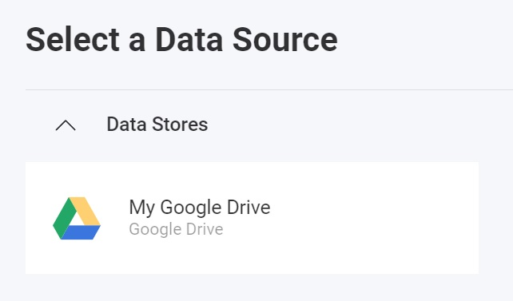

import Tabs from '@theme/Tabs';
import TabItem from '@theme/TabItem';

# Google Drive データ ソースの追加

:::danger breaking changes

Currently, the Reveal SDK is in the process of decoupling the data sources from the Reveal SDK core package. In order to ensure the project's continued functionality, you might be required to install additional packages into your project. Please see the [Supported Data Sources](web/datasources.md#supported-data-sources) topic for more information.

:::

**手順 1** - `RevealView.onDataSourcesRequested` イベントのイベント ハンドラーを追加します。

```js
var revealView = new $.ig.RevealView("#revealView");
revealView.onDataSourcesRequested = (callback) => {
    //add code here
    callback(new $.ig.RevealDataSources([], [], false));
};
```

**手順 2** - `RevealView.onDataSourcesRequested` イベント ハンドラーで、[RVGoogleDriveDataSource](https://help.revealbi.io/api/javascript/latest/classes/rvgoogledrivedatasource.html) オブジェクトの新しいインスタンスを作成します。`Title` プロパティと `Subtitle` プロパティを、Google ドライブに対応する値に設定します。`RVGoogleDriveDataSource` オブジェクトを作成したら、それをデータ ソース コレクションに追加します。

```js
revealView.onDataSourcesRequested = (callback) => {
    var googleDrive = new $.ig.RVGoogleDriveDataSource();
    googleDrive.title = "My Google Drive";
    googleDrive.subtitle = "Google Drive";

    callback(new $.ig.RevealDataSources([googleDrive], [], false));
};
```

アプリケーションが実行されたら、新しい可視化を作成すると、新しく作成された Google ドライブ データ ソースが [データ ソースの選択] ダイアログに表示されます。



:::note

`RVGoogleDriveDataSource` は、Reveal SDK に登録された認証プロバイダーに基づいてフォルダーとファイルを読み込みます。Google ドライブは `RVBearerTokenDataSourceCredential` を使用して認証します。詳細については、「[認証](../authentication#ベアラー-トークン認証)」トピックを参照してください。

:::

:::info コードの取得

このサンプルのソース コードは、[GitHub](https://github.com/RevealBi/sdk-samples-javascript/tree/main/DataSources/GoogleDrive-ServiceAccount) にあります。

:::