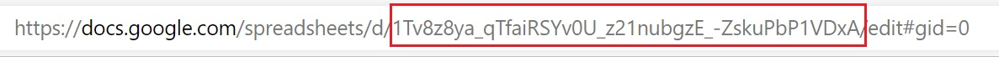

import Tabs from '@theme/Tabs';
import TabItem from '@theme/TabItem';

# Google スプレッドシート データ ソースの追加

:::danger breaking changes

現在、Reveal SDK は、Reveal SDK core パッケージからデータ ソースを分離する過程にあります。 プロジェクトの継続的な機能を確保するために、プロジェクトに追加のパッケージをインストールすることが必要になる場合があります。 詳細については、[サポートされるデータ ソース](web/datasources.md#サポートされるデータ-ソース) トピックを参照してください。

:::

**手順 1** - `RevealView.onDataSourcesRequested` イベントのイベント ハンドラーを追加します。

```js
var revealView = new $.ig.RevealView("#revealView");
revealView.onDataSourcesRequested = (callback) => {
    //add code here
    callback(new $.ig.RevealDataSources([], [], false));
};
```

**手順 2** - `RevealView.onDataSourcesRequested` イベント ハンドラーで、[RVGoogleDriveDataSourceItem](https://help.revealbi.io/api/javascript/latest/classes/rvgoogledrivedatasourceitem.html) オブジェクトの新しいインスタンスを作成します。`Identifier` プロパティを Google スプレッドシート ID に設定します。

```js
revealView.onDataSourcesRequested = (callback) => {
    //get file from google drive
    const googleDriveDSI = new $.ig.RVGoogleDriveDataSourceItem();
    googleDriveDSI.identifier = "file_identifier";

    callback(new $.ig.RevealDataSources([], [], false));
};
```

`Identifier` とも呼ばれる Google スプレッドシート ID は、Google スプレッドシートで作成する各スプレッドシートの一意の識別子です。`Identifier` を見つける最も簡単な方法は、スプレッドシートの URL を確認することです。URL では、スプレッドシート ID は、URL の「/d/」部分の後に続く文字と数字の文字列です。



この例では、`Identifier` は **1Tv8z8ya_qTfaiRSYv0U_z21nubgzE_-ZskuPbP1VDxA** です。

**手順 3** - [RVGoogleSheetDataSourceItem](https://help.revealbi.io/api/javascript/latest/classes/rvgooglesheetdatasourceitem.html) オブジェクトの新しいインスタンスを作成して、新しい Google スプレッドシート データ ソース項目を作成します。値に対応する `Title`、`Subtitle`、および `Sheet` プロパティを設定します。`RVGoogleSheetDataSourceItem` オブジェクトを作成したら、それをデータ ソース項目コレクションに追加します。

```js
revealView.onDataSourcesRequested = (callback) => {
    //get file from google drive
    const googleDriveDSI = new $.ig.RVGoogleDriveDataSourceItem();
    googleDriveDSI.identifier = "file_identifier";

    //indicate the file is a google sheet and set the sheet name
    const googleSheet  = new $.ig.RVGoogleSheetDataSourceItem(googleDriveDSI);
    googleDriveDSI.title = "My Google Sheet";
    googleSheet.subtitle = "Google Drive";
    googleSheet.sheet = "Sheet1";

    callback(new $.ig.RevealDataSources([], [googleSheet], false));
};
```

アプリケーションが実行されたら、新しい可視化を作成すると、新しく作成された Google スプレッド データ ソース項目が [データ ソースの選択] ダイアログに表示されます。


:::info コードの取得

このサンプルのソース コードは、[GitHub](https://github.com/RevealBi/sdk-samples-javascript/tree/main/DataSources/GoogleSheets-ServiceAccount) にあります。

:::