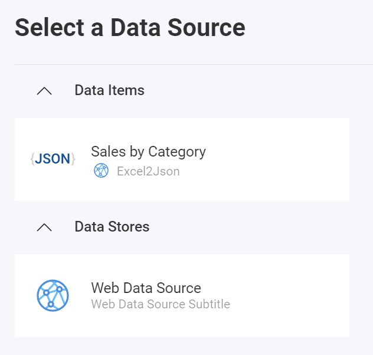

import Tabs from '@theme/Tabs';
import TabItem from '@theme/TabItem';

# JSON データ ソースの追加

:::danger 重大な変更

現在、Reveal SDK は、Reveal SDK core パッケージからデータ ソースを分離する過程にあります。プロジェクトの継続的な機能を確保するために、プロジェクトに追加のパッケージをインストールすることが必要になる場合があります。詳細については、[サポートされるデータ ソース](web/datasources.md#サポートされるデータ-ソース) トピックを参照してください。

:::

**手順 1** - `RevealView.onDataSourcesRequested` イベントのイベント ハンドラーを追加します。

```js
var revealView = new $.ig.RevealView("#revealView");
revealView.onDataSourcesRequested = (callback) => {
    //add code here
    callback(new $.ig.RevealDataSources([], [], false));
};
```

**手順 2** - `RevealView.onDataSourcesRequested` イベント ハンドラーで、[RVWebResourceDataSource](https://help.revealbi.io/api/javascript/latest/classes/rvwebresourcedatasource.html) オブジェクトの新しいインスタンスを作成します。CSV リソースへのアクセスに認証が必要ない場合は、`URL` プロパティを CSV リソースの URL に設定し、`useAnonymousAuthentication` プロパティを `false` に設定します。オプションで、`RVWebResourceDataSource` オブジェクトをコールバックのデータ ソース コレクションに追加して、RevealView の [データ ソース] ダイアログに表示できます。

```js
revealView.onDataSourcesRequested = (callback) => {
    const webDS = new $.ig.RVWebResourceDataSource();
    webDS.title = "Web Data Source";
    webDS.subtitle = "Web Data Source Subtitle";
    webDS.url = "https://excel2json.io/api/share/6e0f06b3-72d3-4fec-7984-08da43f56bb9";
    webDS.useAnonymousAuthentication = true;

    callback(new $.ig.RevealDataSources([webDS], [], false));
};
```

アプリケーションが実行されたら、新しい可視化を作成すると、新しく作成された Web リソース データ ソースが [データ ソースの選択] ダイアログに表示されます。


**手順 3** - データ ソース ダイアログの **[JSON の設定]** 画面をスキップして JSON データを直接使用するには、[RVWebResourceDataSourceItem](https://help.revealbi.io/api/javascript/latest/classes/rvwebresourcedatasourceitem.html) の新しいインスタンスを作成し、前の手順で作成した `RVWebResourceDataSource` オブジェクトをコンストラクター引数として渡します。次に、[RVJsonDataSourceItem](https://help.revealbi.io/api/javascript/latest/classes/rvjsondatasourceitem.html) の新しいインスタンスを作成し、「RVWebResourceDataSourceItem」 をコンストラクター引数として渡します。`Title` と `Subtitle` プロパティを設定します。最後に、`Config` プロパティをデータの構造を表す JSON 文字列に設定する**必要があります**。このプロセスを簡単にするために、[RVJsonSchemaConfigBuilder](https://help.revealbi.io/api/javascript/latest/classes/rvjsonschemaconfigbuilder.html) クラスを使用して、流暢な API を使用して JSON 構造を構築できます。

`RVJsonDataSourceItem` オブジェクトを作成したら、それをデータ ソース項目コレクションに追加します。

```js
revealView.onDataSourcesRequested = (callback) => {
    const webDS = new $.ig.RVWebResourceDataSource();
    webDS.title = "Web Data Source";
    webDS.subtitle = "Web Data Source Subtitle";
    webDS.url = "https://raw.githubusercontent.com/fivethirtyeight/data/master/airline-safety/airline-safety.csv";
    webDS.useAnonymousAuthentication = true;

    //to skip the "Set up your JSON" dialog and directly use the JSON data
    const webDSI = new $.ig.RVWebResourceDataSourceItem(webDS);
    const jsonDSI = new $.ig.RVJsonDataSourceItem(webDSI);
    jsonDSI.title = "Sales by Category";
    jsonDSI.subtitle = "Excel2Json";
    jsonDSI.config = new $.ig.RVJsonSchemaConfigBuilder()
        .addNumericField("CategoryID")
        .addStringField("CategoryName")
        .addStringField("ProductName")
        .addNumericField("ProductSales")
        .build();

    callback(new $.ig.RevealDataSources([webDS], [jsonDSI], false));
};
```

アプリケーションが実行されたら、新しい3可視化を作成すると、[データ ソースの選択] ダイアログに新しく作成された JSON データ ソース項目が表示されます。



In JSON, data is organized hierarchically, often featuring nested structures where objects contain other objects or arrays. To navigate these structures programmatically, you can specify nested properties, which are essentially a sequence of keys or indices that lead to the desired data.
```js
const jsonDsItem = new $.ig.RVJsonDataSourceItem(dsItem);
jsonDsItem.config = new RevealApi.RVJsonSchemaConfigBuilder()
        .addStringField("fieldA")
        .addNumericField("fieldB")
        .addNumericField("/geo/location/lat")
        .addNumericField("/geo/location/lng")
        .setIterationDepth(0)
        .build();
```

:::info コードの取得

このサンプルのソース コードは、[GitHub](https://github.com/RevealBi/sdk-samples-javascript/tree/main/DataSources/Json) にあります。

:::