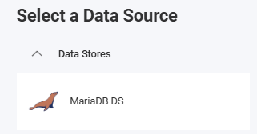
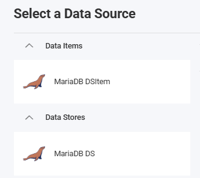

import Tabs from '@theme/Tabs';
import TabItem from '@theme/TabItem';

# MariaDB Data Source

## Introduction

MariaDB is a community-developed, commercially supported open-source relational database that is a drop-in replacement for MySQL. This topic explains how to connect to MariaDB data sources in your Reveal application to visualize and analyze your data.

:::important Prerequisites
Before configuring the MariaDB data source in Reveal, you must have access to a MariaDB server and the appropriate database driver for your platform:
- For Windows/.NET: [MySqlConnector](https://mysqlconnector.net/) or the MySQL .NET connector.
- For Node.js: A MySQL-compatible driver (e.g. `mysql2`).

These drivers are essential for establishing connections to your MariaDB data source. After installation, ensure the drivers are properly configured according to the connector documentation.
:::

## Server Configuration

### Installation

<Tabs groupId="code" queryString>
  <TabItem value="aspnet" label="ASP.NET" default>

**Step 1** - Install the Reveal MariaDB connector package

For ASP.NET applications, you need to install a separate NuGet package to enable MariaDB support:

```bash
dotnet add package Reveal.Sdk.Data.MariaDB
```

**Step 2** - Register the MariaDB data source in your application:

```csharp
builder.Services.AddControllers().AddReveal(builder =>
{
    builder.DataSources.RegisterMariaDB();
});
```

  </TabItem>
  <TabItem value="node" label="Node.js">

For Node.js applications, the MariaDB data source is already included in the main Reveal SDK package. No additional installation is required beyond the standard Reveal SDK setup.

  </TabItem>
 
</Tabs>

### Connection Configuration

<Tabs groupId="code" queryString>
  <TabItem value="aspnet" label="ASP.NET" default>

```csharp
// Create a data source provider
public class DataSourceProvider : IRVDataSourceProvider
{
    public async Task<RVDataSourceItem> ChangeDataSourceItemAsync(IRVUserContext userContext, string dashboardId, RVDataSourceItem dataSourceItem)
    {
        // Required: Update the underlying data source
        await ChangeDataSourceAsync(userContext, dataSourceItem.DataSource);

        if (dataSourceItem is RVMariaDBDataSourceItem mariadbItem)
        {
            // Configure specific item properties as needed
            if (mariadbItem.Id == "mariadb_sales_data")
            {
                mariadbItem.Table = "orders";
            }
        }

        return dataSourceItem;
    }

    public Task<RVDashboardDataSource> ChangeDataSourceAsync(IRVUserContext userContext, RVDashboardDataSource dataSource)
    {
        if (dataSource is RVMariaDBDataSource mariadbDS)
        {
            // Configure connection properties
            mariadbDS.Host = "localhost";
            mariadbDS.Port = 3306;
            mariadbDS.Database = "your-db-name";
        }

        return Task.FromResult(dataSource);
    }
}
```

  </TabItem>
  <TabItem value="node" label="Node.js">

```javascript
// Create data source providers
const dataSourceItemProvider = async (userContext, dataSourceItem) => {
    // Required: Update the underlying data source
    await dataSourceProvider(userContext, dataSourceItem.dataSource);

    if (dataSourceItem instanceof reveal.RVMariaDBDataSourceItem) {
        // Configure specific item properties if needed
        if (dataSourceItem.id === "mariadb_sales_data") {
            dataSourceItem.table = "orders";
        }
    }

    return dataSourceItem;
}

const dataSourceProvider = async (userContext, dataSource) => {
    if (dataSource instanceof reveal.RVMariaDBDataSource) {
        // Configure connection properties
        dataSource.host = "localhost";
        dataSource.port = 3306;
        dataSource.database = "your-db-name";
    }

    return dataSource;
}
```

  </TabItem>
  <TabItem value="node-ts" label="Node.js - TS">

```typescript
// Create data source providers
const dataSourceItemProvider = async (userContext: IRVUserContext | null, dataSourceItem: RVDataSourceItem) => {
    // Required: Update the underlying data source
    await dataSourceProvider(userContext, dataSourceItem.dataSource);

    if (dataSourceItem instanceof RVMariaDBDataSourceItem) {
        // Configure specific item properties if needed
        if (dataSourceItem.id === "mariadb_sales_data") {
            dataSourceItem.table = "orders";
        }
    }

    return dataSourceItem;
}

const dataSourceProvider = async (userContext: IRVUserContext | null, dataSource: RVDashboardDataSource) => {
    if (dataSource instanceof RVMariaDBDataSource) {
        // Configure connection properties
        dataSource.host = "localhost";
        dataSource.port = 3306;
        dataSource.database = "your-db-name";
    }

    return dataSource;
}
```

  </TabItem>

</Tabs>

:::danger Important
Any changes made to the data source in the `ChangeDataSourceAsync` method are not carried over into the `ChangeDataSourceItemAsync` method. You **must** update the data source properties in both methods. We recommend calling the `ChangeDataSourceAsync` method within the `ChangeDataSourceItemAsync` method passing the data source item's underlying data source as the parameter as shown in the examples above.
:::

### Authentication

Authentication for MariaDB is typically handled with username and password. For detailed information on authentication options, see the [Authentication](web/authentication.md) topic.

<Tabs groupId="code" queryString>
  <TabItem value="aspnet" label="ASP.NET" default>

```csharp
public class AuthenticationProvider : IRVAuthenticationProvider
{
    public Task<IRVDataSourceCredential> ResolveCredentialsAsync(IRVUserContext userContext, RVDashboardDataSource dataSource)
    {
        IRVDataSourceCredential userCredential = null;
        if (dataSource is RVMariaDBDataSource)
        {
            userCredential = new RVUsernamePasswordDataSourceCredential("your_username", "your_password");
        }
        return Task.FromResult<IRVDataSourceCredential>(userCredential);
    }
}
```

  </TabItem>
  <TabItem value="node" label="Node.js">

```javascript
const authenticationProvider = async (userContext, dataSource) => {
    if (dataSource instanceof reveal.RVMariaDBDataSource) {
        return new reveal.RVUsernamePasswordDataSourceCredential("your_username", "your_password");
    }
    return null;
}
```

  </TabItem>
  <TabItem value="node-ts" label="Node.js - TS">

```ts
const authenticationProvider = async (userContext: IRVUserContext | null, dataSource: RVDashboardDataSource) => {
    if (dataSource instanceof RVMariaDBDataSource) {
        return new RVUsernamePasswordDataSourceCredential("your_username", "your_password");
    }
    return null;
}
```

  </TabItem>

</Tabs>

## Client-Side Implementation

On the client side, you only need to specify basic properties like ID, title, and subtitle for the data source. The actual connection configuration happens on the server.

### Creating Data Sources

**Step 1** - Add an event handler for the `RevealView.onDataSourcesRequested` event.

```js
const revealView = new $.ig.RevealView("#revealView");
revealView.onDataSourcesRequested = (callback) => {
    // Add data source here
    callback(new $.ig.RevealDataSources([], [], false));
};
```

**Step 2** - In the `RevealView.onDataSourcesRequested` event handler, create a new instance of the `RVMariaDBDataSource` object. Set the `title` and `subtitle` properties. After you have created the `RVMariaDBDataSource` object, add it to the data sources collection.

```js
revealView.onDataSourcesRequested = (callback) => {
    const mariadbDS = new $.ig.RVMariaDBDataSource();
    mariadbDS.title = "MariaDB";
    mariadbDS.subtitle = "Data Source";

    callback(new $.ig.RevealDataSources([mariadbDS], [], false));
};
```

When the application runs, create a new Visualization and you will see the newly created MariaDB data source listed in the "Select a Data Source" dialog.



### Creating Data Source Items

Data source items represent specific tables or datasets within your MariaDB data source that users can select for visualization. On the client side, you only need to specify ID, title, and subtitle.

```js
revealView.onDataSourcesRequested = (callback) => {
    // Create the data source
    const mariadbDS = new $.ig.RVMariaDBDataSource();
    mariadbDS.title = "My MariaDB Datasource";
    mariadbDS.subtitle = "MariaDB";

    // Create a data source item
    const mariadbDSI = new $.ig.RVMariaDBDataSourceItem(mariadbDS);
    mariadbDSI.id = "mariadb_sales_data";
    mariadbDSI.title = "My MariaDB Datasource Item";
    mariadbDSI.subtitle = "MariaDB";

    callback(new $.ig.RevealDataSources([mariadbDS], [mariadbDSI], true));
};
```

When the application runs, create a new Visualization and you will see the newly created MariaDB data source item listed in the "Select a Data Source" dialog.



:::warning Error Messages
MariaDB is MySQL-compatible, and it is common for drivers and error messages to reference MySQL even when connected to MariaDB.
:::

## Additional Resources

- [MariaDB Documentation](https://mariadb.com/kb/en/documentation/)
- [Sample Source Code on GitHub](https://github.com/RevealBi/sdk-samples-javascript/tree/main/DataSources/MariaDB)

## API Reference

<Tabs groupId="code" queryString>
<TabItem value="aspnet" label="ASP.NET" default>

* [RVMariaDBDataSource](https://help.revealbi.io/api/aspnet/latest/Reveal.Sdk.Data.MariaDB.RVMariaDBDataSource.html) - Represents a MariaDB data source
* [RVMariaDBDataSourceItem](https://help.revealbi.io/api/aspnet/latest/Reveal.Sdk.Data.MariaDB.RVMariaDBDataSourceItem.html) - Represents a MariaDB data source item

</TabItem>
<TabItem value="node" label="Node.js">

* [RVMariaDBDataSource](https://help.revealbi.io/api/javascript/latest/classes/rvmariadbdatasource.html) - Represents a MariaDB data source
* [RVMariaDBDataSourceItem](https://help.revealbi.io/api/javascript/latest/classes/rvmariadbdatasourceitem.html) - Represents a MariaDB data source item

</TabItem>
</Tabs>
