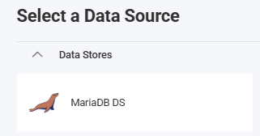
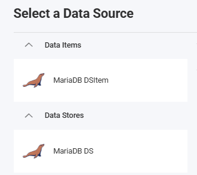

import Tabs from '@theme/Tabs';
import TabItem from '@theme/TabItem';

# MariaDB データ ソース

## 概要

MariaDB は、コミュニティ主導で開発され、商用サポートも提供されているオープンソースのリレーショナル データベースで、MySQL のドロップイン置換として利用できます。このトピックでは、Reveal アプリケーションで MariaDB データ ソースに接続して、データを視覚化および分析する方法について説明します。

## サーバーの構成

### インストール

<Tabs groupId="code" queryString>
  <TabItem value="aspnet" label="ASP.NET" default>

**手順 1** - Reveal MariaDB コネクタ パッケージをインストールします。

ASP.NET アプリケーションの場合、MariaDB サポートを有効にするには、別の NuGet パッケージをインストールする必要があります。

```bash
dotnet add package Reveal.Sdk.Data.MariaDB
```

**手順 2** - アプリケーションに MariaDB データ ソースを登録します。

```csharp
builder.Services.AddControllers().AddReveal(builder =>
{
    builder.DataSources.RegisterMariaDB();
});
```

  </TabItem>
  <TabItem value="node" label="Node.js">

Node.js アプリケーションの場合、MariaDB データ ソースはメインの Reveal SDK パッケージに既に含まれています。標準の Reveal SDK セットアップ以外に追加のインストールは必要ありません。

  </TabItem>
 
</Tabs>

### 接続の構成

<Tabs groupId="code" queryString>
  <TabItem value="aspnet" label="ASP.NET" default>

```csharp
// Create a data source provider
public class DataSourceProvider : IRVDataSourceProvider
{
    public async Task<RVDataSourceItem> ChangeDataSourceItemAsync(IRVUserContext userContext, string dashboardId, RVDataSourceItem dataSourceItem)
    {
        // Required: Update the underlying data source
        await ChangeDataSourceAsync(userContext, dataSourceItem.DataSource);

        if (dataSourceItem is RVMariaDBDataSourceItem mariadbItem)
        {
            // Configure specific item properties as needed
            if (mariadbItem.Id == "mariadb_sales_data")
            {
                mariadbItem.Table = "orders";
            }
        }

        return dataSourceItem;
    }

    public Task<RVDashboardDataSource> ChangeDataSourceAsync(IRVUserContext userContext, RVDashboardDataSource dataSource)
    {
        if (dataSource is RVMariaDBDataSource mariadbDS)
        {
            // Configure connection properties
            mariadbDS.Host = "localhost";
            mariadbDS.Port = 3306;
            mariadbDS.Database = "your-db-name";
        }

        return Task.FromResult(dataSource);
    }
}
```

  </TabItem>
  <TabItem value="node" label="Node.js">

```javascript
// Create data source providers
const dataSourceItemProvider = async (userContext, dataSourceItem) => {
    // Required: Update the underlying data source
    await dataSourceProvider(userContext, dataSourceItem.dataSource);

    if (dataSourceItem instanceof reveal.RVMariaDBDataSourceItem) {
        // Configure specific item properties if needed
        if (dataSourceItem.id === "mariadb_sales_data") {
            dataSourceItem.table = "orders";
        }
    }

    return dataSourceItem;
}

const dataSourceProvider = async (userContext, dataSource) => {
    if (dataSource instanceof reveal.RVMariaDBDataSource) {
        // Configure connection properties
        dataSource.host = "localhost";
        dataSource.port = 3306;
        dataSource.database = "your-db-name";
    }

    return dataSource;
}
```

  </TabItem>
  <TabItem value="node-ts" label="Node.js - TS">

```typescript
// Create data source providers
const dataSourceItemProvider = async (userContext: IRVUserContext | null, dataSourceItem: RVDataSourceItem) => {
    // Required: Update the underlying data source
    await dataSourceProvider(userContext, dataSourceItem.dataSource);

    if (dataSourceItem instanceof RVMariaDBDataSourceItem) {
        // Configure specific item properties if needed
        if (dataSourceItem.id === "mariadb_sales_data") {
            dataSourceItem.table = "orders";
        }
    }

    return dataSourceItem;
}

const dataSourceProvider = async (userContext: IRVUserContext | null, dataSource: RVDashboardDataSource) => {
    if (dataSource instanceof RVMariaDBDataSource) {
        // Configure connection properties
        dataSource.host = "localhost";
        dataSource.port = 3306;
        dataSource.database = "your-db-name";
    }

    return dataSource;
}
```

  </TabItem>

</Tabs>

:::danger 重要
`ChangeDataSourceAsync` メソッドでデータ ソースに加えた変更は、`ChangeDataSourceItemAsync` メソッドには引き継がれません。両方のメソッドでデータ ソース プロパティを**更新する必要があります**。上記の例に示すように、`ChangeDataSourceItemAsync` メソッド内で、データ ソース項目の基になるデータ ソースをパラメーターとして渡して `ChangeDataSourceAsync` メソッドを呼び出すことをお勧めします。
:::

### 認証

MariaDB の認証は通常、ユーザー名とパスワードを使用して処理されます。認証オプションの詳細については、[認証](../authentication.md) トピックを参照してください。

<Tabs groupId="code" queryString>
  <TabItem value="aspnet" label="ASP.NET" default>

```csharp
public class AuthenticationProvider : IRVAuthenticationProvider
{
    public Task<IRVDataSourceCredential> ResolveCredentialsAsync(IRVUserContext userContext, RVDashboardDataSource dataSource)
    {
        IRVDataSourceCredential userCredential = null;
        if (dataSource is RVMariaDBDataSource)
        {
            userCredential = new RVUsernamePasswordDataSourceCredential("your_username", "your_password");
        }
        return Task.FromResult<IRVDataSourceCredential>(userCredential);
    }
}
```

  </TabItem>
  <TabItem value="node" label="Node.js">

```javascript
const authenticationProvider = async (userContext, dataSource) => {
    if (dataSource instanceof reveal.RVMariaDBDataSource) {
        return new reveal.RVUsernamePasswordDataSourceCredential("your_username", "your_password");
    }
    return null;
}
```

  </TabItem>
  <TabItem value="node-ts" label="Node.js - TS">

```ts
const authenticationProvider = async (userContext: IRVUserContext | null, dataSource: RVDashboardDataSource) => {
    if (dataSource instanceof RVMariaDBDataSource) {
        return new RVUsernamePasswordDataSourceCredential("your_username", "your_password");
    }
    return null;
}
```

  </TabItem>

</Tabs>

## クライアント側の実装

クライアント側では、データ ソースの ID、タイトル、サブタイトルなどの基本プロパティのみを指定する必要があります。実際の接続構成はサーバー上で行われます。

### データ ソースの作成

**手順 1** - `RevealView.onDataSourcesRequested` イベントのイベント ハンドラーを追加します。

```js
const revealView = new RevealView("#revealView");
revealView.onDataSourcesRequested = (callback) => {
    // Add data source here
    callback(new RevealDataSources([], [], false));
};
```

**手順 2** - `RevealView.onDataSourcesRequested` イベント ハンドラーで、`RVMariaDBDataSource` オブジェクトの新しいインスタンスを作成します。`title` と `subtitle` プロパティを設定します。`RVMariaDBDataSource` オブジェクトを作成したら、それをデータ ソース コレクションに追加します。

```js
revealView.onDataSourcesRequested = (callback) => {
    const mariadbDS = new RVMariaDBDataSource();
    mariadbDS.title = "MariaDB";
    mariadbDS.subtitle = "Data Source";

    callback(new RevealDataSources([mariadbDS], [], false));
};
```

アプリケーションが実行されたら、新しい可視化を作成すると、新しく作成された MariaDB データ ソースが [データ ソースの選択] ダイアログに表示されます。



### データ ソース項目の作成

データ ソース項目は、ユーザーが視覚化のために選択できる MariaDB データ ソース内の特定のテーブルまたはデータセットを表します。クライアント側では、ID、タイトル、サブタイトルのみを指定する必要があります。

```js
revealView.onDataSourcesRequested = (callback) => {
    // Create the data source
    const mariadbDS = new RVMariaDBDataSource();
    mariadbDS.title = "My MariaDB Datasource";
    mariadbDS.subtitle = "MariaDB";

    // Create a data source item
    const mariadbDSI = new RVMariaDBDataSourceItem(mariadbDS);
    mariadbDSI.id = "mariadb_sales_data";
    mariadbDSI.title = "My MariaDB Datasource Item";
    mariadbDSI.subtitle = "MariaDB";

    callback(new RevealDataSources([mariadbDS], [mariadbDSI], true));
};
```

アプリケーションが実行されたら、新しい可視化を作成すると、新しく作成された MariaDB データ ソース項目が [データ ソースの選択] ダイアログに表示されます。



:::warning エラー メッセージ
MariaDB は MySQL と互換性があるため、MariaDB に接続している場合でも、ドライバーやエラー メッセージが MySQL を参照することは一般的です。
:::

## その他のリソース

- [MariaDB ドキュメント](https://mariadb.com/kb/en/documentation/)
- [GitHub のサンプル ソース コード](https://github.com/RevealBi/sdk-samples-javascript/tree/main/DataSources/MariaDB)

## API リファレンス

<Tabs groupId="code" queryString>
<TabItem value="aspnet" label="ASP.NET" default>

* [RVMariaDBDataSource](https://help.revealbi.io/api/aspnet/latest/Reveal.Sdk.Data.MariaDB.RVMariaDBDataSource.html) - MariaDB データ ソースを表します
* [RVMariaDBDataSourceItem](https://help.revealbi.io/api/aspnet/latest/Reveal.Sdk.Data.MariaDB.RVMariaDBDataSourceItem.html) - MariaDB データ ソース項目を表します

</TabItem>
<TabItem value="node" label="Node.js">

* [RVMariaDBDataSource](https://help.revealbi.io/api/javascript/latest/classes/rvmariadbdatasource.html) - MariaDB データ ソースを表します
* [RVMariaDBDataSourceItem](https://help.revealbi.io/api/javascript/latest/classes/rvmariadbdatasourceitem.html) - MariaDB データ ソース項目を表します

</TabItem>
</Tabs>
