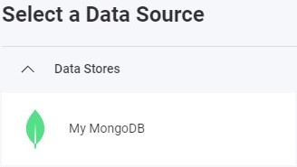

import Tabs from '@theme/Tabs';
import TabItem from '@theme/TabItem';

# MongoDB データ ソースの追加

:::danger 重大な変更

現在、Reveal SDK は、Reveal SDK core パッケージからデータ ソースを分離する過程にあります。プロジェクトの継続的な機能を確保するために、プロジェクトに追加のパッケージをインストールすることが必要になる場合があります。詳細については、[サポートされるデータ ソース](web/datasources.md#サポートされるデータ-ソース) トピックを参照してください。

:::

## クライアント側

**手順 1** - `RevealView.onDataSourcesRequested` イベントのイベント ハンドラーを追加します。

```js
var revealView = new $.ig.RevealView("#revealView");
revealView.onDataSourcesRequested = (callback) => {
    //add code here
    callback(new $.ig.RevealDataSources([], [], false));
};
```

**手順 2** - `RevealView.onDataSourcesRequested` イベント ハンドラーで、`RVMongoDBDataSource` オブジェクトの新しいインスタンスを作成します。`Title` プロパティを、MongoDB Server に対応する値に設定します。`RVMongoDBDataSource` オブジェクトを作成したら、それをデータ ソース コレクションに追加します。

```js
revealView.onDataSourcesRequested = (callback) => {
    var mongoDataSource = new $.ig.RVMongoDataSource();
    mongoDataSource.title = "My MongoDB";

    callback(new $.ig.RevealDataSources([mongoDataSource], [], false));
};
```

アプリケーションが実行されたら、新しい可視化を作成すると、新しく作成された MongoDB データ ソースが [データ ソースの選択] ダイアログに表示されます。



**手順 3** - `RVMongoDBDataSourceItem` オブジェクトの新しいインスタンスを作成して、新しいデータ ソース項目を追加します。データベース コレクションに対応する `id` および `title` プロパティを設定します。`RVMongoDBDataSourceItem` オブジェクトを作成したら、それをデータ ソース項目コレクションに追加します。

```js
revealView.onDataSourcesRequested = (callback) => {
    var mongoDataSource = new $.ig.RVMongoDBDataSource();
    mongoDataSource.title = "My MongoDB";

    var mongoDsi = new $.ig.RVMongoDBDataSourceItem(mongoDataSource);
    mongoDsi.id = "MyMongoDatasourceItem";
    mongoDsi.title = "My MongoDB Item";

    callback(new $.ig.RevealDataSources([mongoDataSource], [mongoDsi], false));
};
```

アプリケーションが実行されたら、新しい可視化を作成すると、新しく作成された MongoDB データ ソースが [データ ソースの選択] ダイアログに表示されます。


## サーバー側

**手順 1** - クライアントでデータ ソースとデータ ソース項目を作成しますが、接続情報は指定しません。`id`、`title`、および/または `subtitle` のみを入力してください。

```js
var revealView = new $.ig.RevealView("#revealView");
revealView.onDataSourcesRequested = (callback) => {
    
    var mongoDS = new $.ig.RVMongoDBDataSource();
    mongoDS.id = "MyMongoDBDataSource";
    mongoDS.title = "My MongoDB";

    var mongoDSI = new $.ig.RVMongoDBDataSourceItem(mongoDS);
    mongoDSI.id = "MyMongoDBDataSourceItem";
    mongoDSI.title = "My MongoDB Item";

    callback(new $.ig.RevealDataSources([mongoDS], [mongoDSI], false));
};
```

**手順 2** - データ ソース プロバイダーを作成します。この例では、クライアントで定義された **MongoDB** データベースに接続するための接続情報を提供しています。これを実現するために、使用しているデータ ソース/項目のタイプを決定し、オブジェクトで使用可能なプロパティを設定します。

<Tabs groupId="code" queryString>
  <TabItem value="aspnet" label="ASP.NET" default>

```cs
public class DataSourceProvider : IRVDataSourceProvider
{
    public Task<RVDataSourceItem> ChangeDataSourceItemAsync(IRVUserContext userContext, string dashboardId, RVDataSourceItem dataSourceItem)
    {
        if (dataSourceItem is RVMongoDBDataSourceItem mongoDsi)
        {
            //required: update underlying data source
            ChangeDataSourceAsync(userContext, mongoDsi.DataSource);

            //only change the table if we have selected our data source item
            if (mongoDsi.Id == "MyMongoDatasourceItem")
            {
                //set the collection
                mongoDsi.collection = "orders";
            }
        }
        return Task.FromResult(dataSourceItem);
    }

    public Task<RVDashboardDataSource> ChangeDataSourceAsync(IRVUserContext userContext, RVDashboardDataSource dataSource)
    {
        if (dataSource is RVMongoDBDataSource mongoDatasource)
        {
            mongoDatasource.connectionString = "mongodb+srv://cluster0.ta2xrrt.mongodb.net/";
            mongoDatasource.database = "test";
        }
        return Task.FromResult(dataSource);
    }
}
```

  </TabItem>

<TabItem value="node" label="Node.js">    

```js
const dataSourceItemProvider = async (userContext, dataSourceItem) => {
	if (dataSourceItem instanceof reveal.RVMongoDBDataSourceItem) {

		//required: update underlying data source
		dataSourceProvider(userContext, dataSourceItem.dataSource);

		//only change the collection if we have selected our data source item
		if (dataSourceItem.id === "MyMongoDBDatasourceItem") {
			dataSourceItem.collection = "orders";
		}		
	}
	return dataSourceItem;
}

const dataSourceProvider = async (userContext, dataSource) => {
	if (dataSource instanceof reveal.RVMongoDBDataSource) {
		dataSource.connectionString = "mongodb+srv://cluster0.ta2xrrt.mongodb.net/";
		dataSource.database = "test";
	}
	return dataSource;
}
```

  </TabItem>

  <TabItem value="node-ts" label="Node.js - TS">    

```ts
const dataSourceItemProvider = async (userContext: IRVUserContext | null, dataSourceItem: RVDataSourceItem) => {
	if (dataSourceItem instanceof RVMongoDBDataSourceItem) {

		//required: update underlying data source
		dataSourceProvider(userContext, dataSourceItem.dataSource);

		//only change the collection if we have selected our data source item
		if (dataSourceItem.id === "MyMongoDBDatasourceItem") {
			dataSourceItem.collection = "orders";
		}		
	}
	return dataSourceItem;
}

const dataSourceProvider = async (userContext: IRVUserContext | null, dataSource: RVDashboardDataSource) => {
	if (dataSource instanceof RVMongoDBDataSource) {
		dataSource.connectionString = "mongodb+srv://cluster0.ta2xrrt.mongodb.net/";
		dataSource.database = "test";
	}
	return dataSource;
}
```

  </TabItem>

</Tabs>

:::info コードの取得

このサンプルのソース コードは [GitHub](https://github.com/RevealBi/sdk-samples-javascript/tree/main/DataSources/MongoDB) にあります。

:::
