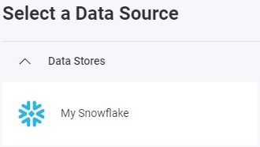
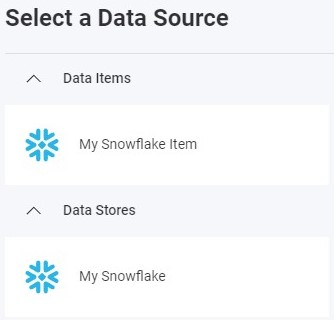

import Tabs from '@theme/Tabs';
import TabItem from '@theme/TabItem';

# Snowflake データ ソース

## はじめに

Snowflake は、データ分析、データ共有、ビジネス インテリジェンス ワークロード向けにスケーラブルなストレージとコンピューティング リソースを提供するクラウドベースのデータ ウェアハウス プラットフォームです。このトピックでは、Reveal アプリケーションで Snowflake データ ソースに接続してデータを視覚化および分析する方法について説明します。

## サーバー構成

### 接続構成

<Tabs groupId="code" queryString>
  <TabItem value="aspnet" label="ASP.NET" default>

```csharp
public class DataSourceProvider : IRVDataSourceProvider
{
    public Task<RVDataSourceItem> ChangeDataSourceItemAsync(IRVUserContext userContext, string dashboardId,
        RVDataSourceItem dataSourceItem)
    {
        if (dataSourceItem is RVSnowflakeDataSourceItem snowflakeDataSourceItem)
        {
            //update underlying data source
            ChangeDataSourceAsync(userContext, snowflakeDataSourceItem.DataSource);

            //only change the table if we have selected our custom data source item
            if (snowflakeDataSourceItem.Id == "MySnowflakeDataSourceItem")
            {
                snowflakeDataSourceItem.Schema = "TPCDS_SF100TCL";
                snowflakeDataSourceItem.Table = "CUSTOMER";
            }
        }

        return Task.FromResult(dataSourceItem);
    }

    public Task<RVDashboardDataSource> ChangeDataSourceAsync(IRVUserContext userContext,
        RVDashboardDataSource dataSource)
    {
        if (dataSource is RVSnowflakeDataSource snowflakeDataSource)
        {
            snowflakeDataSource.Account = "your-account";
            snowflakeDataSource.Host = "your-account-host";
            snowflakeDataSource.Database = "SNOWFLAKE_SAMPLE_DATA";
        }

        return Task.FromResult(dataSource);
    }
}
```

  </TabItem>
  <TabItem value="java" label="Java">

```java
public class DataSourceProvider implements IRVDataSourceProvider {
    public RVDataSourceItem changeDataSourceItem(IRVUserContext userContext, String dashboardsID, RVDataSourceItem dataSourceItem) {

        if (dataSourceItem instanceof RVSnowflakeDataSourceItem snowflakeDataSourceItem) {

            //update underlying data source
            changeDataSource(userContext, dataSourceItem.getDataSource());

            //only change the table if we have selected our custom data source item
            if (Objects.equals(dataSourceItem.getId(), "MySnowflakeDataSourceItem")) {
                snowflakeDataSourceItem.setSchema("TPCDS_SF100TCL");
                snowflakeDataSourceItem.setTable("CUSTOMER");
            }
        }
        return dataSourceItem;
    }

    public RVDashboardDataSource changeDataSource(IRVUserContext userContext, RVDashboardDataSource dataSource) {

        if (dataSource instanceof RVSnowflakeDataSource snowflakeDataSource) {
            snowflakeDataSource.setAccount("your-account");
            snowflakeDataSource.setHost("your-account-host");
            snowflakeDataSource.setDatabase("SNOWFLAKE_SAMPLE_DATA");
        }
        return dataSource;
    }
}
```

  </TabItem>
  <TabItem value="node" label="Node.js">

```javascript
const dataSourceItemProvider = async (userContext, dataSourceItem) => {
    if (dataSourceItem instanceof reveal.RVSnowflakeDataSourceItem) {

        //update underlying data source
        dataSourceProvider(userContext, dataSourceItem.dataSource);

        //only change the table if we have selected our data source item
        if (dataSourceItem.id === "MySnowflakeDataSourceItem") {
            dataSourceItem.schema = "TPCDS_SF100TCL";
            dataSourceItem.table = "CUSTOMER";
        }
    }
    return dataSourceItem;
}

const dataSourceProvider = async (userContext, dataSource) => {
    if (dataSource instanceof reveal.RVSnowflakeDataSource) {
        dataSource.account = "your-account";
        dataSource.host = "your-account-host";
        dataSource.database = "SNOWFLAKE_SAMPLE_DATA";
    }
    return dataSource;
}
```

  </TabItem>
  <TabItem value="node-ts" label="Node.js - TS">

```ts
const dataSourceItemProvider = async (userContext: IRVUserContext | null, dataSourceItem: RVDataSourceItem) => {
    if (dataSourceItem instanceof RVSnowflakeDataSourceItem) {

        //update underlying data source
        dataSourceProvider(userContext, dataSourceItem.dataSource);

        //only change the table if we have selected our data source item
        if (dataSourceItem.id === "MySnowflakeDataSourceItem") {
            dataSourceItem.schema = "TPCDS_SF100TCL";
            dataSourceItem.table = "CUSTOMER";
        }
    }
    return dataSourceItem;
}

const dataSourceProvider = async (userContext: IRVUserContext | null, dataSource: RVDashboardDataSource) => {
    if (dataSource instanceof RVSnowflakeDataSource) {
        dataSource.account = "your-account";
        dataSource.host = "your-account-host";
        dataSource.database = "SNOWFLAKE_SAMPLE_DATA";
    }
    return dataSource;
}
```

  </TabItem>
</Tabs>

:::danger Important
`ChangeDataSourceAsync` メソッドでデータ ソースに加えた変更は、`ChangeDataSourceItemAsync` メソッドには引き継がれません。両方のメソッドでデータ ソースのプロパティを更新する**必要があります**。上記の例に示すように、`ChangeDataSourceItemAsync` メソッド内で、データ ソース項目の基になるデータ ソースをパラメーターとして渡して `ChangeDataSourceAsync` メソッドを呼び出すことをお勧めします。
:::

### 認証

Snowflake の認証は、ユーザー名とパスワードの資格情報を使用してサーバー側で処理されます。すべての認証オプションの詳細については、「[認証](../authentication.md)」トピックを参照してください。

<Tabs groupId="code" queryString>
  <TabItem value="aspnet" label="ASP.NET" default>

```csharp
public class AuthenticationProvider: IRVAuthenticationProvider
{
    public Task<IRVDataSourceCredential> ResolveCredentialsAsync(IRVUserContext userContext, RVDashboardDataSource dataSource)
    {
        IRVDataSourceCredential userCredential = null;
        if (dataSource is RVSnowflakeDataSource)
        {
            userCredential = new RVUsernamePasswordDataSourceCredential("username", "password");
        }
        return Task.FromResult<IRVDataSourceCredential>(userCredential);
    }
}
```

  </TabItem>
  <TabItem value="node" label="Node.js">

```javascript
const authenticationProvider = async (userContext, dataSource) => {
    if (dataSource instanceof reveal.RVSnowflakeDataSource) {
        return new reveal.RVUsernamePasswordDataSourceCredential("username", "password");
    }
    return null;
}
```

  </TabItem>
  <TabItem value="node-ts" label="Node.js - TS">

```ts
const authenticationProvider = async (userContext: IRVUserContext | null, dataSource: RVDashboardDataSource) => {
    if (dataSource instanceof RVSnowflakeDataSource) {
        return new RVUsernamePasswordDataSourceCredential("username", "password");
    }
    return null;
}
```

  </TabItem>
  <TabItem value="java" label="Java">

```java
public class AuthenticationProvider implements IRVAuthenticationProvider {
    @Override
    public IRVDataSourceCredential resolveCredentials(IRVUserContext userContext, RVDashboardDataSource dataSource) {
        if (dataSource instanceof RVSnowflakeDataSource) {
            return new RVUsernamePasswordDataSourceCredential("username", "password");
        }
        return null;
    }
}
```

  </TabItem>
</Tabs>

## クライアント側の実装

### データ ソースの作成

**手順 1** - `RevealView.onDataSourcesRequested` イベントのイベント ハンドラーを追加します。

```js
const revealView = new $.ig.RevealView("#revealView");
revealView.onDataSourcesRequested = (callback) => {
    // Add data source here
    callback(new $.ig.RevealDataSources([], [], false));
};
```

**手順 2** - `RevealView.onDataSourcesRequested` イベント ハンドラーで、`RVSnowflakeDataSource` オブジェクトの新しいインスタンスを作成します。`title` と `subtitle` プロパティを設定します。`RVSnowflakeDataSource` オブジェクトを作成したら、それをデータ ソース コレクションに追加します。

```js
revealView.onDataSourcesRequested = (callback) => {
    const snowflakeDS = new $.ig.RVSnowflakeDataSource();
    snowflakeDS.title = "Snowflake";
    snowflakeDS.subtitle = "Data Source";

    callback(new $.ig.RevealDataSources([snowflakeDS], [], false));
};
```

アプリケーションが実行されたら、新しい可視化を作成すると、新しく作成された Snowflake データ ソースが [データ ソースの選択] ダイアログに表示されます。



### データ ソース項目の作成

データ ソース項目は、ユーザーが視覚化のために選択できる Snowflake データ ソース内の特定のデータセットを表します。クライアント側では、ID、タイトル、サブタイトルのみを指定する必要があります。

```js
revealView.onDataSourcesRequested = (callback) => {
    // Create the data source
    const snowflakeDS = new $.ig.RVSnowflakeDataSource();
    snowflakeDS.title = "My Snowflake Datasource";
    snowflakeDS.subtitle = "Snowflake";

    // Create a data source item
    const snowflakeDSI = new $.ig.RVSnowflakeDataSourceItem(snowflakeDS);
    snowflakeDSI.id = "MySnowflakeDataSourceItem";
    snowflakeDSI.title = "My Snowflake Datasource Item";
    snowflakeDSI.subtitle = "Snowflake";

    callback(new $.ig.RevealDataSources([snowflakeDS], [snowflakeDSI], false));
};
```

アプリケーションが実行されたら、新しい可視化を作成すると、新しく作成された Snowflake 項目データ ソースが [データ ソースの選択] ダイアログに表示されます。



:::info コードの取得

このサンプルのソース コードは [GitHub](https://github.com/RevealBi/sdk-samples-javascript/tree/main/DataSources/Snowflake) にあります。

:::
