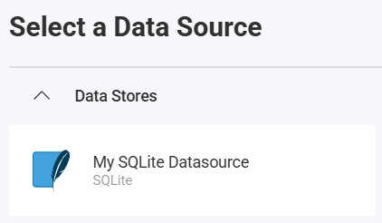
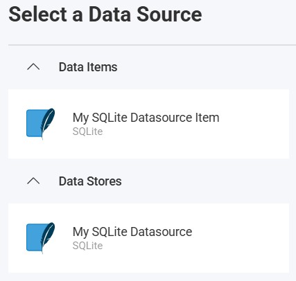

import Tabs from '@theme/Tabs';
import TabItem from '@theme/TabItem';

# SQLite データ ソース

## はじめに

SQLite は、データを 1 つのデータベース ファイルに格納する軽量なファイルベースのリレーショナル データベース エンジンです。このトピックでは、Reveal アプリケーションで SQLite データ ソースに接続してローカル アプリケーション データを視覚化および分析する方法について説明します。

## サーバー構成

### インストール

<Tabs groupId="code" queryString>
  <TabItem value="aspnet" label="ASP.NET" default>

**手順 1** - Reveal SQLite コネクタ パッケージをインストールします。

ASP.NET アプリケーションの場合、SQLite サポートを有効にするには、別の NuGet パッケージをインストールする必要があります。

```bash
dotnet add package Reveal.Sdk.Data.SQLite
```

**手順 2** - アプリケーションに SQLite データ ソースを登録します。

```csharp
builder.Services.AddControllers().AddReveal( builder =>
{
    builder.DataSources.RegisterSQLite();
});
```

  </TabItem>
  <TabItem value="node" label="Node.js">

Node.js アプリケーションの場合、SQLite データ ソースはメインの Reveal SDK パッケージに既に含まれています。標準の Reveal SDK セットアップ以外に追加のインストールは必要ありません。

  </TabItem>
  <TabItem value="node-ts" label="Node.js - TS">

Node.js TypeScript アプリケーションの場合、SQLite データ ソースはメインの Reveal SDK パッケージに既に含まれています。標準の Reveal SDK セットアップ以外に追加のインストールは必要ありません。

  </TabItem>
  <TabItem value="java" label="Java">

Java アプリケーションの場合、SQLite データ ソースはメインの Reveal SDK パッケージに既に含まれています。標準の Reveal SDK セットアップ以外に追加のインストールは必要ありません。

  </TabItem>
</Tabs>

### 接続構成

<Tabs groupId="code" queryString>
  <TabItem value="aspnet" label="ASP.NET" default>

```csharp
// Create a data source provider
public class DataSourceProvider : IRVDataSourceProvider
{
    public async Task<RVDataSourceItem> ChangeDataSourceItemAsync(IRVUserContext userContext, string dashboardId, RVDataSourceItem dataSourceItem)
    {
        // Required: Update the underlying data source
        await ChangeDataSourceAsync(userContext, dataSourceItem.DataSource);

        if (dataSourceItem is RVSQLiteDataSourceItem sqliteItem)
        {
            // Configure specific item properties if needed
            if (sqliteItem.Id == "sqlite_customers")
            {
                sqliteItem.Table = "Customers";

                // Optional: override date inference for this item only
                // sqliteItem.DisableDateTypeInference = true;
            }
        }

        return dataSourceItem;
    }

    public Task<RVDashboardDataSource> ChangeDataSourceAsync(IRVUserContext userContext, RVDashboardDataSource dataSource)
    {
        if (dataSource is RVSQLiteDataSource sqliteDS)
        {
            // Configure connection properties
            sqliteDS.Database = "your-sqlite-database-path";

            // Optional: keep ISO date strings and Unix epoch values as raw types
            // sqliteDS.DisableDateTypeInference = true;
        }

        return Task.FromResult(dataSource);
    }
}
```

  </TabItem>
  <TabItem value="node" label="Node.js">

```javascript
// Create data source providers
const dataSourceItemProvider = async (userContext, dataSourceItem) => {
    // Required: Update the underlying data source
    await dataSourceProvider(userContext, dataSourceItem.dataSource);

    if (dataSourceItem instanceof reveal.RVSQLiteDataSourceItem) {
        // Configure specific item properties if needed
        if (dataSourceItem.id === "sqlite_customers") {
            dataSourceItem.table = "Customers";

            // Optional: override date inference for this item only
            // dataSourceItem.disableDateTypeInference = true;
        }
    }

    return dataSourceItem;
}

const dataSourceProvider = async (userContext, dataSource) => {
    if (dataSource instanceof reveal.RVSQLiteDataSource) {
        // Configure connection properties
        dataSource.database = "your-sqlite-database-path";

        // Optional: keep ISO date strings and Unix epoch values as raw types
        // dataSource.disableDateTypeInference = true;
    }

    return dataSource;
}
```

  </TabItem>
  <TabItem value="node-ts" label="Node.js - TS">

```ts
// Create data source providers
const dataSourceItemProvider = async (userContext: IRVUserContext | null, dataSourceItem: RVDataSourceItem) => {
    // Required: Update the underlying data source
    await dataSourceProvider(userContext, dataSourceItem.dataSource);

    if (dataSourceItem instanceof RVSQLiteDataSourceItem) {
        // Configure specific item properties if needed
        if (dataSourceItem.id === "sqlite_customers") {
            dataSourceItem.table = "Customers";

            // Optional: override date inference for this item only
            // dataSourceItem.disableDateTypeInference = true;
        }
    }

    return dataSourceItem;
}

const dataSourceProvider = async (userContext: IRVUserContext | null, dataSource: RVDashboardDataSource) => {
    if (dataSource instanceof RVSQLiteDataSource) {
        // Configure connection properties
        dataSource.database = "your-sqlite-database-path";

        // Optional: keep ISO date strings and Unix epoch values as raw types
        // dataSource.disableDateTypeInference = true;
    }

    return dataSource;
}
```

  </TabItem>
  <TabItem value="java" label="Java">

```java
// Create a data source provider
public class DataSourceProvider implements IRVDataSourceProvider {
    public RVDataSourceItem changeDataSourceItem(IRVUserContext userContext, String dashboardId, RVDataSourceItem dataSourceItem) {
        // Required: Update the underlying data source
        changeDataSource(userContext, dataSourceItem.getDataSource());

        if (dataSourceItem instanceof RVSQLiteDataSourceItem sqliteItem) {
            // Configure specific item properties if needed
            if ("sqlite_customers".equals(sqliteItem.getId())) {
                sqliteItem.setTable("Customers");

                // Optional: override date inference for this item only
                // sqliteItem.setDisableDateTypeInference(true);
            }
        }

        return dataSourceItem;
    }

    public RVDashboardDataSource changeDataSource(IRVUserContext userContext, RVDashboardDataSource dataSource) {
        if (dataSource instanceof RVSQLiteDataSource sqliteDS) {
            // Configure connection properties
            sqliteDS.setDatabase("your-sqlite-database-path");

            // Optional: keep ISO date strings and Unix epoch values as raw types
            // sqliteDS.setDisableDateTypeInference(true);
        }

        return dataSource;
    }
}
```

  </TabItem>
</Tabs>

`Database` は SQLite データベース ファイルを指し、絶対パスと相対パスの両方を指定できます。.NET の場合、相対パスは `AppContext.BaseDirectory` を基準に解決されます。Node.js および Java の場合、相対パスはアプリケーションの作業ディレクトリを基準に解決されます。

`DisableDateTypeInference` は `RVSQLiteDataSource` と `RVSQLiteDataSourceItem` の両方でオプションです。有効にすると、Reveal は SQLite の日付に似た値を、自動的に日付/日時フィールドに昇格させる代わりに、生の文字列または数値型のまま保持します。

:::danger 重要
`ChangeDataSourceAsync` メソッドでデータ ソースに加えた変更は、`ChangeDataSourceItemAsync` メソッドには引き継がれません。両方のメソッドでデータ ソースのプロパティを更新する**必要があります**。上記の例に示すように、`ChangeDataSourceItemAsync` メソッド内で、データ ソース項目の基になるデータ ソースをパラメーターとして渡して `ChangeDataSourceAsync` メソッドを呼び出すことをお勧めします。
:::

### 認証

SQLite は認証を必要としません。`Database` プロパティを Reveal でクエリする SQLite ファイルに設定することで、サーバー側でアクセスを構成します。

## クライアント側の実装

クライアント側では、データ ソースの ID、タイトル、サブタイトルなどの基本プロパティのみを指定する必要があります。実際のデータベース ファイル パスとテーブルの選択はサーバー側で行われます。

### データ ソースの作成

**手順 1** - `RevealView.onDataSourcesRequested` イベントのイベント ハンドラーを追加します。

```js
const revealView = new RevealView("#revealView");
revealView.onDataSourcesRequested = (callback) => {
    // Add data source here
    callback(new RevealDataSources([], [], false));
};
```

**手順 2** - `RevealView.onDataSourcesRequested` イベント ハンドラーで、`RVSQLiteDataSource` オブジェクトの新しいインスタンスを作成します。`title` と `subtitle` プロパティを設定します。`RVSQLiteDataSource` オブジェクトを作成したら、それをデータ ソース コレクションに追加します。

```js
revealView.onDataSourcesRequested = (callback) => {
    const sqliteDS = new RVSQLiteDataSource();
    sqliteDS.id = "sqlite_ds";
    sqliteDS.title = "My SQLite Datasource";
    sqliteDS.subtitle = "SQLite";

    callback(new RevealDataSources([sqliteDS], [], false));
};
```

アプリケーションが実行されたら、新しい可視化を作成すると、新しく作成された SQLite データ ソースが [データ ソースの選択] ダイアログに表示されます。



### データ ソース項目の作成

データ ソース項目は、ユーザーが視覚化のために選択できる SQLite データ ソース内の特定のテーブルを表します。クライアント側では、ID、タイトル、サブタイトルのみを指定する必要があります。

```js
revealView.onDataSourcesRequested = (callback) => {
    // Create the data source
    const sqliteDS = new RVSQLiteDataSource();
    sqliteDS.id = "sqlite_ds";
    sqliteDS.title = "My SQLite Datasource";
    sqliteDS.subtitle = "SQLite";

    // Create a data source item
    const sqliteDSI = new RVSQLiteDataSourceItem(sqliteDS);
    sqliteDSI.id = "sqlite_dsi";
    sqliteDSI.title = "My SQLite Datasource Item";
    sqliteDSI.subtitle = "SQLite";

    callback(new RevealDataSources([sqliteDS], [sqliteDSI], false));
};
```

アプリケーションが実行されたら、新しい可視化を作成すると、新しく作成された SQLite データ ソース項目が [データ ソースの選択] ダイアログに表示されます。



## その他のリソース

- [SQLite ドキュメント](https://www.sqlite.org/docs.html)

## API リファレンス

<Tabs groupId="code" queryString>
<TabItem value="aspnet" label="ASP.NET" default>

* [RVSQLiteDataSource](https://help.revealbi.io/api/aspnet/latest/Reveal.Sdk.Data.SQLite.RVSQLiteDataSource.html) - SQLite データ ソースを表します
* [RVSQLiteDataSourceItem](https://help.revealbi.io/api/aspnet/latest/Reveal.Sdk.Data.SQLite.RVSQLiteDataSourceItem.html) - SQLite データ ソース項目を表します

</TabItem>
<TabItem value="node" label="Node.js">

* [RVSQLiteDataSource](https://help.revealbi.io/api/javascript/latest/classes/RVSQLiteDataSource.html) - SQLite データ ソースを表します
* [RVSQLiteDataSourceItem](https://help.revealbi.io/api/javascript/latest/classes/RVSQLiteDataSourceItem.html) - SQLite データ ソース項目を表します

</TabItem>
</Tabs>
