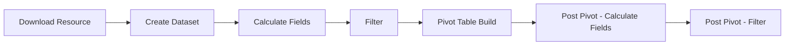

# キャッシュ

Reveal SDK のキャッシュは、クエリされたすべてのデータを、キャッシュと呼ばれる高速な組み込みデータベースに保存することでパフォーマンスを最適化するように設計されたデフォルトの仕組みです。このプロセスにより、頻繁にアクセスされるデータがすぐに利用できるようになり、クエリの開始時に、要求されたデータがすでにキャッシュに存在するかどうかが SDK によって自動的にチェックされます。キャッシュ ヒットの場合、SDK は元のソースへの追加リクエストを必要とせずに、情報を迅速に取得します。

## キャッシュの仕組み
SDK を通じてデータをクエリすると、パイプライン ステップごとに、そのデータを取得するために使用されるすべてのオプションを含む新しい**キー**が作成されます。この**キー**は、パイプライン ステップからの結果データと一緒に保存されます。同じ操作を繰り返すと、各パイプライン ステップに固有のキーが認識され、対応するデータがキャッシュから取得されます。ただし、順序付けやフィルタリングなど、特定のステップのデータ クエリの構成を変更すると、**キー**は一致せず、影響を受けるステップおよびそれ以降のステップで処理が実行されます。この新しいクエリは結果とともに保存されます。たとえば、Excel ファイルから取得したデータの順序を変更しても、ファイルが再度ダウンロードされることはなく、フィルターやその後のステップなど、変更が必要な特定のステップの処理のみが実行されます。

### 処理パイプライン
処理パイプラインは、データがシステムで処理される一連のステージを示します。処理パイプラインを理解することは、キャッシュがどこでどのように動作するかを識別するために重要であり、データ取得の最適化と全体的な処理効率の向上に重要な役割を果たします。



<br/>

- `[Download Resource]` ステージは、通常、CSV/Json/Excel ファイルをダウンロードするリソースベースのデータ ソースを使用する場合にのみ適用されます。
- 要求されたデータによっては、一部のステージがスキップされたり、変更が加えられなかったりする場合があります。たとえば、処理するピボット後の計算フィールドがないか、データ ソースに送信されるクエリにすべてのフィルターが含まれている場合は、`[Filter]` ステップが不要になる可能性があります。
- SSAS データ ソースは別の処理パイプラインを使用するため、これらのステージは SSAS データ ソースには適用されません。

### キャッシュ ファイル
デフォルトでは、キャッシュ ファイルは現在のユーザーの一時ディレクトリ内の `RevealCache_XXXX` という名前のフォルダーに保存されます。`XXXX` はインスタンスを識別する番号です。`CachePath` と `DataCachePath` という 2 つの構成プロパティを使用して、このデフォルトの動作をオーバーライドできます。

```cs
builder.Services
    .AddControllers()
    .AddReveal(revealSetupBuilder =>
    {
        revealSetupBuilder.AddSettings(settings =>
        {
            settings.CachePath = "your-cache-path";
            settings.DataCachePath = "your-data-cache-path";
        });
    });
```

- `CachePath` は、残りのキャッシュ ファイル (ダウンロード ファイルなど) が保存されるディレクトリを指します。デフォルトでは、システムの一時ディレクトリにある `RevealCache_XXXX` という名前のディレクトリになります。
- `DataCachePath` は、ファイル キャッシュ データが保存されるディレクトリを指します。デフォルトは `CachePath` です。

追加のプロパティを構成して、キャッシュ サイズを制御できます。

```cs
builder.Services.AddControllers().AddReveal(revealSetupBuilder =>
{
    revealSetupBuilder.AddSettings(settings =>
    {
        settings.MaxStorageCells = 10000000;
        settings.MaxDownloadSize = 209715200;
        settings.MaxStringCellSize = 256;
        settings.MaxTotalStringsSize = 64000000;
    });
});
```

- `MaxStorageCells` は、任意のデータ ソースから処理されるセルの予想される最大サイズを指します。エンジンは、キャッシュにディスク領域を使いすぎないようにします。この設定は、キャッシュ管理のヒントを提供します。デフォルトは 1000 万セルです。
- `MaxDownloadSize` は、1 回のダウンロード (CSV ファイルなど) の最大サイズをバイト単位で表します。デフォルトは 200 MB です。
- `MaxStringCellSize` は、データセット列の文字列が持つことができる文字数の制限を指します。デフォルトは 256 です。
- `MaxTotalStringsSize` は、すべてのセルの文字の総数として指定された、ピボット テーブルまたはグリッドの予想される最大サイズを指します。この設定によりメモリ管理のヒントを提供し、エンジンによるメモリの過多な使用を避けます。デフォルトは 6400 万です。

### キャッシュの種類
**Download (ダウンロード)** - `[Download Resource]` ステージで使用されるこのキャッシュは、CSV/Excel/Json ファイルからデータを読み取るときに、ダウンロードされたリソースを保存します。ファイルシステム キャッシュは `[RevealCache]/download` に保存され、関連するメタデータは `[RevealCache]/download.sqlite` に保存されます。

個々のダウンロードは、`MaxDownloadSize` 設定で指定されたバイト数によって制限されます。ダウンロード キャッシュの全体的なサイズは 5GB に固定されています。現時点ではこの制限を変更するための API が存在しないことに注意してください。

**Dataset (データセット)** - `[Create Dataset]` ステージと `[Calculate Fields]` ステージで使用されます。

Sqlite ファイルは `[RevealCache]/dataset` に保存され、メタデータは `dataset.sqlite` に存在します。

一部のデータセットはメモリ内に生成され、メモリ内のデータセット キャッシュにも保存されます。

個々のデータセットのサイズは、一連のパラメーターによって間接的に制限されます: `MaxStorageCells` および `MaxTotalStringsSize`。データセット キャッシュの合計サイズは 5 GB に固定されています。現時点では、この制限を変更するために使用できる API はありません。

**Tabular Data (表形式のデータ)** - このキャッシュは、すべてのステージを実行した後の結果を保持します。

データは JSON としてシリアル化され、メモリ内キャッシュに一時的に保存されます。

キャッシュのサイズに制限はありません。

## キャッシュの更新
キャッシュの更新には、精度を維持し、最新の情報を反映するために、キャッシュ内に保存されているデータを更新することが含まれます。デフォルトでは、キャッシュは `1 日に 1 回`更新されるように設定されています。キャッシュ更新の動作は視覚化 UI から変更でき、ユーザーは特定の要件に基づいて更新期間を変更したり、手動更新をトリガーしたりできます。

メニューの更新オプション (3 つの点で示されている) をクリックするだけで、手動更新をトリガーできます。


データの更新頻度コンボ ボックスから別の値を選択することで、更新頻度を変更できます。このオプションは、データ ソース構成ダイアログで使用できます。

使用できるオプションは以下のとおりです。
- 常に
- 1 時間に 1 回
- 1 日に 1 回
- 週に １ 回


## キャッシュの無効化
キャッシュを無効にすることは利用可能なオプションではありません。ただし、データ ソースのデータ更新頻度を `[常に]` に設定すると、同様の結果が得られます。この構成により、アプリケーションはキャッシュをバイパスして常に新しいデータを取得できるようになります。クエリ中にキャッシュが参照されない場合でも、処理されたデータは保存されることに注意してください。このアプローチでは最新の情報へのアクセスが保証されますが、リアルタイム アクセスを利用する場合、データ ソースへの負荷の増加による潜在的なパフォーマンスへの影響に留意することが重要です。開発者は、デバッグ目的や、頻繁に変更される動的データを扱う場合に、一時的にこの構成を選択することがあります。

キャッシュをバイパスするには、データ ソースのデータ更新頻度を `[常に]` に設定します。


## キャッシュのクリア

キャッシュのクリアは、キャッシュが保存されているフォルダーの内容を削除するだけ、と簡単です。このプロセスはストレージ領域を解放し、キャッシュを確実にリセットするのに役立ちます。さらに、アプリケーションは次のクエリ時に元のソースから最新のデータを取得できるため、更新された最新のエクスペリエンスが提供されます。