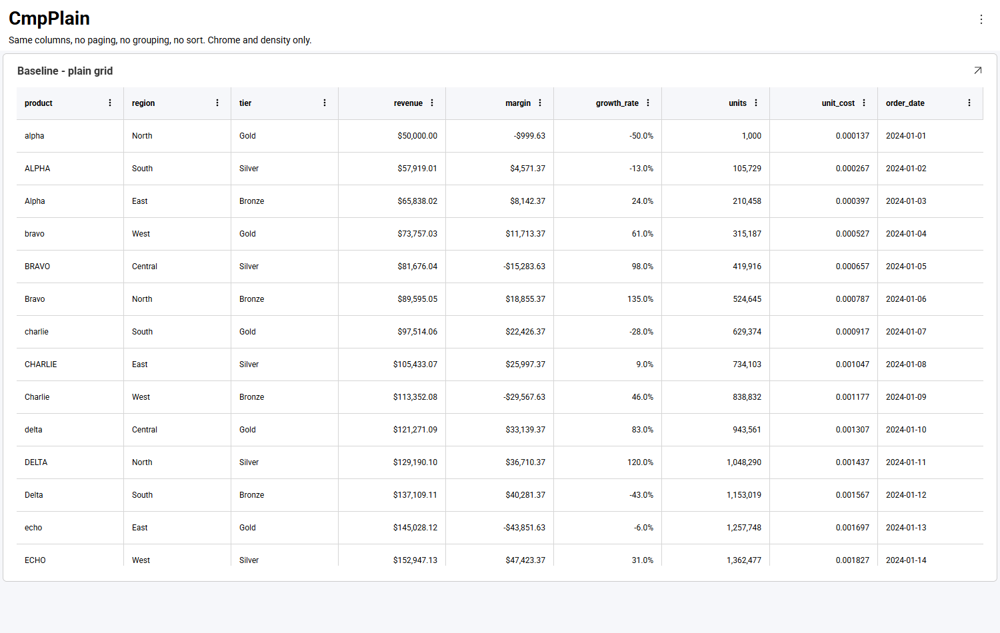
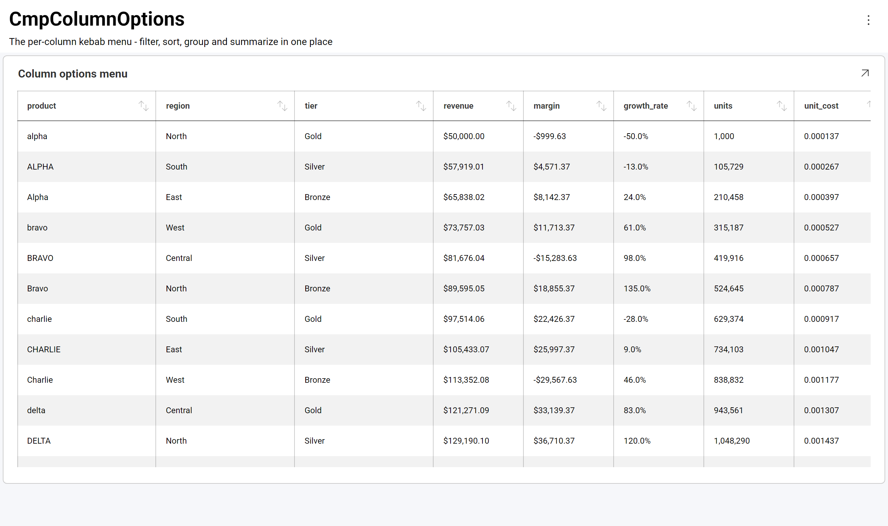
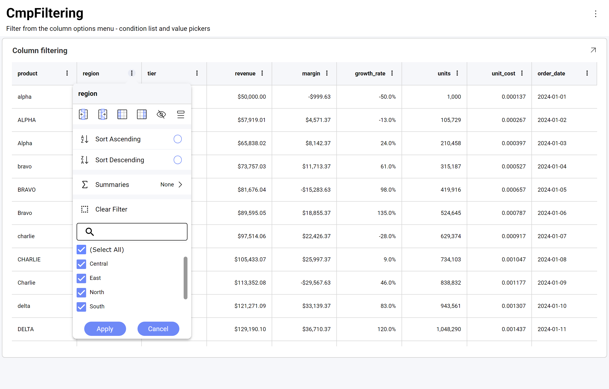
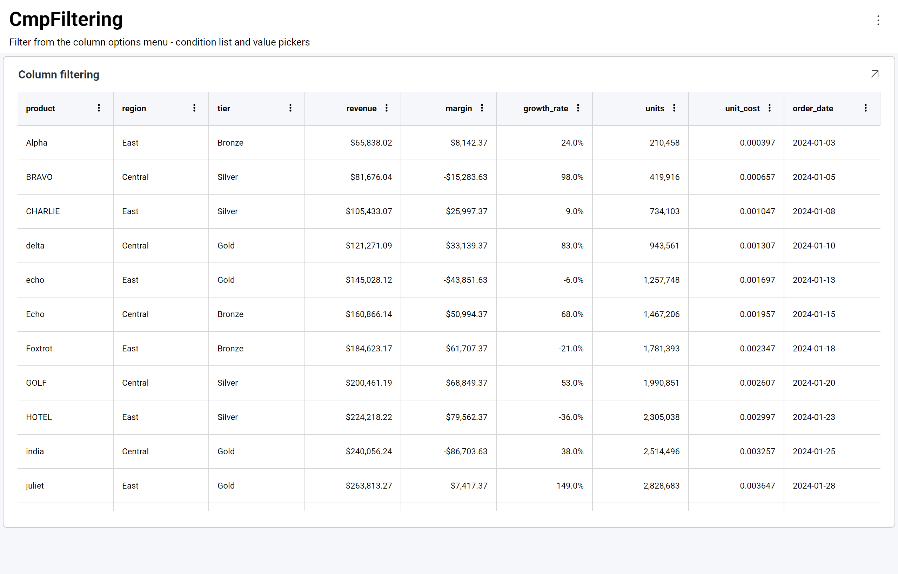
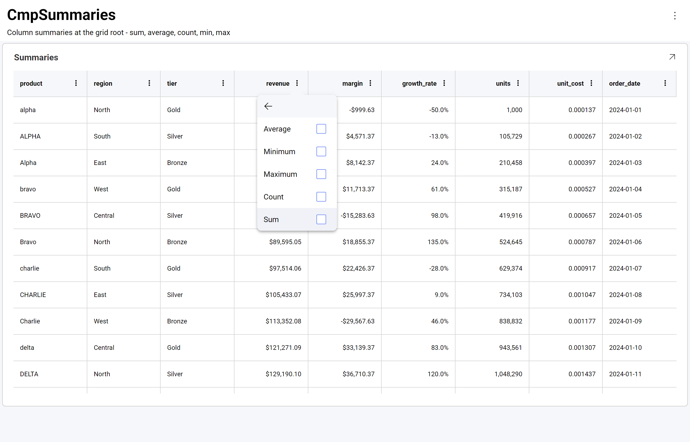
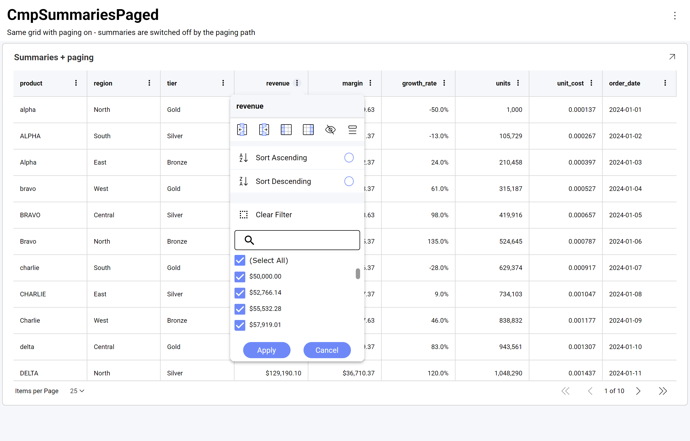
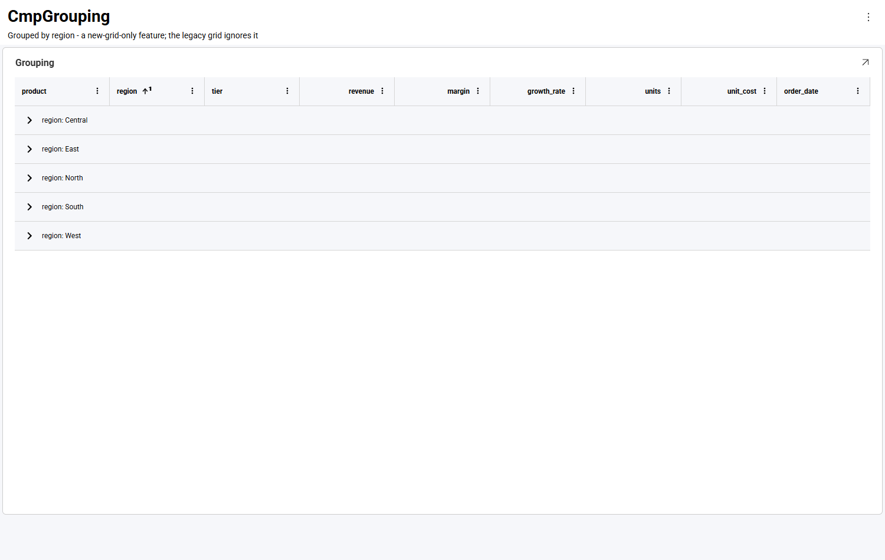
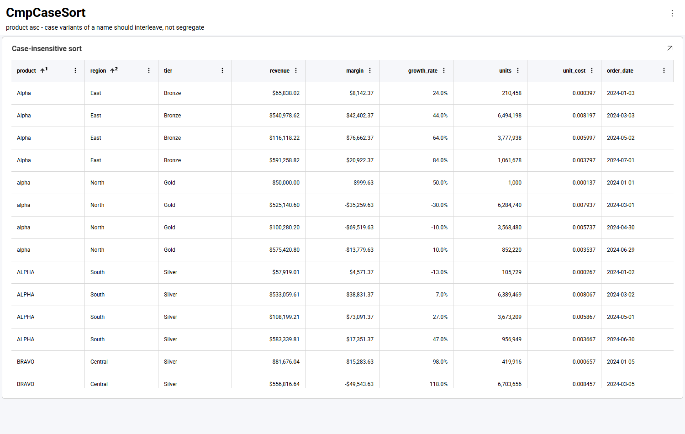
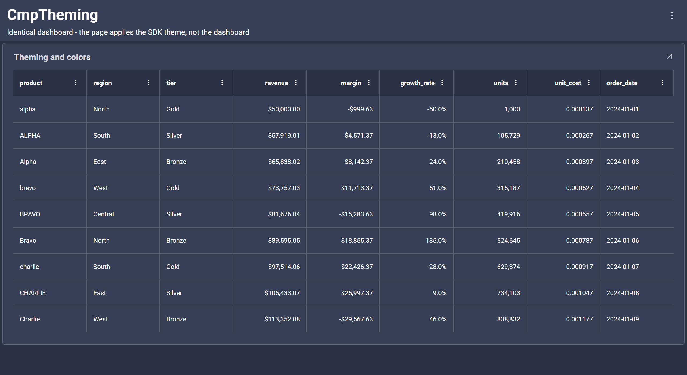
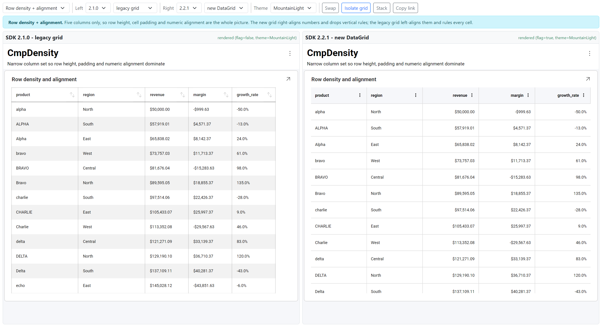

# データ グリッド

**データ グリッド**は、グリッド表示形式の最新の実装です。従来のグリッドが提供する表形式のレイアウトに加えて、フィルタリング、集計、グループ化、固定を行える列オプション メニューを列ごとに追加します。



データ グリッドは、バージョン 2.2.0 以降の**デフォルトのグリッド表示形式**です。新しいグリッド タイプではありません。同じ `Grid` 表示形式が、`newDataGrid` 機能に応じて従来のグリッドまたはデータ グリッドとしてレンダリングされます。既存のダッシュボードは再作成することなくデータ グリッドでレンダリングされ、ダッシュボード ファイルの内容は変更されません。

:::note

**すでにデータ グリッドをご利用の場合、このトピックに新しい内容はありません。**以前のバージョンで `newDataGrid` 機能を有効にしていた場合、これまで使用してきたグリッドとまったく同じものです。グリッドのハイパーリンク列を除き、このトピックで新しい機能が追加されるわけではなく、アプリケーションの動作も変わりません。

2.2.0 で変わったのは*デフォルト*です。機能フラグを設定していなかったアプリケーションでも、データ グリッドが使用されるようになりました。このトピックは、データ グリッドが従来のグリッドと比べて何を提供するのかを一箇所にまとめることを目的としています。初めてデータ グリッドに触れる方がその利点を把握でき、両者を比較したい方が違いを正確に確認できます。

:::

## データ グリッドの新機能

以下の一覧はすべて**データ グリッドの新機能**です。従来のグリッドにはこれらの機能はありません。

| 機能 | エンドユーザーができること | 有効化の方法 |
|---|---|---|
| [列オプション メニュー](#列オプション-メニュー) | すべての列ヘッダーに表示される **⋮** ボタン。並べ替え、フィルタリング、集計、グループ化、固定、列の表示/非表示を 1 つのメニューにまとめています | 自動 |
| [列のフィルタリング](#列のフィルタリング) | 列の値を検索可能なチェックボックス リストから選択し、ヘッダーから任意の列をフィルターできます | 自動 |
| [列の集計](#列の集計) | 数値列の合計、平均、カウント、最小値、最大値を集計行に表示します | 自動 — ただし [集計とページング](#集計とページング) を参照してください |
| [グループ化](#グループ化) | 折りたたみ可能なグループ行。列メニューから任意の深さでグループ化できます | メニューからの操作は自動。保存されたグループ化はダッシュボードで設定します |
| [列の固定](#列オプション-メニュー) | グリッドをスクロールしても列が左端または右端に固定されたままになります | 自動 |
| [列のサイズ変更と移動](#列のサイズ変更と移動) | ヘッダーの端をドラッグして列のサイズを変更し、中央をドラッグして列を移動できます。従来のグリッドでは列の幅は固定です | 自動 |
| [列の表示/非表示](#列オプション-メニュー) | ダッシュボードを編集せずに表示する列を選択できます | 自動 |
| [複数列の並べ替え](#複数列の並べ替え) | 2 列目を並べ替えると並べ替えが追加され、並べ替えられた各ヘッダーに**並べ替え順序の番号**が表示されます。並べ替えでは大文字と小文字は区別されません | 自動 |
| [セルの選択とコピー](#セルの選択とコピー) | セルをクリックするか範囲をドラッグして、**Ctrl+C** で CSV としてコピーできます。値は表示されているとおりに書式設定されます | 自動 |
| [テーマ設定](#テーマ設定) | 列メニューを含むすべての要素で、適用中の Reveal テーマに従います | `RevealSdkSettings.theme` |
| ハイパーリンク列 | 行ごとのリンク先を持つリンクとしてセルをレンダリングします | ダッシュボードで設定します。[ハイパーリンク列](hyperlink-columns.md) を参照してください |

### 機能を個別に有効にする必要はありますか?

**いいえ。** 機能ごとのスイッチはクライアント側にもサーバー側にも存在せず、`.rdash` ファイルに追加するものもありません。単一の `newDataGrid` 機能がどちらのグリッド実装をレンダリングするかを選択し、上記の表にあるすべての機能は SDK 自体によって構成された状態で提供されます。

つまり現時点では、**個々の機能を個別に無効にする方法はサポートされていません**。たとえば、列オプション メニューを残したままフィルター セクションだけを削除したり、コピー機能を無効にしたりすることはできません。選択できるのは、どちらのグリッドをレンダリングするかのみです。

```js
// データ グリッド (2.2.0 以降のデフォルト) - 上記のすべての機能が有効になります
RevealSdkSettings.betaFeatures.enable("newDataGrid");

// 従来のグリッド - 上記の機能はいずれも使用できません
RevealSdkSettings.betaFeatures.disable("newDataGrid");
```

:::info

**クライアント側のみ**。どちらのグリッドをレンダリングするかは表示形式の構築時にブラウザー側で決定されるため、サーバー SDK はこれに関与せず、構成も不要です。1 つのサーバーで、どちらのグリッドを使用するアプリケーションにも対応できます。

:::

構成可能な例外は 2 つあります。`RevealSdkSettings.theme` で適用する**テーマ** ([テーマ設定](#テーマ設定) を参照) と、ダッシュボード自体で作成されるもの (グループ化、並べ替え、フィールドの書式設定、名前を変更したキャプション、ハイパーリンク列) です。

## グリッドの切り替え

データ グリッドはデフォルトで有効になっているため、使用するためのコードは必要ありません。従来のグリッドに戻すには、`RevealView` を作成する前に機能を無効にします。

```js
RevealSdkSettings.betaFeatures.disable("newDataGrid");
```

明示的に有効にするには (たとえば、機能は利用できるもののデフォルトでは無効になっているバージョン 2.1.0 の場合) 次のようにします。

```js
RevealSdkSettings.betaFeatures.enable("newDataGrid");
```

機能 API の詳細については、[ベータ機能](beta-features.md) を参照してください。

:::info

この機能は表示形式の構築中に読み取られるため、`RevealView` を作成する前、つまりアプリケーションの起動時に変更してください。ビューがレンダリングされた後に切り替えても、すでに画面に表示されているグリッドは変更されません。

:::

:::caution

**以前のバージョンからアップグレードする場合**: データ グリッドは 2.2.0 でデフォルトになったため、これまで従来のグリッドでレンダリングされていたダッシュボードはデータ グリッドでレンダリングされるようになります。最も目立つ違いは、数値列が右揃えになることと、行の交互の網かけがなくなることです。[レイアウトと配置](#レイアウトと配置) および [行の網かけ](#行の網かけ) を参照してください。

条件付き書式の動作も異なります。同じセルに複数のルールが一致する場合、データ グリッドはそれらすべてをリスト順に適用し、重複するプロパティについては後のルールが優先されます。

:::

## 列オプション メニュー

データ グリッドのすべての列には、ヘッダーに **⋮** ボタンがあります。このボタンで列オプション メニューが開き、並べ替え、フィルタリング、集計、グループ化、固定、列の表示/非表示を 1 か所にまとめて操作できます。


| セクション | 動作 |
|---|---|
| **左に固定 / 右に固定** | グリッドを水平方向にスクロールしても表示されたままになるよう、列を左端または右端に固定します。 |
| **グループ化 / 列の表示 / 列を非表示** | この列で行をグループ化するか、表示する列を選択するか、この列を非表示にします。 |
| **昇順で並べ替え / 降順で並べ替え** | この列で並べ替えます。複数の列を並べ替えると、前の並べ替えが置き換えられるのではなく、複数列の並べ替えが構成されます。 |
| **集計** | 列を集計します。[列の集計](#列の集計) を参照してください。数値列のみが対象です。 |
| **フィルターのクリア** と値の一覧 | 列をフィルターします。[列のフィルタリング](#列のフィルタリング) を参照してください。 |

従来のグリッドには同等の機能がありません。ヘッダーには並べ替え矢印のみが表示され、メニュー、フィルタリング、集計はいずれも使用できません。



:::tip

**ヘッダーのテキスト**をクリックすると列が並べ替えられます。メニューは **⋮** ボタンからのみ開きます。ヘッダーをクリックすると列が選択される従来のグリッドとは動作が異なります。

:::

## 列のフィルタリング

各列は、その列のオプション メニューからフィルターできます。値の一覧は列の一意の値から作成され、検索が可能です。値の多い列で特に便利です。



**(すべて選択)** ですべての値を一括で切り替え、除外する値のチェックを外してから **[適用]** を選択します。次の例では、`region` 列を **Central** と **East** でフィルターしています。



**[フィルターのクリア]** は、その列のフィルターのみを解除します。

異なる列のフィルターは組み合わされるため、`region` でフィルターした後に `tier` でフィルターすると、両方の条件に一致する行に絞り込まれます。

:::info

値は一覧に**書式設定された状態**で、セルに表示されるとおりに表示されます。通貨列であれば `50000` ではなく `$50,000.00` と表示されます。フィルタリング自体は基になる値に対して行われます。

:::

列のフィルタリングは、ダッシュボード フィルターに追加して適用されます。これはデータ グリッドのみの機能です。従来のグリッドでは、ダッシュボード フィルターを通じてのみグリッドをフィルターできます。

## 列の集計

数値列では、集計行に集計値を表示できます。列の **⋮** メニューを開いて **[集計]** を選択します。



**平均**、**最小値**、**最大値**、**カウント**、**合計**の 5 つの集計を利用できます。単一選択ではなくチェックボックスであるため、1 つの列に複数の集計を同時に表示できます。

### 集計とページング

グリッドでページングが有効になっている場合、集計は無効になり、列オプション メニューから **[集計]** の項目が削除されます。ページングされたグリッドは一度に 1 ページ分の行のみを保持するため、そこから計算した集計は結果セット全体ではなく現在のページを表すことになるためです。

次の図は、ページングを有効にした同じグリッドです。メニューは **[降順で並べ替え]** から直接 **[フィルターのクリア]** に続いています。



並べ替え、フィルタリング、グループ化はページングの影響を受けず、通常どおり動作します。

:::caution

グリッドでページングを有効にした後に列の集計が表示されなくなった場合は、これが原因です。ページングされたグリッドで合計を表示するには、別の表示形式として追加してください。

:::

## グループ化

データ グリッドはグループ化された行をレンダリングします。列のオプション メニューからグループ化するか、エディターで表示形式に `Grouped Columns` を設定します。



グループ化は複数のレベルに対応しており、各レベルは個別に展開および折りたたみができます。


:::info

グループ化は**データ グリッドの機能**です。従来のグリッドはダッシュボードのグループ化設定を無視してフラットな表をレンダリングするため、同じダッシュボード ファイルでもこの機能が有効かどうかで表示が大きく異なります。

グループはデフォルトで折りたたまれた状態でレンダリングされます。ただし、ページングされたグリッドでは展開された状態でレンダリングされます。

:::

## 複数列の並べ替え

2 列目を並べ替えると、並べ替えが置き換えられるのではなく**追加**されます。並べ替えられた各ヘッダーには、並べ替え順序における位置を示す**並べ替え順序の番号**が上付き文字で表示されます。



この例では、`product ↑¹` が最初に、`region ↑²` が 2 番目に並べ替えられます。並べ替えでは大文字と小文字が区別されないため、`Alpha`、`alpha`、`ALPHA` は大文字と小文字のブロックに分かれることなく、まとめて並べ替えられます。

## テーマ設定

データ グリッドは、`RevealSdkSettings.theme` で適用されたテーマに従います。ヘッダーとセルの背景、テキストと区切り線の色、スクロールバー、選択されたセルのハイライト、集計行、そしてツールチップを含む列オプション メニューのすべての要素が、適用中のテーマから取得されます。

```js
RevealSdkSettings.theme = new OceanDarkTheme();
```

Mountain Light:


Ocean Dark — 同じダッシュボードで、テーマのみを変更した状態です。



カスタム テーマも同様に機能します。テーマ プロパティの一覧については、[ダッシュボードのテーマ設定](theming-dashboards.md) を参照してください。

:::info

テーマは `RevealView` を作成する**前に**設定してください。グリッドはレンダリング時にテーマの色を解決するため、後からテーマを割り当てても、すでに画面に表示されているグリッドは再描画されません。

テーマは表示形式に色を適用しますが、それをホストしているページには適用しません。周囲のページと調和させるには、`theme.dashboardBackgroundColor` を独自のレイアウトに適用してください。適用しない場合、ダーク テーマでは明るいページ上に暗いグリッドが表示されます。

:::

## 行の網かけ

従来のグリッドは行を交互に網かけします。データ グリッドではこれを行いません。行は単一のフラットな背景に配置され、水平の区切り線で区切られます。

左が従来のグリッド、右がデータ グリッドで、同じテーマを適用した状態です。


:::caution

行の交互の網かけは、データ グリッドでは**現在利用できません**。また、有効にするためのプロパティもありません。これは、ダッシュボードを従来のグリッドから切り替える際に最も目立つスタイルの違いです。

データ グリッドでは、行の交互の網かけが**意図的に無効化**されています。この機能は、グループ化、セルの結合、条件付き書式などの高度な機能と競合し、表示が一貫しなくなるためです。基になるコードは存在しますが、すべてのグリッド機能で一貫して動作する設計が決まるまで無効化されています。

:::

## レイアウトと配置

メニュー以外にも、データ グリッドは行のレイアウト方法が従来のグリッドと異なります。左が従来のグリッド、右がデータ グリッドです。



| | 従来のグリッド | データ グリッド |
|---|---|---|
| **数値の配置** | テキストと同じく左揃え | **右揃え**。桁が揃うため大小を比較しやすくなります |
| **セルの罫線** | すべてのセルに垂直と水平の罫線 | 水平の罫線のみで、より細い線 |
| **行の網かけ** | 行を交互に網かけ | フラットな背景 |
| **行の高さ** | より高密度 | セルの余白が広く、行が高い |
| **ヘッダー** | すべての列に並べ替え矢印 | 列ごとに **⋮** メニュー。並べ替えられた列には並べ替え順序の番号を表示 |
| **列の幅** | 固定。表示形式からはみ出すことがある | 利用可能な幅に合わせて配置され、ドラッグでサイズ変更が可能 |

数値列の右揃えは通常、最初に気付く違いです。データ グリッドを展開する前にエンドユーザーに伝えておくとよいでしょう。

## 列のサイズ変更と移動

どちらの操作も列ヘッダーで行います。いずれも**データ グリッドの機能**であり、従来のグリッドはどちらにも反応しません。

| 操作 | 結果 |
|---|---|
| ヘッダーの**右端**をドラッグ | その列のサイズを変更します。隣接する列の幅は維持され、はみ出した部分は水平スクロール領域になります。 |
| ヘッダーの**中央**をドラッグ | 列を移動し、新しい位置に配置します。 |

2 つのグリッドは、ドラッグする前の初期の幅の決め方も異なります。データ グリッドは利用可能な幅に合わせて列を配置しますが、従来のグリッドは固定幅を使用するため、表示形式からはみ出して後ろの列が見えなくなることがあります。

:::caution

従来のグリッドでは、列の幅は**固定**です。切り詰められた列を読めないエンドユーザーには、列を広げる手段も移動する手段もありません。データ グリッドでは、どちらもドラッグ 1 回で行えます。

:::

列の**表示/非表示**と**固定**はこれとは別の機能で、ヘッダーではなく列オプション メニューから操作します。[列オプション メニュー](#列オプション-メニュー) を参照してください。

## セルの選択とコピー

セルをクリックすると選択されます。セル上をドラッグすると矩形の範囲が選択され、起点となるセルが枠線で強調表示されます。


**Ctrl+C** (macOS では **⌘+C**) を押すと、選択内容がクリップボードにコピーされます。単一のセルは 1 つの値として、範囲は **CSV** 形式 (カンマ区切りで 1 行につき 1 行) としてコピーされます。

```
alpha,North,"$50,000.00",-50.0%,2024-01-01
ALPHA,South,"$57,919.01",-13.0%,2024-01-02
Alpha,East,"$65,838.02",24.0%,2024-01-03
```

この出力について、次の 2 点に注意してください。

- **値は生の値ではなく、書式設定された状態でコピーされます。** 通貨セルは `50000` ではなく `$50,000.00` として、パーセンテージは `-0.5` ではなく `-50.0%` としてコピーされます。これは画面の表示と一致しており、フィルターの値の一覧と同じ動作です。基になる値をコピーするオプションはありません。
- **カンマを含む値は引用符で囲まれる**ため、区切り文字があいまいになることはありません。

:::note

この内容はタブ区切りではなく CSV 形式です。クリップボード上の CSV の扱いはスプレッドシート アプリケーションによって異なり、そのままセルに配置される場合もあれば、テキスト インポートの手順を経る場合もあります。プレーン テキスト エディターに貼り付けた場合は、常に上記のとおりの内容になります。

:::

:::info

セルの選択とクリップボードへのコピーは**データ グリッドの機能**です。従来のグリッドはいずれにも対応していません。

**一度に選択できる範囲は 1 つです。** Ctrl キーを押しながら 2 つ目の範囲をドラッグすると、1 つ目の範囲が置き換えられます。そのため、コピーされる内容は常に 1 つの矩形ブロックになります。

:::

## セルのクリックへの応答

データ グリッドは、他のすべての表示形式と同じクリック イベントを発生させます。エンドユーザーがセルをクリックしたときに応答するには、`onVisualizationDataPointClicked` を使用します。

```js
revealView.onVisualizationDataPointClicked = (visualization, cell, row) => {
    console.log(visualization.title);
    console.log(cell.columnName, cell.value, cell.formattedValue);
    console.log(row[0].columnLabel);
};
```

`cell` 引数には、クリックされたセルの `columnName`、`columnLabel`、`value`、`formattedValue` が含まれます。`row` にはその行のすべてのセルが含まれます。[クリック イベント](click-events.md) を参照してください。

## その他の列機能

ハイパーリンク列、名前を変更したフィールド キャプション、セルの書式設定 (通貨、パーセンテージ、小数精度、日付) はいずれもサポートされています。ハイパーリンク列は表示形式エディターで設定し、データ グリッドではクリック可能なリンクとしてレンダリングされます。[ハイパーリンク列](hyperlink-columns.md) を参照してください。

## 現在の制限事項

現時点では、以下の機能は SDK では利用できません。この表が示す区別に注意してください。**「構成できない」ことは「動作しない」ことを意味しません**。セルの選択とクリップボードへのコピーはエンドユーザーの操作では機能し、コードから制御できないだけです。

| 機能 | 状態 |
|---|---|
| **行の交互の網かけ** | **意図的に無効化**されており、有効にするためのプロパティもありません。グループ化、セルの結合、条件付き書式と競合するためです。すべてのグリッド機能で動作する設計が決まるまで保留されています。[行の網かけ](#行の網かけ) を参照してください |
| **選択の構成** | 選択とコピーは**エンドユーザーの操作では機能します** ([セルの選択とコピー](#セルの選択とコピー) を参照)。ただし、選択モードの指定、コピーの無効化、コードからの選択の設定や取得を行う API はありません。クリックされたセルに応答するには `onVisualizationDataPointClicked` を使用してください |
| **生の値のコピー** | コピーされる値は常に表示されているとおりに書式設定されます。基になる値をコピーするオプションはありません |
| **複数範囲の選択** | 一度に選択できるセル範囲は 1 つのみで、別の範囲を選択すると置き換えられます |
| **個々の機能の無効化** | グリッドの機能は SDK によって構成されるため、個別に有効化または無効化することはできません。[機能を個別に有効にする必要はありますか?](#機能を個別に有効にする必要はありますか) を参照してください |
| **グリッド ツールバー** | グリッドの上にツールバーはありません。列の固定と列の表示/非表示は、列オプション メニューから利用できます |
| **セル、ヘッダー、ページャーのテンプレート化** | カスタムのセル、ヘッダー、ページャー テンプレートを指定する API はありません。セルの外観は、フィールドの書式設定とテーマで制御します |

**利用できる**カスタマイズ: テーマ ([ダッシュボードのテーマ設定](theming-dashboards.md))、表示形式のオーバーフロー メニュー (`onMenuOpening` — [カスタム メニュー アイテム](custom-menu-items.md) を参照)、ツールチップ ([ツールチップ](tooltips.md))、クリックの処理 ([クリック イベント](click-events.md))、およびダッシュボードで作成されるフィールド レベルの書式設定、キャプション、ハイパーリンクです。

:::info

データ グリッドは引き続き `newDataGrid` 機能フラグを通じて提供されるため、この一覧はリリースごとに変更される可能性があります。最新の状態については、[リリース ノート](release-notes.md) および [ベータ機能](beta-features.md) を参照してください。

:::
