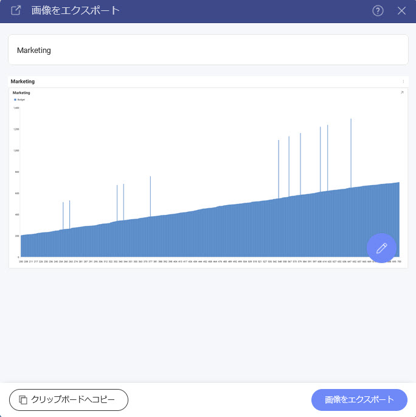
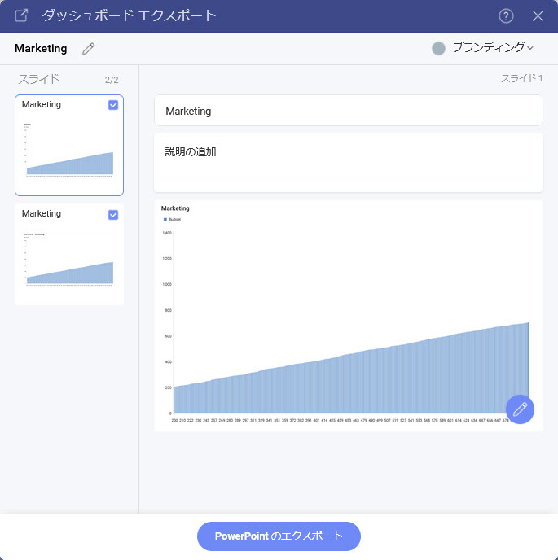

# エクスポート

Reveal SDK を使用すると、ダッシュボードと表示形式の両方をエクスポートして、新しいドキュメント タイプまたは画像を生成できます。

サポートされているダッシュボードのエクスポート形式:
- Excel
- 画像
- JSON
- PDF
- PowerPoint

サポートされている視覚化エクスポート形式:
- Excel
- 画像

すべてのエクスポート オプションは、ダッシュボードを開いたとき、または視覚化を最大化したときに、`RevealView` オーバー フロー メニューの **[エクスポート]** メニュー項目にあります。


ユーザーが **[エクスポート]** ボタンをクリックすると、有効なエクスポート オプションの 1 つを選択できます。

## Excel へエクスポート
エンドユーザーが **[エクスポート]** オーバーフロー メニューから **[Excel]** メニュー項目をクリックすると、Excel のエクスポートが実行されます。


**[Excel]** メニュー項目は、`RevealView.showExportToExcel` プロパティを設定することで表示/非表示にできます。

```js
revealView.showExportToExcel = false;
```

**[Excel]** メニュー項目をクリックすると、エンドユーザーは、ワークブックのタイトル、ワークシートのタイトル、作成するワークシート、および表示形式を含めるかどうかを変更できるさまざまなオプションを求められます。


## 画像へのエクスポート
Reveal SDK では、ダッシュボードまたは表示形式を画像にエクスポートする方法が 2 つあります:
- エンドユーザーによるエクスポート
- プログラムでエクスポート

### エンドユーザーによる画像エクスポート
エンドユーザーの画像のエクスポートは、エンドユーザーが **[エクスポート]** オーバーフロー メニューから **[画像]** メニュー項目をクリックすると実行されます。


**[画像]** メニュー項目は、`RevealView.showExportImage` プロパティを設定することで表示/非表示にできます。

```js
revealView.showExportImage = false;
```

**[画像]** メニュー項目をクリックすると、エンドユーザーにダイアログが表示され、画像をクリップボードにコピーするか、組み込みの画像エディターを使用して画像を編集するか、画像を PNG としてディスクに保存するかを選択できます。



#### カスタム画像のエクスポート
デフォルトでは、エンドユーザーが **[画像をエクスポート] ダイアログ**の **[画像をエクスポート]** ボタンをクリックすると、画像がエクスポートされ、エンドユーザーが画像ファイルを保存する場所を選択できるようにブラウザーのダウンロードに追加されます。ただし、この動作は傍受することができ、代わりにカスタム画像エクスポート ロジックを使用できます。

カスタム画像エクスポートを使用するには、`RevealView.onImageExported` イベントにイベント ハンドラーを追加する必要があります。

```js
revealView.onImageExported = (image) => {

};
```

`RevealView.onImageExported` イベントは、画像のエクスポートを保存するのに役立つ次のパラメーターを提供します:
- **image** - 撮影されたダッシュボードのスクリーンショット

#### 例: カスタム画像のエクスポート

```js
revealView.onImageExported = (image) => {
    var body = window.open("about:blank").document.body;
    body.appendChild(image);
};
```

### プログラムで画像のエクスポート
エンドユーザーの操作なしでダッシュボードの画像をプログラムでエクスポートするには、`RevealView.toImage` メソッドを呼び出す必要があります。`RevealView.toImage` メソッドを呼び出すと、画面に表示されている RevealView コンポーネントのスクリーンショットが作成されます。``RevealView.toImage`` メソッドは、[画像をエクスポート] ダイアログでユーザーにプロンプトを**表示しません**。

```cs
revealView.toImage( image => {
    //handle image
});
```

#### 例: プログラムで画像のエクスポート

```html
<button onclick="exportToImage()">Export to Image</button>
```

```js
function exportToImage() {
    revealView.toImage(image => {
        console.log(image);
        var body = window.open("about:blank").document.body;
        body.appendChild(image);
    });
}
```

:::info Get the Code

このサンプルのソース コードは [GitHub](https://github.com/RevealBi/sdk-samples-javascript/tree/master/Exporting-Image) にあります。

:::

## PDF へのエクスポート
PDF エクスポートは、エンドユーザーが **[エクスポート]** オーバーフロー メニューから **[PDF]** メニュー項目をクリックすると実行されます。


**[PDF]** メニュー項目は、`RevealView.ShowExportToPDF` プロパティを設定することで表示/非表示にできます。

```js
revealView.showExportToPDF = false;
```

**[PDF]** メニュー項目をクリックすると、エンドユーザーにさまざまなオプションの入力を求められます。これにより、ユーザーは PDF ドキュメントのタイトルを変更したり、ドキュメントに含める表示形式、各表示形式のタイトルと説明、ブランド、ページの向き、言語を選択ができます。


## PowerPoint へエクスポート
エンドユーザーが **[エクスポート]** オーバーフロー メニューから **[PowerPoint]** メニュー項目をクリックすると、PowerPoint のエクスポートが実行されます。


**PowerPoint** メニュー項目は、`RevealView.ShowExportToPowerpoint` プロパティを設定することで表示/非表示にできます。

```js
revealView.showExportToPowerPoint = false;
```

**PowerPoint** メニュー項目をクリックすると、エンドユーザーは、PowerPoint ドキュメントのタイトルを変更したり、ドキュメントに含める表示形式、各表示形式のタイトルと説明、およびブランディングを選択したりできるさまざまなオプションが表示されます。


