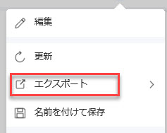
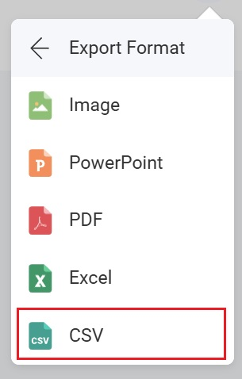
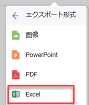
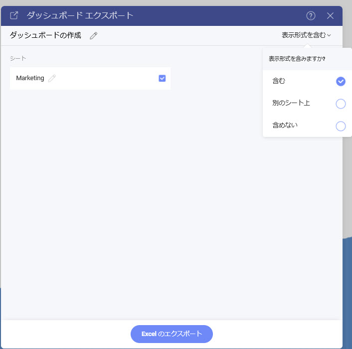
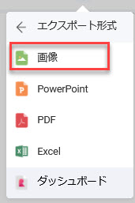
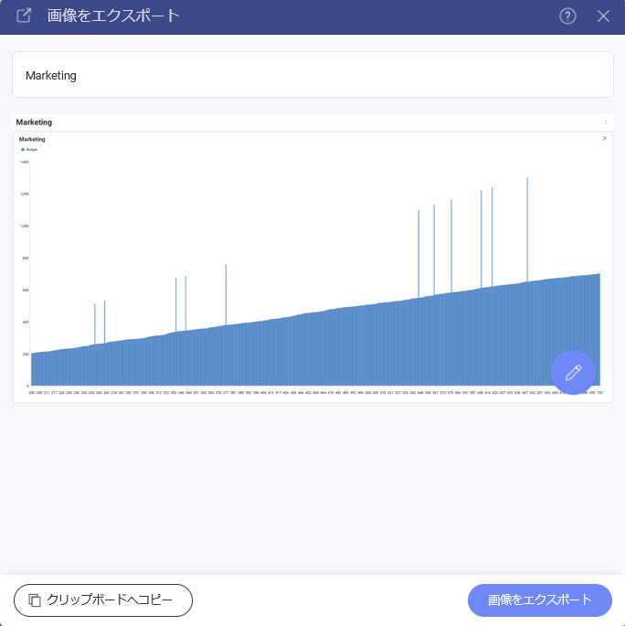
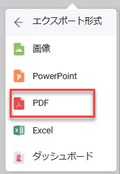
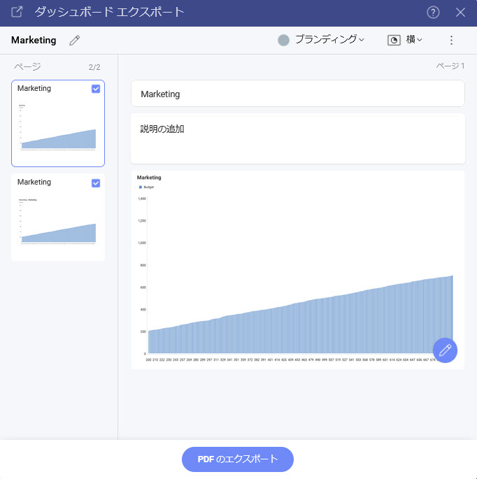
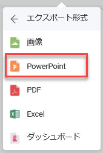
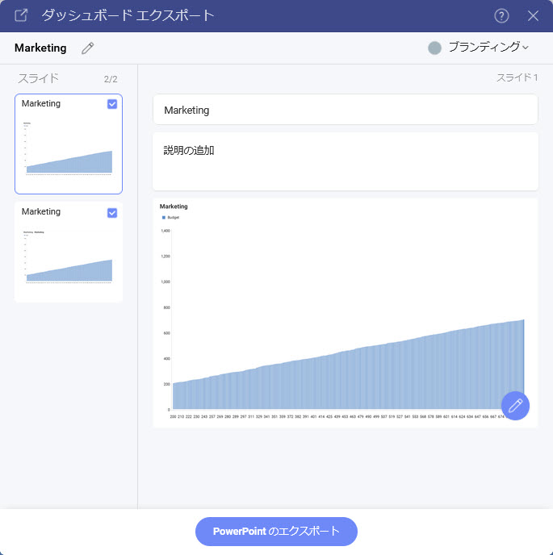

# エクスポート

Reveal SDK を使用すると、ダッシュボードと表示形式の両方をエクスポートして、新しいドキュメント タイプまたは画像を生成できます。

サポートされているダッシュボードのエクスポート形式:
- CSV
- Excel
- 画像
- PDF
- PowerPoint

サポートされている視覚化エクスポート形式:
- Excel
- 画像

すべてのエクスポート オプションは、ダッシュボードを開いたとき、または視覚化を最大化したときに、`RevealView` オーバー フロー メニューの **[エクスポート]** メニュー項目にあります。



ユーザーが **[エクスポート]** ボタンをクリックすると、有効なエクスポート オプションの 1 つを選択できます。

## CSV へエクスポート
CSV エクスポートは、エンドユーザーが **[エクスポート]** オーバーフロー メニューから **[CSV]** メニュー項目をクリックすると実行されます。



**[CSV]** メニュー項目は、`RevealView.showExportToCSV` プロパティを設定することで表示/非表示にできます。

```js
revealView.showExportToCSV = false;
```

**[CSV]** メニュー項目をクリックすると、エンドユーザーにさまざまなオプションの入力を求められます。これにより、ユーザーはエクスポートの名前を変更したり、エクスポートに含める表示形式のデータを選択したり、フォーマットされた値を使用するか生の値を使用するかを選択できます。


## Excel へエクスポート
エンドユーザーが **[エクスポート]** オーバーフロー メニューから **[Excel]** メニュー項目をクリックすると、Excel のエクスポートが実行されます。



**[Excel]** メニュー項目は、`RevealView.showExportToExcel` プロパティを設定することで表示/非表示にできます。

```js
revealView.showExportToExcel = false;
```

**[Excel]** メニュー項目をクリックすると、エンドユーザーは、ワークブックのタイトル、ワークシートのタイトル、作成するワークシート、および表示形式を含めるかどうかを変更できるさまざまなオプションを求められます。




## 画像へのエクスポート
Reveal SDK では、ダッシュボードまたは表示形式を画像にエクスポートする方法が 2 つあります:
- エンドユーザーによるエクスポート
- プログラムでエクスポート

### エンドユーザーによる画像エクスポート
エンドユーザーの画像のエクスポートは、エンドユーザーが **[エクスポート]** オーバーフロー メニューから **[画像]** メニュー項目をクリックすると実行されます。



**[画像]** メニュー項目は、`RevealView.showExportImage` プロパティを設定することで表示/非表示にできます。

```js
revealView.showExportImage = false;
```

**[画像]** メニュー項目をクリックすると、エンドユーザーにダイアログが表示され、画像をクリップボードにコピーするか、組み込みの画像エディターを使用して画像を編集するか、画像を PNG としてディスクに保存するかを選択できます。



#### カスタム画像のエクスポート
デフォルトでは、エンドユーザーが **[画像をエクスポート] ダイアログ**の **[画像をエクスポート]** ボタンをクリックすると、画像がエクスポートされ、エンドユーザーが画像ファイルを保存する場所を選択できるようにブラウザーのダウンロードに追加されます。ただし、この動作は傍受することができ、代わりにカスタム画像エクスポート ロジックを使用できます。

カスタム画像エクスポートを使用するには、`RevealView.onImageExported` イベントにイベント ハンドラーを追加する必要があります。

```js
revealView.onImageExported = (image) => {

};
```

`RevealView.onImageExported` イベントは、画像のエクスポートを保存するのに役立つ次のパラメーターを提供します:
- **image** - 撮影されたダッシュボードのスクリーンショット

#### 例: カスタム画像のエクスポート

```js
revealView.onImageExported = (image) => {
    var body = window.open("about:blank").document.body;
    body.appendChild(image);
};
```

### プログラムで画像のエクスポート
エンドユーザーの操作なしでダッシュボードの画像をプログラムでエクスポートするには、`RevealView.toImage` メソッドを呼び出す必要があります。`RevealView.toImage` メソッドを呼び出すと、画面に表示されている RevealView コンポーネントのスクリーンショットが作成されます。``RevealView.toImage`` メソッドは、[画像をエクスポート] ダイアログでユーザーにプロンプトを**表示しません**。

```cs
revealView.toImage( image => {
    //handle image
});
```

#### 例: プログラムで画像のエクスポート

```html
<button onclick="exportToImage()">Export to Image</button>
```

```js
function exportToImage() {
    revealView.toImage(image => {
        console.log(image);
        var body = window.open("about:blank").document.body;
        body.appendChild(image);
    });
}
```

:::info コードの取得

このサンプルのソース コードは [GitHub](https://github.com/RevealBi/sdk-samples-javascript/tree/master/Exporting-Image) にあります。

:::

## PDF へのエクスポート
PDF エクスポートは、エンドユーザーが **[エクスポート]** オーバーフロー メニューから **[PDF]** メニュー項目をクリックすると実行されます。



**[PDF]** メニュー項目は、`RevealView.ShowExportToPDF` プロパティを設定することで表示/非表示にできます。

```js
revealView.showExportToPDF = false;
```

**[PDF]** メニュー項目をクリックすると、エンドユーザーにさまざまなオプションの入力を求められます。これにより、ユーザーは PDF ドキュメントのタイトルを変更したり、ドキュメントに含める表示形式、各表示形式のタイトルと説明、ブランド、ページの向き、言語を選択ができます。



### エクスポートされるグリッドおよびピボットのセルのテキスト長

グリッドおよびピボットのエクスポートに含まれる文字列値は、ダッシュボードと同じ文字数制限に従います。この制限は `MaxStringCellSize` で設定され、デフォルトは 256 文字です。これを超える値は切り捨てられるため、エクスポートされたドキュメントには画面上の表示形式とまったく同じ長さのテキストがセルごとに表示されます。

エクスポートでより多くの文字を表示するには `MaxStringCellSize` を大きくしてください。これはエクスポートのオプションではなくサーバー全体のデータ読み込み設定であるため、サーバー上のすべてのダッシュボードで同じく長いテキストが表示されるようになります。この制限はデータの読み込み時に適用されるため、既存のデータに新しい値を反映するには、キャッシュを新しい状態にしてアプリケーションを再起動します。トレードオフと手順については、[データ制限](https://help.revealbi.io/ja/web/data-size-limits/#maxstringcellsize-と長いテキスト値)を参照してください。

### キャッシュの更新

キャッシュの更新が必要な場合は、キャッシュを新しい状態にしてアプリケーションを起動してください。

1. アプリケーションを停止します。
2. キャッシュ フォルダーを削除します。デフォルトではシステムの一時ディレクトリ内の `RevealCache_XXXX` で、`CachePath` および `DataCachePath` で設定した場所がある場合はその場所です。[キャッシュ ファイル](https://help.revealbi.io/ja/web/caching/#キャッシュ-ファイル)を参照してください。
3. アプリケーションを再起動します。

データは最初の使用時に再度読み込まれ、新しい制限が適用されます。表示形式のメニューにある **[更新]** オプションは 1 つのデータ ソースを更新するものであり、この手順の代わりにはなりません。

グリッドおよびピボットのセルは幅が固定されているため、エクスポートされるドキュメントのレイアウトが長い値に合わせて調整されることはありません。長い値は複数行に折り返され、行の高さとページ数が増加します。

## PowerPoint へエクスポート
エンドユーザーが **[エクスポート]** オーバーフロー メニューから **[PowerPoint]** メニュー項目をクリックすると、PowerPoint のエクスポートが実行されます。



**PowerPoint** メニュー項目は、`RevealView.ShowExportToPowerpoint` プロパティを設定することで表示/非表示にできます。

```js
revealView.showExportToPowerPoint = false;
```

**PowerPoint** メニュー項目をクリックすると、エンドユーザーは、PowerPoint ドキュメントのタイトルを変更したり、ドキュメントに含める表示形式、各表示形式のタイトルと説明、およびブランディングを選択したりできるさまざまなオプションが表示されます。


