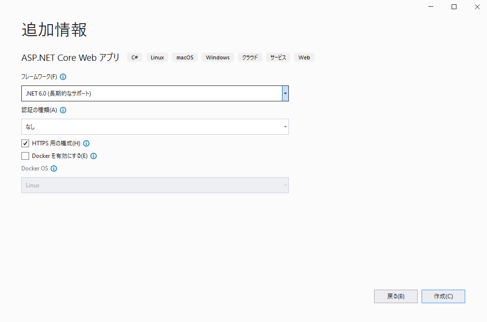

# Reveal SDK for ASP.NET で作業を開始

## 手順 1 - 手順新しい ASP.NET Web アプリの作成

以下の手順では、新しい ASP.NET Core Web App プロジェクトを作成する方法を説明します。既存のアプリケーションに Reveal SDK を追加する場合は、手順 2 へ移動します。

1 - Visual Studio 2019 を起動し、スタート ページで **[新しいプロジェクトの作成]** をクリックします。**ASP.NET Core Web App** テンプレートを選択し、**[次へ]** をクリックします。


2 - プロジェクト名と説明と場所を入力し、**[次へ]** をクリックします。


3 - フレームワーク、認証タイプ、Docker オプションを選択し、**[作成]** をクリックします。



## 手順 2 - Reveal SDK の追加

1 - ソリューションまたはプロジェクトを右クリックし、**[ソリューションの NuGet パッケージの管理]** を選択します。


2 - パッケージ マネージャー ダイアログで **[参照]** タブを開き、**Infragistics (Local)** パッケージ ソースを選択して **Reveal.Sdk.AspNetCore** NuGet パッケージをプロジェクトにインストールします。


3 - `Program.cs` ファイルを開き、`using Reveal.Sdk` 名前空間を追加します。次に、以下のように `IMcvBuilder.AddReveal()` への呼び出しを追加します。

```cs
using Reveal.Sdk;

builder.Services.AddRazorPages().AddReveal();
```

## 手順 3 - Reveal JavaScript API の追加

1 - `Pages/Shared/_Layout.cshtml` ファイルを開いて変更し、ページの下部に (`</body>` 終了タグの直前、`jquery.min.js` スクリプトの後) `infragistics.reveal.js` スクリプトを含めます。

```html
<script src="https://dl.revealbi.io/reveal/libs/[var:sdkVersion]/infragistics.reveal.js"></script>
```

2 - 残りの Reveal JavaScript API 依存関係をインストールします。

- Day.js 1.8.15 またはそれ以降

```html
<script src="https://unpkg.com/dayjs@1.8.21/dayjs.min.js"></script>
```

最終の `_Layout.cshtml` ファイルは以下のようになります。

```html title="Pages/Shared/_Layout.cshtml"
<!DOCTYPE html>
<html lang="en">
<head>
    <meta charset="utf-8" />
    <meta name="viewport" content="width=device-width, initial-scale=1.0" />
    <title>@ViewData["Title"] - GettingStarted</title>
    <link rel="stylesheet" href="~/lib/bootstrap/dist/css/bootstrap.min.css" />
    <link rel="stylesheet" href="~/css/site.css" asp-append-version="true" />
    <link rel="stylesheet" href="~/GettingStarted.styles.css" asp-append-version="true" />
</head>
<body>
    <header>
        <nav class="navbar navbar-expand-sm navbar-toggleable-sm navbar-light bg-white border-bottom box-shadow mb-3">
            <div class="container">
                <a class="navbar-brand" asp-area="" asp-page="/Index">GettingStarted</a>
                <button class="navbar-toggler" type="button" data-bs-toggle="collapse" data-bs-target=".navbar-collapse" aria-controls="navbarSupportedContent"
                        aria-expanded="false" aria-label="Toggle navigation">
                    <span class="navbar-toggler-icon"></span>
                </button>
                <div class="navbar-collapse collapse d-sm-inline-flex justify-content-between">
                    <ul class="navbar-nav flex-grow-1">
                        <li class="nav-item">
                            <a class="nav-link text-dark" asp-area="" asp-page="/Index">Home</a>
                        </li>
                        <li class="nav-item">
                            <a class="nav-link text-dark" asp-area="" asp-page="/Privacy">Privacy</a>
                        </li>
                    </ul>
                </div>
            </div>
        </nav>
    </header>
    <div class="container">
        <main role="main" class="pb-3">
            @RenderBody()
        </main>
    </div>

    <footer class="border-top footer text-muted">
        <div class="container">
            &copy; 2022 - GettingStarted - <a asp-area="" asp-page="/Privacy">Privacy</a>
        </div>
    </footer>

    
    <script src="~/lib/jquery/dist/jquery.min.js"></script>
    <script src="~/lib/bootstrap/dist/js/bootstrap.bundle.min.js"></script>
    <script src="~/js/site.js" asp-append-version="true"></script>

    // highlight-start
    <script src="https://unpkg.com/dayjs@1.8.21/dayjs.min.js"></script>
    <script src="https://dl.revealbi.io/reveal/libs/[var:sdkVersion]/infragistics.reveal.js"></script>
    // highlight-end

    @await RenderSectionAsync("Scripts", required: false)
</body>
</html>
```

## 手順 4 - Reveal ビューの初期化

1 - `Pages/Index.cshtml` ファイルを開いて変更し、新しい `<div>` タグを追加して、`id` を `revealView` に設定します。

```html
<div id="revealView" style="height: 800px; width: 100%;"></div>
```

2 - `Index.cshtml` ファイルの最後に `Scripts` セクションを追加し、`revealView` を初期化します。

```html
@section Scripts
{
    <script type="text/javascript">
        // highlight-next-line
        var revealView = new $.ig.RevealView("#revealView");
    </script>
}
```

次に、新しい `$.ig.RevealView` を作成し、`#revealView` セレクターを渡すことで、`RevealView` の新しいインスタンスを作成します。

最終の `Index.cshtml` ファイルは以下のようになります。

```html
@page
@model IndexModel
@{
    ViewData["Title"] = "Home page";
}

// highlight-next-line
<div id="revealView" style="height: 800px; width: 100%;"></div>

@section Scripts
{
    <script type="text/javascript">
        // highlight-next-line
        var revealView = new $.ig.RevealView("#revealView");
    </script>
}
```
## 手順 5 - アプリケーションの実行

**[F5]** を押してアプリケーションを実行します。


完了しました! 最初の Reveal SDK アプリケーションを作成しました。

:::info コードの取得

このサンプルのソース コードは [GitHub](https://github.com/RevealBi/sdk-samples-javascript/tree/main/01-GettingStarted/client/aspnet-webapp) にあります。

:::