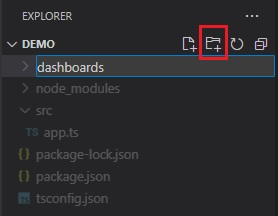

# Node.js と TypeScript を使用して Reveal SDK サーバーをセットアップする

## 手順 1 - Node.js プロジェクトの作成

1 - コマンドラインを開き、**reveal-server-node** という名前のディレクトリを作成します。

```bash
mkdir reveal-server-node
```

2 - コマンドライン パスを新しく作成したディレクトリに変更します。

```bash
cd reveal-server-node
```

3 - ディレクトリで **npm** を初期化します。

```bash npm2yarn
npm init -y
```

4 - **express** フレームワークをインストールします。

```bash npm2yarn
npm install express
```

5 - **TypeScript** およびその他のパッケージ タイプをインストールします。

```bash npm2yarn
npm install typescript @types/node @types/express @types/cors --save-dev
```

6 - **Nodemon** および **ts-node** パッケージをインストールします。

```bash npm2yarn
npm install nodemon ts-node --save-dev
```

7 - **TypeScript** を構成します。この例では、ルート ディレクトリを「src」に、出力ディレクトリを「dist」に設定しています。

```bash
npx tsc --init --rootDir src --outDir dist
```

8 - **VS Code** でプロジェクトを開きます。

```bash
code .
```

9 - **src** というディレクトリに **app.ts** という名前の新しいファイルを作成します。


次のコードを追加します:

```js
import express, { Application } from 'express';

const app: Application = express();

app.listen(5111, () => {
	console.log(`Reveal server accepting http requests`);
});
```

## 手順 2 - Reveal SDK の追加

1 - Node.js 用の **Reveal SDK** をインストールします。

```bash npm2yarn
npm install reveal-sdk-node
```

2 - `app.ts` ファイルを変更して Reveal を追加します。

```js title="app.ts"
import express, { Application } from 'express';
// highlight-next-line
import reveal from 'reveal-sdk-node';

const app: Application = express();

// highlight-next-line
app.use("/", reveal());

app.listen(5111, () => {
	console.log(`Reveal server accepting http requests`);
});
```

## 手順 3 - ダッシュボード フォルダーの作成

1 - Visual Studio Code で、エクスプローラーの **[新しいフォルダー]** ボタンをクリックし、**dashboards** という名前を付けます。フォルダーは **dashboards** という名前で、アプリケーションの作業ディレクトリに作成する必要があります。



デフォルトで、Reveal SDK は **dashboards** フォルダーからすべてのダッシュボードを読み込む規則を使用します。この規則を変更でするにはカスタムの `IRVDashboardProvider` を作成します。

## 手順 4 - CORS ポリシー (デバッグ) の設定

アプリケーションの開発とデバッグでは、サーバーとクライアント アプリを異なる URL でホストするのが一般的です。たとえば、サーバーは `https://localhost:24519` で実行されますが、Angular アプリは `https://localhost:4200` で実行されます。クライアント アプリケーションからダッシュボードを読み込もうとすると、Cross-Origin Resource Sharing (CORS) ポリシーが原因で失敗します。このシナリオを有効にするには、CORS ポリシーを作成し、サーバー プロジェクトで有効にする必要があります。

1 - **cors** パッケージと TypeScript 型をインストールします。

```bash npm2yarn
npm install cors
npm install @types/cors --save-dev
```

2 - `app.ts` ファイルを変更して **cors** を有効にします。

```js title="app.ts"
import express, { Application } from 'express';
import reveal from 'reveal-sdk-node';
// highlight-next-line
import cors from "cors";

const app: Application = express();

// highlight-next-line
app.use(cors());

app.use("/", reveal());

app.listen(5111, () => {
	console.log(`Reveal server accepting http requests`);
});
```

## 手順 5 - Node.js サーバーの起動

最後の手順は、次のコマンドを実行して Node.js サーバーを起動することです。

```bash
npx nodemon src/app.ts
```

必要に応じて、次のスクリプトを `package.json` ファイルに追加できます。

```json title="package.json"
"scripts": {
  "start": "node dist/app.js", //runs the app.js file in the dist folder that was generated from the build script
  "dev": "npx nodemon src/app.ts", //runs the server and watches for changes during development
  "build": "tsc -p .", //builds the app and generates javascript files in the dist folder
},
```

次に、開発中に **dev** スクリプトを実行します。

```bash npm2yarn
npm run dev
```

:::info コードの取得

このサンプルのソース コードは [GitHub](https://github.com/RevealBi/sdk-samples-javascript/tree/main/01-GettingStarted/server/nodejs-ts) にあります。

:::