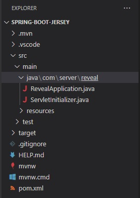

# Spring Boot と Jersey を使用した Reveal SDK サーバーのセットアップ

## 手順 1 - Jersey プロジェクトで Spring Boot を作成する

以下の手順では、Jersey プロジェクトを使用して新しい Java Spring Boot を作成する方法について説明します。既存のアプリケーションに Reveal SDK を追加する場合は、手順 2 へ移動します。

Visual Studio Code で Spring Boot アプリケーションを開発するには、以下をインストールする必要があります:
- [開発キット (JDK)](https://www.microsoft.com/openjdk)
- [Java 用拡張パック](https://marketplace.visualstudio.com/items?itemName=vscjava.vscode-java-pack)
- [Spring Boot 拡張パック](https://marketplace.visualstudio.com/items?itemName=pivotal.vscode-boot-dev-pack)

Visual Studio Code と Java の使用を開始する方法の詳細については、[Java の使用を開始する](https://code.visualstudio.com/docs/java/java-tutorial)チュートリアルを参照してください。

1 - Visual Studio Code を起動し、コマンド パレットを開いて **>Spring Initializr: Create a Maven Project** と入力し、**Enter** を押します。


2 - Spring Boot バージョン **2.7.6** を選択します。


:::caution

バージョン 3.0.0 は現在サポートされていません。

:::

3 - 言語として **Java** を選択します。


4 - グループ ID を提供します。この例では、**com.server** を使用しています。


5 - 成果物 ID を提供します。この例では、**reveal** を使用しています。


6 - **War** パッケージ タイプを選択します。


7 - Java のバージョンを選択します。この例では、バージョン **17** を使用しています。


8 - **Spring Web** と **Jersey** の依存関係を選択します。


9 - 新しく作成したプロジェクトを保存して開きます。



## 手順 2 - Reveal SDK の追加

1 - **pom.xml** ファイルを更新します。

まず、Reveal Maven リポジトリを追加します。

```xml title="pom.xml"
<repositories>
    <repository>
        <id>reveal.public</id>
        <url>https://maven.revealbi.io/repository/public</url>
    </repository>	
</repositories>
```

次に、Reveal SDK を依存関係として追加します。

```xml title="pom.xml"
<dependency>
    <groupId>com.infragistics.reveal.sdk</groupId>
    <artifactId>reveal-sdk</artifactId>
    <version>1.3.0</version>
</dependency>
```

2 - Jersey Config クラスを作成し、`RevealEngineInitializer.initialize` メソッドを呼び出して Reveal SDK を初期化します。Reveal SDK が Jersey で適切に機能するには、すべての Reveal SDK クラスを Jersey に登録する必要があります。Reveal SDK クラスを登録するには、`RevealEngineInitializer.getClassesToRegister` メソッドによって返されたクラスをループして、Jersey Config に登録します。

```java title="RevealJerseyConfig.java"
import org.glassfish.jersey.server.ResourceConfig;
import org.springframework.stereotype.Component;

import com.infragistics.reveal.engine.init.InitializeParameterBuilder;
import com.infragistics.reveal.engine.init.RevealEngineInitializer;

import javax.ws.rs.ApplicationPath;

@Component
@ApplicationPath("/")
public class RevealJerseyConfig extends ResourceConfig 
{
    public RevealJerseyConfig()
    {
        RevealEngineInitializer.initialize();
        
        //register all Reveal classes in JAX-RS context
        for (Class<?> clazz : RevealEngineInitializer.getClassesToRegister()) {
        	register(clazz);
        }
    }
}
```

## 手順 3 - ダッシュボード プロバイダーの作成

1 - Visual Studio Code で **resources** フォルダーを選択し、エクスプローラーで [新しいフォルダー] ボタンをクリックします。新しいフォルダーに **dashboards** という名前を付けます。


2 - 次に、新しく作成された **dashboards** フォルダーから Reveal ダッシュボードを読み込むダッシュボード プロバイダーを作成します。

```java title="RevealDashboardProvider.java"
import com.infragistics.reveal.sdk.api.IRVUserContext;

import java.io.IOException;
import java.io.InputStream;

import com.infragistics.reveal.sdk.api.IRVDashboardProvider;

public class RevealDashboardProvider implements IRVDashboardProvider {

    @Override
    public InputStream getDashboard(IRVUserContext userContext, String dashboardId) throws IOException {
        InputStream dashboardStream = getClass().getResourceAsStream("/dashboards/" + dashboardId + ".rdash");
		return dashboardStream;
    }

    @Override
    public void saveDashboard(IRVUserContext arg0, String arg1, InputStream arg2) throws IOException {
        
    }	
}
```

3 - 最後に、`RevealJerseyConfig` クラスの `RevealEngineInitializer` を使用してダッシュボード プロバイダーを登録します。

```java title="RevealJerseyConfig.java"
@Component
@ApplicationPath("/")
public class RevealJerseyConfig extends ResourceConfig 
{
    public RevealJerseyConfig()
    {
        RevealEngineInitializer.initialize(new InitializeParameterBuilder()
        // highlight-next-line
        .setDashboardProvider(new RevealDashboardProvider())
        .build());
        
        //register all Reveal classes in JAX-RS context
        for (Class<?> clazz : RevealEngineInitializer.getClassesToRegister()) {
        	register(clazz);
        }
    }
}
```

## 手順 4 - CORs ポリシー (デバッグ) の設定

アプリケーションの開発とデバッグでは、サーバーとクライアント アプリを異なる URL でホストするのが一般的です。例えば、サーバーは `https://localhost:24519` で実行されている可能性がありますが、Angular アプリは `https://localhost:4200` で実行されている可能性があります。クライアント アプリケーションからダッシュボードを読み込もうとすると、Cross-Origin Resource Sharing (CORS) ポリシーが原因で失敗します。このシナリオを有効にするには、CORS ポリシーを作成し、サーバー プロジェクトで有効にする必要があります。

1 - CorsFilter を作成します。

```java title="CorsFilter.java"
import java.io.IOException;

import javax.ws.rs.container.ContainerRequestContext;
import javax.ws.rs.container.ContainerRequestFilter;
import javax.ws.rs.container.ContainerResponseContext;
import javax.ws.rs.container.ContainerResponseFilter;
import javax.ws.rs.container.PreMatching;
import javax.ws.rs.core.Response;

@PreMatching
public class CorsFilter implements ContainerRequestFilter, ContainerResponseFilter {

    /**
     * Method for ContainerRequestFilter.
     */
    @Override
    public void filter(ContainerRequestContext request) throws IOException {

        // If it's a preflight request, we abort the request with
        // a 200 status, and the CORS headers are added in the
        // response filter method below.
        if (isPreflightRequest(request)) {
            request.abortWith(Response.ok().build());
            return;
        }
    }

    /**
     * A preflight request is an OPTIONS request
     * with an Origin header.
     */
    private static boolean isPreflightRequest(ContainerRequestContext request) {
        return request.getHeaderString("Origin") != null
                && request.getMethod().equalsIgnoreCase("OPTIONS");
    }

    /**
     * Method for ContainerResponseFilter.
     */
    @Override
    public void filter(ContainerRequestContext request, ContainerResponseContext response)
            throws IOException {

        // if there is no Origin header, then it is not a
        // cross origin request. We don't do anything.
        if (request.getHeaderString("Origin") == null) {
            return;
        }


        // If it is a preflight request, then we add all
        // the CORS headers here.
        if (isPreflightRequest(request)) {
            response.getHeaders().add("Access-Control-Allow-Credentials", "true");
            response.getHeaders().add("Access-Control-Allow-Methods",
                "GET, POST, PUT, DELETE, OPTIONS, HEAD");
            response.getHeaders().add("Access-Control-Allow-Headers",
                // Whatever other non-standard/safe headers (see list above) 
                // you want the client to be able to send to the server,
                // put it in this list. And remove the ones you don't want.
                "X-Requested-With, Authorization, " +
                "Accept-Version, Content-MD5, CSRF-Token, Content-Type");
        }

        // Cross origin requests can be either simple requests
        // or preflight request. We need to add this header
        // to both type of requests. Only preflight requests
        // need the previously added headers.
        response.getHeaders().add("Access-Control-Allow-Origin", "*");
    }
}
```

2 - `RevealJerseyConfig` クラスに `CorsFilter` を登録します。

```java title="RevealJerseyConfig.java"
@Component
@ApplicationPath("/")
public class RevealJerseyConfig extends ResourceConfig 
{
    public RevealJerseyConfig()
    {
        RevealEngineInitializer.initialize(new InitializeParameterBuilder()
        .setDashboardProvider(new RevealDashboardProvider())
        .build());
        
        //register all Reveal classes in JAX-RS context
        for (Class<?> clazz : RevealEngineInitializer.getClassesToRegister()) {
        	register(clazz);
        }

        //register the cors filter for debugging
        // highlight-next-line
        register(CorsFilter.class);  
    }
}
```

:::info コードの取得

このサンプルのソース コードは [GitHub](https://github.com/RevealBi/sdk-samples-javascript/tree/main/01-GettingStarted/server/spring-boot-jersey) にあります。

:::