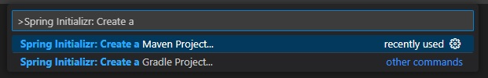
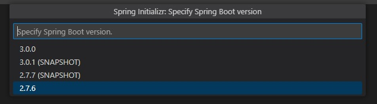

# Spring Boot を使用した Reveal SDK サーバーのセットアップ

## 手順 1 - Spring Boot プロジェクトを作成する

以下の手順では、新しい Java Spring Boot プロジェクトを作成する方法について説明します。既存のアプリケーションに Reveal SDK を追加する場合は、手順 2 へ移動します。

Visual Studio Code で Spring Boot アプリケーションを開発するには、以下をインストールする必要があります:
- [開発キット (JDK)](https://www.microsoft.com/openjdk)
- [Java 用拡張パック](https://marketplace.visualstudio.com/items?itemName=vscjava.vscode-java-pack)
- [Spring Boot 拡張パック](https://marketplace.visualstudio.com/items?itemName=pivotal.vscode-boot-dev-pack)

Visual Studio Code と Java の使用を開始する方法の詳細については、[Java の使用を開始する](https://code.visualstudio.com/docs/java/java-tutorial)チュートリアルを参照してください。

1 - Visual Studio Code を起動し、コマンド パレットを開いて **>Spring Initializr: Create a Maven Project** と入力し、**Enter** を押します。



2 - Spring Boot バージョン **3.3.2** を選択します。



:::caution

バージョン 2.x は Reveal 1.7.x 以降、サポートされていません。

:::

3 - 言語として **Java** を選択します。


4 - グループ ID を提供します。この例では、**com.server** を使用しています。


5 - 成果物 ID を提供します。この例では、**reveal** を使用しています。


6 - **War** パッケージ タイプを選択します。


7 - Java のバージョンを選択します。Spring Boot 3.x を使用する場合、**17** 以降が必要です。


8 - **Spring Web** の依存関係を選択します。

9 - 新しく作成したプロジェクトを保存して開きます。


## 手順 2 - Reveal SDK の追加

Java SDK には Java 17 以降および Jakarta EE 9 準拠サーバーが必要です。Java SDK は現在、ネイティブ .NET コンポーネントをラップしているため、AIX など、それらのコンポーネントを実行できない一部のまれなプラットフォームはサポートされていません。Jetty をサーバーとして使用する場合、そのバージョンが Reveal SDK で内部的に使用される Jetty バージョン (現在は 12.0.12) と競合する可能性があります。

1 - **pom.xml** ファイルを更新します。

まず、Reveal Maven リポジトリを追加します。

```xml title="pom.xml"
<repositories>
    <repository>
        <id>reveal.public</id>
        <url>https://maven.revealbi.io/repository/public</url>
    </repository>	
</repositories>
```

次に、Reveal SDK を依存関係として追加します。

```xml title="pom.xml"
<dependency>
    <groupId>io.revealbi</groupId>
    <artifactId>reveal-sdk-servlet</artifactId>
    <version>[var:sdkVersion]</version>
</dependency>
```

2 - `RevealEngineServlet` を Spring Boot サーブレットとして登録します。現在の Java SDK は JAX-RS 上で動作しなくなったため、Reveal SDK クラスを JAX-RS コンテキストに登録する必要はありません。`RevealEngineServlet` コンストラクターはリクエストを受け取り、`RVUserContext` を作成します。これは以前のコンテナー対応ユーザー コンテキスト プロバイダー設定の代替です。サンプルのプロバイダー クラスはアプリケーションの実装に置き換えてください。リクエスト ベースのプロパティをユーザー コンテキストに渡す必要がある場合は、
`null` をリクエストから生成した `Properties` オブジェクトに置き換えてください。

```java title="Application.java"
@SpringBootApplication
public class Application {

    public static void main(String[] args) {
       SpringApplication.run(Application.class, args);
    }

    @Bean
    ServletRegistrationBean<RevealEngineServlet> revealServlet() {
       RevealEngineServlet revealEngineServlet = new RevealEngineServlet(() -> new RevealServerBuilder()
                // Replace these sample providers with your application's implementations.
                .setAuthenticationProvider(new MyIRVAuthenticationProvider())
                .setDashboardProvider(new RVDashboardProvider("c:\\your-path"))
                .setDataSourceProvider(new MyIRVDataSourceProvider())
                .addSettings(settings -> {
                    // settings.setLicense("your license or remove to use ~/.revealbi-sdk/license.key");
                })
                .build(), request -> new RVUserContext("whatever", null /* replace null with a Properties built from the request if needed */));

       return new ServletRegistrationBean<>(revealEngineServlet, "/reveal-api/*");
    }
}
```

## 手順 3 - dashboards フォルダーの作成

1 - ダッシュボード用のフォルダーを作成します。

2 - ダッシュボードを含むフォルダーを使用するように `RVDashboardProvider` を構成します。

```java title="Application.java"
new RevealServerBuilder()
    .setDashboardProvider(new RVDashboardProvider("c:\\your-path"))
    .build();
```

## 手順 4 - CORS ポリシーの設定 (デバッグ)

アプリケーションの開発およびデバッグ中は、サーバーとクライアント アプリを異なる URL でホストすることが一般的です。たとえば、サーバーが `https://localhost:8080` で動作し、Angular アプリが `https://localhost:4200` で動作しているような場合です。クライアント アプリケーションからダッシュボードを読み込もうとすると、クロス オリジン リソース シェアリング (CORS) ポリシーにより失敗します。このシナリオを有効にするには、`Application.java` に `WebMvcConfigurer` Bean を追加します。

```java title="Application.java"
import org.springframework.boot.web.servlet.FilterRegistrationBean;
import org.springframework.context.annotation.Bean;
import org.springframework.core.Ordered;
import org.springframework.web.cors.CorsConfiguration;
import org.springframework.web.cors.UrlBasedCorsConfigurationSource;
import org.springframework.web.filter.CorsFilter;

@Bean
FilterRegistrationBean<CorsFilter> corsFilter() {
    CorsConfiguration config = new CorsConfiguration();
    config.addAllowedOriginPattern("*");
    config.addAllowedHeader("*");
    config.addAllowedMethod("*"); // 開発環境のみ！本番環境では適切に構成してください。

    UrlBasedCorsConfigurationSource source = new UrlBasedCorsConfigurationSource();
    source.registerCorsConfiguration("/**", config);

    FilterRegistrationBean<CorsFilter> bean = new FilterRegistrationBean<>(new CorsFilter(source));
    bean.addUrlPatterns("/*");
    bean.setOrder(Ordered.HIGHEST_PRECEDENCE);
    return bean;
}
```

## 手順 5 - パッケージ化と配置

Reveal SDK には、特定のプラットフォームとアーキテクチャの組み合わせ向けにビルドされたネイティブ コンポーネントが含まれています。アプリケーションをパッケージ化すると、Maven は現在のマシン用のネイティブ コンポーネントを選択します。配置先のプラットフォームまたはアーキテクチャがパッケージ化に使用したマシンと異なる場合は、Maven プロファイル パラメーター `-P os_arch` を使用して、対象のプラットフォームとアーキテクチャを選択します。

ネイティブ .NET バイナリは、プラットフォーム固有の成果物にリソースとして含まれ、実行時に一時ディレクトリへ展開されます。展開されたフォルダーは、`linux-aarch64-3` のような `platform-arch-version` 形式を使用します。

:::info コードの取得

このサンプルのソース コードは [GitHub](https://github.com/RevealBi/sdk-samples-javascript/tree/main/01-GettingStarted/server/spring-boot) にあります。

:::
