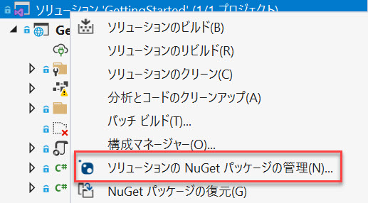
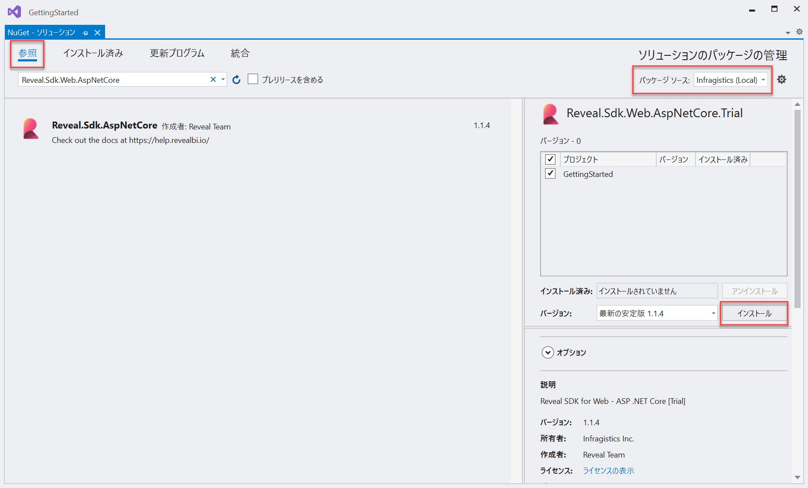

# Installing the Server SDK

## ASP.NET

以下の手順では、Reveal SDK を既存の ASP.NET Core プロジェクトにインストールする方法について説明します。

1 - ソリューションまたはプロジェクトを右クリックし、**[ソリューションの NuGet パッケージの管理]** を選択します。



2 - パッケージ マネージャー ダイアログで **[参照]** タブを開き、**nuget.org** パッケージ ソースまたは **Infragistics (Local)** パッケージ ソースを選択して **Reveal.Sdk.AspNetCore** NuGet パッケージをプロジェクトにインストールします。



3 - `Program.cs` ファイルを開き、`using Reveal.Sdk;` 名前空間を追加します。次に、既存の `builder.Services.AddControllers()` メソッドに `IMcvBuilder.AddReveal()` の呼び出しを追加します。

```cs
using Reveal.Sdk;

builder.Services.AddControllers().AddReveal();
```

4 - プロジェクトを右クリックし、**[追加] -> [新しいフォルダー]** を選択します。フォルダーの名前は **「Dashboards」** にしてください。


デフォルトで、Reveal SDK は **Dashboards** フォルダーからすべてのダッシュボードを読み込む規則を使用します。この規則を変更するにはカスタムの `IRVDashboardProvider` を作成します。詳細については、[ダッシュボードの読み込み](loading-dashboards.md)トピックを参照してください。

## Node.js

1 - Node.js 用の **Reveal SDK** をインストールします。

```bash npm2yarn
npm install reveal-sdk-node
```

2 - `main.js` ファイルを変更して Reveal を追加します。

```js
var express = require('express');
// highlight-next-line
var reveal = require('reveal-sdk-node');

const app = express();

// highlight-next-line
app.use('/', reveal());

app.listen(8080, () => {
	console.log(`Reveal server accepting http requests`);
});
```

3 - Visual Studio Code で、エクスプローラーの **[新しいフォルダー]** ボタンをクリックし、**dashboards** という名前を付けます。フォルダーは **dashboards** という名前で、アプリケーションの作業ディレクトリに作成する必要があります。


デフォルトで、Reveal SDK は **dashboards** フォルダーからすべてのダッシュボードを読み込む規則を使用します。この規則を変更でするにはカスタムの `IRVDashboardProvider` を作成します。

## Java

以下の手順では、Reveal SDK を既存の Java アプリケーションにインストールする方法について説明します。

1 - **pom.xml** ファイルを更新します。Reveal Maven リポジトリを追加します。

```xml title="pom.xml"
<repositories>
    <repository>
        <id>reveal.public</id>
        <url>https://maven.revealbi.io/repository/public</url>
    </repository>	
</repositories>
```

2 - Reveal SDK を依存関係として追加します。

```xml title="pom.xml"
<dependency>
    <groupId>com.infragistics.reveal.sdk</groupId>
    <artifactId>reveal-sdk</artifactId>
    <version>[var:sdkVersion]</version>
</dependency>
```

### Spring Boot - Jersey

Jersey Config クラスを作成し、`RevealEngineInitializer.initialize` メソッドを呼び出して Reveal SDK を初期化します。Reveal SDK を Jersey で正しく動作させるためには、Reveal SDK の全クラスを Jersey に登録する必要があります。Reveal SDK のクラスを登録するには、`RevealEngineInitializer.getClassesToRegister` メソッドによって返されるクラスをループして、Jersey Config にそれらを登録します。

```java title="RevealJerseyConfig.java"
import org.glassfish.jersey.server.ResourceConfig;
import org.springframework.stereotype.Component;

import com.infragistics.reveal.engine.init.RevealEngineInitializer;

import javax.ws.rs.ApplicationPath;

@Component
@ApplicationPath("/")
public class RevealJerseyConfig extends ResourceConfig 
{
    public RevealJerseyConfig()
    {
        RevealEngineInitializer.initialize();
        
        //register all Reveal classes in JAX-RS context
        for (Class<?> clazz : RevealEngineInitializer.getClassesToRegister()) {
        	register(clazz);
        }
    }
}
```

### Tomcat

1 - Jakarta RESTful Web Services (JAX-RS) 実装への依存関係を追加します。Jersey、RESTeasy、Apache CXF など複数の選択肢の中から選ぶことができます。お好みのプロバイダー提供元が説明する手順に従ってください。

例として Jersey 用に追加する必要がある依存関係を以下に示します:

```xml
<dependency>
    <groupId>org.glassfish.jersey.containers</groupId>
    <artifactId>jersey-container-servlet</artifactId>
    <version>2.32</version>
</dependency>
<dependency>
    <groupId>org.glassfish.jersey.inject</groupId>
    <artifactId>jersey-cdi2-se</artifactId>
    <version>2.32</version>
</dependency>
```

2 - ServletContextListener クラスを作成し `RevealEngineInitializer.initialize` メソッドを呼び出して Reveal SDK を初期化します。

```java
import javax.servlet.ServletContextEvent;
import javax.servlet.ServletContextListener;
import javax.servlet.annotation.WebListener;

import com.infragistics.reveal.engine.init.RevealEngineInitializer;

@WebListener
public class RevealServletContextListener implements ServletContextListener {

	@Override
	public void contextDestroyed(ServletContextEvent ctx) {
		
	}

	@Override
	public void contextInitialized(ServletContextEvent ctx) {
		
		//initialize Reveal
		RevealEngineInitializer.initialize();
	}
}
```