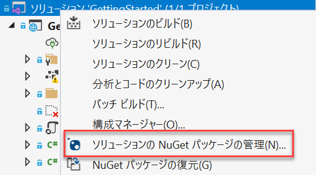
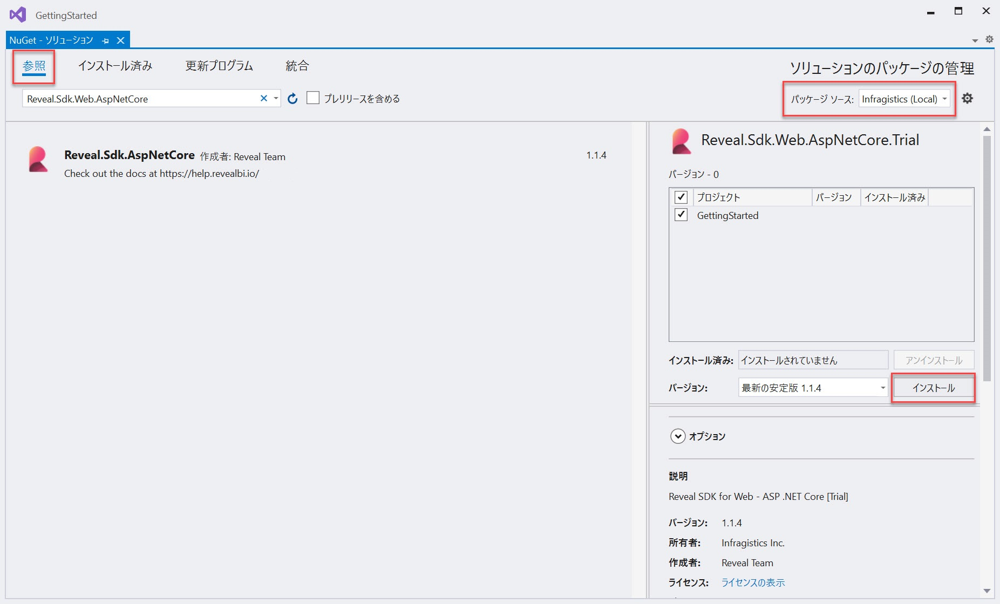
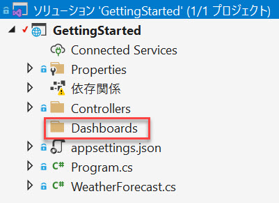
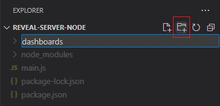

# Server SDK のインストール

## ASP.NET

以下の手順では、Reveal SDK を既存の ASP.NET Core プロジェクトにインストールする方法について説明します。

1 - ソリューションまたはプロジェクトを右クリックし、**[ソリューションの NuGet パッケージの管理]** を選択します。



2 - パッケージ マネージャー ダイアログで **[参照]** タブを開き、**nuget.org** パッケージ ソースまたは **Infragistics (Local)** パッケージ ソースを選択して **Reveal.Sdk.AspNetCore** NuGet パッケージをプロジェクトにインストールします。



3 - `Program.cs` ファイルを開き、`using Reveal.Sdk;` 名前空間を追加します。次に、既存の `builder.Services.AddControllers()` メソッドに `IMcvBuilder.AddReveal()` の呼び出しを追加します。

```cs
using Reveal.Sdk;

builder.Services.AddControllers().AddReveal();
```

4 - プロジェクトを右クリックし、**[追加] -> [新しいフォルダー]** を選択します。フォルダーの名前は **「Dashboards」** にしてください。



デフォルトで、Reveal SDK は **Dashboards** フォルダーからすべてのダッシュボードを読み込む規則を使用します。この規則を変更するにはカスタムの `IRVDashboardProvider` を作成します。詳細については、[ダッシュボードの読み込み](loading-dashboards.md)トピックを参照してください。

## Node.js

1 - Node.js 用の **Reveal SDK** をインストールします。

```bash npm2yarn
npm install reveal-sdk-node
```

2 - `main.js` ファイルを変更して Reveal を追加します。

```js
var express = require('express');
// highlight-next-line
var reveal = require('reveal-sdk-node');

const app = express();

// highlight-next-line
app.use('/', reveal());

app.listen(8080, () => {
	console.log(`Reveal server accepting http requests`);
});
```

3 - Visual Studio Code で、エクスプローラーの **[新しいフォルダー]** ボタンをクリックし、**dashboards** という名前を付けます。フォルダーは **dashboards** という名前で、アプリケーションの作業ディレクトリに作成する必要があります。



デフォルトで、Reveal SDK は **dashboards** フォルダーからすべてのダッシュボードを読み込む規則を使用します。この規則を変更でするにはカスタムの `IRVDashboardProvider` を作成します。

## Java

以下の手順では、Reveal SDK を既存の Java アプリケーションにインストールする方法について説明します。

Java SDK には Java 17 以降が必要です。Java SDK は現在、ネイティブ .NET コンポーネントをラップしているため、AIX など、それらのコンポーネントを実行できない一部のまれなプラットフォームはサポートされていません。Jetty をサーバーとして使用する場合、そのバージョンが Reveal SDK で内部的に使用される Jetty バージョン (現在は 12.0.12) と競合する可能性があります。

1 - **pom.xml** ファイルを更新します。Reveal Maven リポジトリを追加します。

```xml title="pom.xml"
<repositories>
    <repository>
        <id>reveal.public</id>
        <url>https://maven.revealbi.io/repository/public</url>
    </repository>	
</repositories>
```

2 - Reveal SDK を依存関係として追加します。

```xml title="pom.xml"
<dependency>
    <groupId>io.revealbi</groupId>
    <artifactId>reveal-sdk-servlet</artifactId>
    <version>[var:sdkVersion]</version>
</dependency>
```

### Spring Boot - Jersey

`RevealEngineServlet` を Spring Boot サーブレットとして登録します。現在の Java SDK は JAX-RS 上で動作しなくなったため、Reveal SDK クラスを Jersey に登録する必要はありません。

```java title="Application.java"
@SpringBootApplication
public class Application {

    public static void main(String[] args) {
       SpringApplication.run(Application.class, args);
    }

    @Bean
    ServletRegistrationBean<RevealEngineServlet> revealServlet() {
       RevealEngineServlet revealEngineServlet = new RevealEngineServlet(() -> new RevealServerBuilder()
                .setDashboardProvider(new RVDashboardProvider("c:\\your-path"))
                .addSettings(settings -> {
                    // settings.setLicense("your license or remove to use ~/.revealbi-sdk/license.key");
                })
                .build(), request -> new RVUserContext("user identifier", createPropertiesFrom(request)));

       return new ServletRegistrationBean<>(revealEngineServlet, "/reveal-api/*");
    }
}
```

### Tomcat

`ServletContextListener` クラスを作成し、`RevealEngineServlet` を登録します。

```java
@WebListener
public class AppInitializer implements ServletContextListener {

	@Override
	public void contextInitialized(ServletContextEvent sce) {
        RevealEngineServlet revealEngineServlet = new RevealEngineServlet(() -> new RevealServerBuilder()
                .setDashboardProvider(new RVDashboardProvider("c:\\your-path"))
                .addSettings(settings -> {
                    // settings.setLicense("your license or remove to use ~/.revealbi-sdk/license.key");
                })
                .build(), request -> new RVUserContext("user identifier", createPropertiesFrom(request)));

        ServletRegistration.Dynamic reg = sce.getServletContext().addServlet("revealServlet", revealEngineServlet);
        reg.setAsyncSupported(true);
        reg.addMapping("/reveal-api/*");
	}
}
```

### パッケージ化と配置

Reveal SDK には、特定のプラットフォームとアーキテクチャの組み合わせ向けにビルドされたネイティブ コンポーネントが含まれています。アプリケーションをパッケージ化すると、Maven は現在のマシン用のネイティブ コンポーネントを選択します。配置先のプラットフォームまたはアーキテクチャがパッケージ化に使用したマシンと異なる場合は、Maven プロファイル パラメーター `-P os_arch` を使用して、対象のプラットフォームとアーキテクチャを選択します。

ネイティブ .NET バイナリは、プラットフォーム固有の成果物にリソースとして含まれ、実行時に一時ディレクトリへ展開されます。展開されたフォルダーは、`linux-aarch64-3` のような `platform-arch-version` 形式を使用します。
