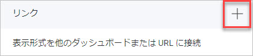
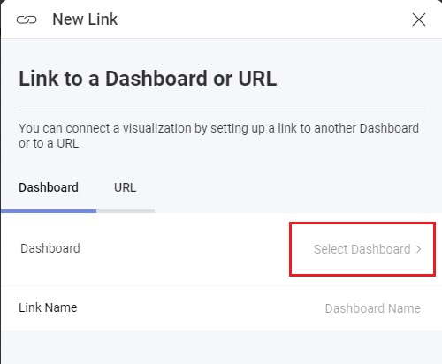

import Tabs from '@theme/Tabs';
import TabItem from '@theme/TabItem';

# ダッシュボード リンク

Reveal SDK はダッシュボードのリンクをサポートしているため、ユーザーはダッシュボードをナビゲートできます。ダッシュボードからダッシュボードに移動することで、業務上のハイレベルな概要からより詳細なビューに進むことができます。

Reveal SDK の観点からは、ダッシュボードのリンクは、エンドユーザーがビジュアル化されたリンクをクリックして別のダッシュボードをロードするときに呼び出されます。


## ダッシュボード リンクの作成

**[設定]** タブの **[リンク]** セクションにある [+] ボタンをクリックすると、表示形式エディターでダッシュボード リンクが作成されます。



このボタンをクリックすると、エンドユーザーがダッシュボードを選択できるダイアログが表示されます。**[ダッシュボードの選択]** 項目をクリックすると、ダッシュボード選択ダイアログが表示されます。 



この時点で、開発者は、ユーザーが選択できるダッシュボードの範囲を紹介するカスタム ユーザー インターフェイスを作成する必要があります。このプロセスを容易にするために、Reveal SDK には、カスタマイズされた UI を表示するためのトリガーとして機能する `onDashboardSelectorRequested` イベントが用意されています。このイベント内のイベント引数には、選択したダッシュボードの一意の ID を提供し、それを SDK にリンクするコールバック関数が含まれています。

```js
revealView.onDashboardSelectorRequested = (args) => {
    //todo: show dialog to list dashboards and set the selected dashboardId    

    //invoke the callback with the dashboardId selected in the custom dialog
    args.callback(dashboardId);
}
```

カスタム UI からダッシュボードが選択されたら、次の手順は、リンクされたダッシュボードをロードする方法を SDK に指示することです。このために、SDK は `onLinkedDashboardProviderAsync` イベントを提供します。このイベントでは、リンクされたダッシュボード インスタンスが返されます。

```js
revealView.onLinkedDashboardProviderAsync = (dashboardId, title) => {
    return $.ig.RVDashboard.loadDashboard(dashboardId);
};
```

:::info

`onLinkedDashboardProviderAsync` イベントは、**ダッシュボード リンク**が表示形式のツールチップ内でクリックされたときにも呼び出されます。

:::

## 例: ダッシュボード リンク

これは、ダッシュボード リンクを追加するためのカスタム ダッシュボード選択 UI を実装するために必要な手順の高レベルの例です。作業例の完全なソース コードについては、サンプルの終了にある GitHub リンクを参照してください。

1 - サーバー アプリケーションで、利用可能なすべてのダッシュボードの名前を返すサービス エンドポイントを公開して、カスタム UI に表示します。

<Tabs groupId="code" queryString>
  <TabItem value="aspnet" label="ASP.NET" default>

```cs
app.MapGet("dashboards", () =>
{
    // Get the file path for the dashboards
    var filePath = Path.Combine(Environment.CurrentDirectory, "Dashboards");

    // Get the names of all files in the directory
    var files = Directory.GetFiles(filePath);

    //return just the dashboard file names
    return files.Select(x => Path.GetFileNameWithoutExtension(x));
});
```

  </TabItem>

  <TabItem value="java" label="Java">

```java
@Component
@Path("dashboards/")
public class RevealDashboardController {

    @GET
    @Produces(MediaType.APPLICATION_JSON)
    public List<String> getFileNamesWithoutExtension() {
        List<String> filenames = new ArrayList<String>();
        File directory = new File("dashboards");
        File[] files = directory.listFiles();

        for (File file : files) {
            String fileNameWithExtension = file.getName();
            String fileNameWithoutExtension = fileNameWithExtension.substring(0, fileNameWithExtension.lastIndexOf("."));
            filenames.add(fileNameWithoutExtension);
        }

        return filenames;
    }
}
```

  </TabItem>

  <TabItem value="node" label="Node.js">    

```ts
app.get("/dashboards/", (req, res) => {
	fs.readdir("dashboards", (err, files) => {
		if (err) {
		  res.status(500).send('Error getting directory information');
		} else {
		  const filenames = files.map((file) => {
			const extension = path.parse(file).ext;
			return file.slice(0, -extension.length);
		  });
		  res.send(filenames);
		}
	  });
});
```

  </TabItem>
</Tabs>

2 - カスタム ダッシュボード セレクター UI として使用する HTML ダイアログを作成します。

```html
<dialog id="dbSelector" class="modal">
    <div id="thumbnails"></div>
    <button onclick="closeDialog()">Cancel</button>
</dialog>
```

3 - RevealView で `onDashboardSelectorRequested` イベントを処理します。このイベントでは、カスタム UI の表示を担当するメソッドを呼び出します。カスタム UI で使用できるように、コールバックを関数に渡します。

```js
revealView.onDashboardSelectorRequested = (args) => {
    openDialog(args.callback);
}
```

4 - サービス エンドポイントからすべてのダッシュボード ファイル名を取得する `openDialog` 関数を実装し、ダイアログに表示するダッシュボードのリストを動的に作成します。

```js
const dialog = document.getElementById("dbSelector");

function openDialog(callback) {
    fetch("http://localhost:5111/dashboards")
        .then(resp => resp.json())
        .then(data => {
            var container = document.querySelector("#thumbnails");
            container.innerHTML = "";

            data.forEach(id => {
                createThumbnail(container, id, callback);
            });

        }).then(() => dialog.showModal());
}

function createThumbnail(container, id, callback) {
    const button = document.createElement("button");
    button.innerHTML = id;
    button.addEventListener('click', (arg) => {
        callback(id);
        closeDialog();
    });
    button.className = "Reveal-Thumbnail-Box";
    container.appendChild(button);
}

function closeDialog() {
    dialog.close();
}
```

5 - `onLinkedDashboardProviderAsync` イベントを処理して、リンクされたダッシュボードを読み込みます。
```js
revealView.onLinkedDashboardProviderAsync = (dashboardId, title) => {
    return $.ig.RVDashboard.loadDashboard(dashboardId);
};
```

:::info Get the Code

このサンプルのソース コードは [GitHub](https://github.com/RevealBi/sdk-samples-javascript/tree/main/LinkingDashboards-UI) にあります。

:::