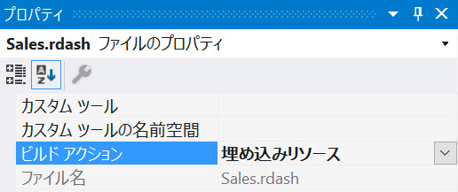

import Tabs from '@theme/Tabs';
import TabItem from '@theme/TabItem';

# ダッシュボードを読み込む

Reveal ダッシュボードはサーバーに保存されます。クライアント アプリケーションは `$.ig.RVDashboard.loadDashboard` メソッドを呼び出し、読み込むダッシュボードの名前を渡します。ダッシュボードのリクエストはサーバーに送信され、サーバーはリクエストされたダッシュボードでクライアントに応答します。クライアントはサーバーのレスポンスで提供されたダッシュボードを受け取り、`RevealView.dashboard` プロパティを設定します。

デフォルトでは Reveal SDK はファイル パスからダッシュボードをロードするための規約を使用しています。具体的には、Reveal SDK はサーバー上の作業ディレクトリにある **Dashboards** フォルダー内のダッシュボードを探します。

1 - サーバー アプリケーションで、作業ディレクトリに **Dashboards** という名前のフォルダを作成しその中にダッシュボード ファイルを配置します。


<Tabs groupId="code">
  <TabItem value="aspnet" label="ASP.NET" default>


  </TabItem>

  <TabItem value="java" label="Java">

:::danger サポート対象外

Java では現在デフォルトのダッシュボード ローダーはサポートされていません。カスタムのダッシュボード プロバイダーを作成する必要があります。

:::

  </TabItem>

  <TabItem value="node" label="Node.js">    


  </TabItem>
</Tabs>

2 - クライアント アプリケーションで、`$.ig.RevealSdkSettings.setBaseUrl`メソッドを呼び出しサーバーのURLを渡します。デバッグ時には、サーバーの URL は `https://localhost` の後にポート番号が付いたものになります。例えば:

```js
$.ig.RevealSdkSettings.setBaseUrl("https://localhost:/5111");   
```

:::caution

サーバーがクライアント アプリケーションと異なる URL で動作している場合、`$.ig.RevealSdkSettings.setBaseUrl` を呼び出すことが必要です。サーバー アプリケーションとクライアント アプリケーションの両方が同じ URL で実行されている場合、このメソッドは必要ありません。このメソッドは一度だけ呼び出す必要があります。

:::

3 - `$.ig.RVDashboard.loadDashboard` メソッドを呼び出し、拡張子 .rdash を除いたダッシュボード ファイル名を渡します。このメソッドにはサーバーから要求されたダッシュボードを提供するコールバックがあります。コールバックからダッシュボードを受け取ったら、`$.ig.RevealView` のインスタンスを取得し、レスポンスにあるダッシュボードに `RevealView.dashboard` プロパティをセットします。

```js
$.ig.RVDashboard.loadDashboard("Sales", (dashboard) => {
    var revealView = new $.ig.RevealView("#revealView");
    revealView.dashboard = dashboard;
});
```

:::info コードの取得

本サンプルのソースコードは [GitHub](https://github.com/RevealBi/sdk-samples-javascript/tree/main/LoadingDashboards) で公開しています。

:::

## カスタム ダッシュボード プロバイダー

デフォルトの **Dashboards** ファイル ディレクトリと異なる場所をアプリケーションで使用する場合、代わりにダッシュボードをロードするためのカスタム ダッシュボード プロバイダを提供することができます。

1 - ダッシュボード プロバイダーを作成します。

<Tabs groupId="code">
  <TabItem value="aspnet" label="ASP.NET" default>

```cs
public class DashboardProvider : IRVDashboardProvider
{
    public Task<Dashboard> GetDashboardAsync(IRVUserContext userContext, string dashboardId)
    {
        throw new NotImplementedException();
    }

    public Task SaveDashboardAsync(IRVUserContext userContext, string dashboardId, Dashboard dashboard)
    {
        throw new NotImplementedException();
    }
}
```

  </TabItem>

  <TabItem value="java" label="Java">

```java
public class DashboardProvider implements IRVDashboardProvider {

    @Override
    public InputStream getDashboard(IRVUserContext userContext, String dashboardId) throws IOException {
        return null;
    }

    @Override
    public void saveDashboard(IRVUserContext arg0, String arg1, InputStream arg2) throws IOException {
        return null;
    }	
}
```

  </TabItem>

  <TabItem value="node" label="Node.js">    

```ts
const dashboardProvider = async (userContext:IRVUserContext | null, dashboardId: string) => {
	return null;
}
```

  </TabItem>
</Tabs>

2 - ダッシュボード プロバイダーを Reveal SDK に登録します。

<Tabs groupId="code">
  <TabItem value="aspnet" label="ASP.NET" default>

```cs
builder.Services.AddControllers().AddReveal( builder =>
{
    builder.AddDashboardProvider<DashboardProvider>();
});
```

  </TabItem>

  <TabItem value="java" label="Java">

```java
RevealEngineInitializer.initialize(new InitializeParameterBuilder().
    setDashboardProvider(new DashboardProvider()).
    build());
```

  </TabItem>
  
  <TabItem value="node" label="Node.js">    

```ts
const revealOptions: RevealOptions = {
	dashboardProvider: dashboardProvider,
};

app.use("/", reveal(revealOptions));
```

  </TabItem>

</Tabs>


## 例: ファイル パスから読み込む

<Tabs groupId="code">
  <TabItem value="aspnet" label="ASP.NET" default>

```cs
public class DashboardProvider : IRVDashboardProvider
{
    public Task<Dashboard> GetDashboardAsync(IRVUserContext userContext, string dashboardId)
    {
        var filePath = Path.Combine(Environment.CurrentDirectory, $"MyDashboardsFolder/{dashboardId}.rdash");
        var dashboard = new Dashboard(filePath);
        return Task.FromResult(dashboard);
    }

    public Task SaveDashboardAsync(IRVUserContext userContext, string dashboardId, Dashboard dashboard)
    {
        throw new NotImplementedException();
    }
}
```

  </TabItem>

  <TabItem value="java" label="Java">

```java
public class RevealDashboardProvider implements IRVDashboardProvider {

    @Override
    public InputStream getDashboard(IRVUserContext userContext, String dashboardId) throws IOException {
        InputStream dashboardStream = new FileInputStream("dashboards/" + dashboardId + ".rdash");
        return dashboardStream;
    }

    @Override
    public void saveDashboard(IRVUserContext arg0, String arg1, InputStream arg2) throws IOException {
        
    }	
}
```

  </TabItem>

  <TabItem value="node" label="Node.js">    

```ts
const dashboardProvider = async (userContext:IRVUserContext | null, dashboardId: string) => {
	return fs.createReadStream(`myDashboards/${dashboardId}.rdash`);
}
```

  </TabItem>
</Tabs>

:::info

このサンプルのソースコードは [GitHub](https://github.com/RevealBi/sdk-samples-javascript/tree/main/LoadingDashboards-File) でご覧いただけます。

:::


## 例: リソースから読み込む

1 - サーバー アプリケーションにリソースとして Reveal ダッシュボード **.rdash** ファイルを埋め込む。


<Tabs groupId="code">
  <TabItem value="aspnet" label="ASP.NET" default>

ASP.NET サーバー アプリケーションにリソースとして Reveal ダッシュボード **.rdash** ファイルを埋め込むには、Visual Studio でダッシュボード ファイルのプロパティを開き、.rdash ファイルの **ビルド アクション** を **埋め込みリソース** に設定します。



  </TabItem>

  <TabItem value="java" label="Java">

Reveal ダッシュボード **.rdash** ファイルを Java サーバー アプリケーションのリソースとして埋め込むには、ダッシュボード ファイルを **resources** ディレクトリに配置します。


  </TabItem>

</Tabs>

2 - ダッシュボード プロバイダーを作成します。

<Tabs groupId="code">
  <TabItem value="aspnet" label="ASP.NET" default>

```cs
public class DashboardProvider : IRVDashboardProvider
{
    public Task<Dashboard> GetDashboardAsync(IRVUserContext userContext, string dashboardId)
    {
        var resource = Assembly.GetExecutingAssembly().GetManifestResourceStream($"RevealSdk.Server.Dashboards.{dashboardId}.rdash");
        using (resource)
        {
            var dashboard = new Dashboard(resource);
            return Task.FromResult(dashboard);
        }
    }

    public Task SaveDashboardAsync(IRVUserContext userContext, string dashboardId, Dashboard dashboard)
    {
        throw new NotImplementedException();
    }
}
```

:::note

`Assembly.GetManifestResourceStream` メソッドで提供するリソースの `name` には、.rdash ファイルの `namespace` とファイル名を含める必要があります。

:::

  </TabItem>

  <TabItem value="java" label="Java">

```java
public class RevealDashboardProvider implements IRVDashboardProvider {

    @Override
    public InputStream getDashboard(IRVUserContext userContext, String dashboardId) throws IOException {
        InputStream dashboardStream = getClass().getResourceAsStream("/dashboards/" + dashboardId + ".rdash");
		return dashboardStream;
    }

    @Override
    public void saveDashboard(IRVUserContext arg0, String arg1, InputStream arg2) throws IOException {
        
    }	
}
```

  </TabItem>

</Tabs>

:::info コードの取得

本サンプルのソースコードは [GitHub](https://github.com/RevealBi/sdk-samples-javascript/tree/main/LoadingDashboards-Resource) に掲載されています。

:::

## 例: JSON から読み込む

上級ユーザーや、Reveal ダッシュボードを .rdash ファイルではなく .json ファイルにシリアライズするユーザーのために、サーバー アプリケーションで `Dashboard.LoadFromJsonAsync` メソッドを使用してこれらの JSON ベースのファイルをロードすることができます。

<Tabs groupId="code">
  <TabItem value="aspnet" label="ASP.NET" default>

```cs
public class DashboardProvider : IRVDashboardProvider
{
    public Task<Dashboard> GetDashboardAsync(IRVUserContext userContext, string dashboardId)
    {
        var filePath = Path.Combine(Environment.CurrentDirectory, $"Dashboards/{dashboardId}.json");
        var json = File.ReadAllText(filePath);
        var dashboard = Dashboard.FromJsonString(json);
        return Task.FromResult(dashboard);
    }

    public Task SaveDashboardAsync(IRVUserContext userContext, string dashboardId, Dashboard dashboard)
    {
        throw new NotImplementedException();
    }
}
```

  </TabItem>

  <TabItem value="java" label="Java">

:::danger サポート対象外

この機能は現在 Java ではサポートされていません。

:::

  </TabItem>

  <TabItem value="node" label="Node.js">    

:::danger サポート対象外

この機能は現在 Node.jsではサポートされていません。

:::

  </TabItem>
</Tabs>

:::caution

Reveal ダッシュボードが JSON にシリアライズされた後にその内容を操作または変更すると、ダッシュボードの整合性が失われ、ダッシュボードの内容に不可逆的な損傷が生じる可能性があります。その結果、ダッシュボードの読み込みエラーもしくは読み込み失敗によってアプリケーションで実行時例外がスローされる可能性があります。

:::

:::info コードの取得

本サンプルのソースコードは [GitHub](https://github.com/RevealBi/sdk-samples-javascript/tree/main/LoadingDashboards-Json)に掲載されています。

:::
