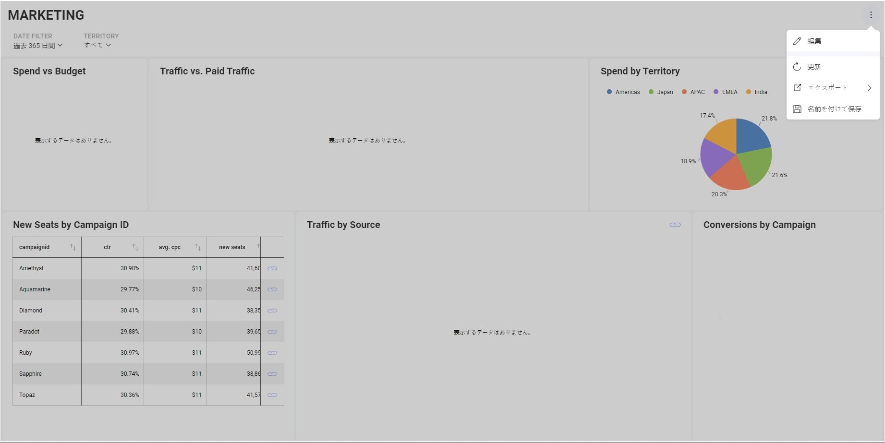
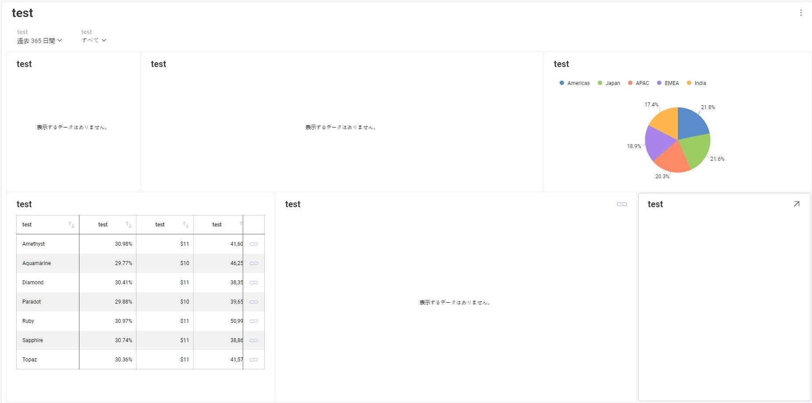
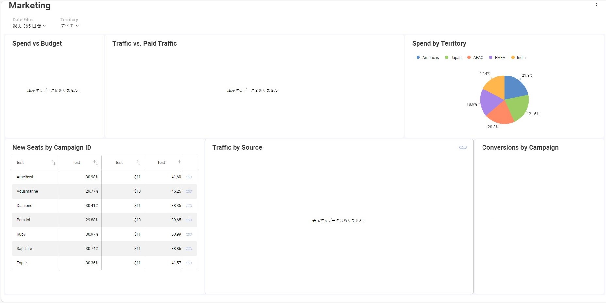

# ローカライズ

Reveal SDK はローカリゼーションの強力なサポートを提供し、多様な世界市場にわたってその多用途性と魅力を強化します。わかりやすく包括的なローカリゼーション フレームワークより、開発者はアプリケーションをさまざまな言語にシームレスに適応させることができます。

現在のローカリゼーション ロケールは、デフォルトではユーザーのブラウザーによって自動的に決定されます。ただし、文字列のローカライズを有効にするには、SDK 自体のロケールを設定する必要があります。この手順では、内部文字列の表示言語をカスタマイズできます。SDK は次のロケールをサポートします: `de`、`es`、`fr`、`it`、`ja`、`ko`、`ms`、`nl`、`pt`、`ru`、`zh- cn`、`zh-tw`。このリストは、`$.ig.SupportedLocales` プロパティを調べることで参照できます。

ロケールを設定するには、メソッド `$.ig.RevealSdkSettings.overrideLocale` を使用し、前述のリストから目的のロケールをパラメーターとして渡します。ロケールを再度オーバーライドする前に、promise を待つことが重要です。問題を回避するには、必ずこの順序に従ってください。

```js
$.ig.RevealSdkSettings.overrideLocale('ja').then(_ => {
    ...
})
```

すべての内部テキストが日本語に変更されるはずです。



その後、可視化のタイトルや列名などの文字列のローカライズを開始する準備が整います。

カスタム翻訳を提供するには、クライアントに `$.ig.RevealSdkSettings.localizedStringsProvider` イベントのハンドラーを追加する必要があります。このイベントは `RVLocalizationElement` と `RVLocalizationContext` を受け取り、ローカライズされた文字列を返す必要があります。

```js
$.ig.RevealSdkSettings.localizedStringsProvider = function (element, context) {
    ...
    return localizedString;
};
```

ここでは、あらゆる入力文字列に対してローカライズされた文字列 `test` を一貫して返すイベント ハンドラーを追加してみます。

```js
$.ig.RevealSdkSettings.localizedStringsProvider = function (element, context) {
    return "test";
};
```

追加後、ダッシュボードは次のように表示されます。



もう少し詳しく見てみましょう。 すべてに対して `test` を返すのではなく、視覚化フィールド ラベルに対してのみ `test` を返すようにしましょう。

```js
$.ig.RevealSdkSettings.localizedStringsProvider = function (element, context) {
    if (element.elementType === $.ig.RVLocalizationElementType.VisualizationFieldLabel) {
        return "test";
    }
    return element.title ?? element.name;
};
```



この方法を使用して、要素タイプ `DashboardFilterTitle`、`DashboardTitle`、`FieldLabel`、`VisualizationFieldLabel`、および `VisualizationTitle` のローカライズ動作をカスタマイズできます。

## 例: コンボ ボックスからロケールを選択する

**手順 1** - 利用可能なローカリゼーション オプションを含むコンボ ボックスをページに追加します。

```html
<div class="dropdown">
    <button class="dropbtn">Language
        <i class="fa fa-caret-down"></i>
    </button>
    <div class="dropdown-content">
        <a href="#" onclick="changeLang('en')">English</a>
        <a href="#" onclick="changeLang('ja')">Japanese</a>
        <a href="#" onclick="changeLang('es')">Spanish</a>
        <a href="#" onclick="changeLang('it')">Italian</a>
        <a href="#" onclick="changeLang('fr')">French</a>
    </div>
</div>
```

**手順 2** - `changeLang` メソッドを追加します。

```js
//function to set the language from the combobox and save it on sessionStorage
function changeLang(lang) {
    sessionStorage.setItem('lang', lang);
    location.reload();
}
```

**手順 3** - 必要な単語を含むディクショナリを作成します。

```js
//this map helps us get the index by lang
const lang = {
    "en": 0, "ja": 1, "es": 2, "it": 3, "fr": 4
};

//this is a map with the word we want to translate and a list of words in each language
const dictionaryTable = {
    "Date Filter": ["Date Filter", "日付フィルター", "Filtro de Fecha", "Filtro data", "Filtre de date"],
    "Date": ["Date", "日にち", "Fecha", "Data", "Date"],
    "Marketing": ["Marketing", "マーケティング", "Marketing", "Marketing", "Commercialisation"],
    "Spend": ["Spend", "費やす", "Gastado", "Spendere", "Dépenser"],
    "Budget": ["Budget", "バジェット", "Presupuesto", "Bilancio", "Budget"],
    "CTR": ["CTR", "クリック率", "CTR", "CTR", "CTR"],
    "Spend by Territory": ["Spend by Territory", "テリトリー別支出額", "Gastos por territorios", "Spese per territorio", "Dépenses par territoire"],
    "Spend vs Budget": ["Spend vs Budget", "支出対予算", "Gasto vs Presupuesto", "Spesa vs budget", "Dépenses vs budget"],
    "Organic Traffic": ["Organic Traffic", "オーガニックトラフィック", "Tráfico orgánico", "Traffico organico", "Trafic organique"],
};
```

**手順 4** - ディクショナリから翻訳する関数を作成します。

```js
//function to translate, expects an RVLocalizationElement and returns a localized string
function translate(element) {
    const selectedLang = sessionLang.toLowerCase();
    const elementDesc = element.title ? element.title : element.name;
    const candidateList = dictionaryTable[elementDesc];
    const candidate = candidateList ? candidateList[lang[selectedLang]] : undefined;
    return candidate ? candidate : elementDesc;
}
```

**手順 5** - `$.ig.RevealSdkSettings.localizedStringsProvider` イベントのハンドラーを追加します。

```js
$.ig.RevealSdkSettings.overrideLocale(sessionLang).then(_ => {
    $.ig.RevealSdkSettings.localizedStringsProvider = function (element, context) {
        return translate(element);
    };
})
```

**手順 6** - 残りのコードを追加してダッシュボードを読み込みます。

```js
const sessionLang = sessionStorage.getItem('lang') ?? 'en';

const lang = {
    "en": 0, "ja": 1, "es": 2, "it": 3, "fr": 4
};

const dictionaryTable = {
    //"OriginalWord": ["English", "Japanese", "Spanish", "Italian", "French"], => example guide
    "Date Filter": ["Date Filter", "日付フィルター", "Filtro de Fecha", "Filtro data", "Filtre de date"],
    "Date": ["Date", "日にち", "Fecha", "Data", "Date"],
    "Marketing": ["Marketing", "マーケティング", "Marketing", "Marketing", "Commercialisation"],
    "Spend": ["Spend", "費やす", "Gastado", "Spendere", "Dépenser"],
    "Budget": ["Budget", "バジェット", "Presupuesto", "Bilancio", "Budget"],
    "CTR": ["CTR", "クリック率", "CTR", "CTR", "CTR"],
    "Spend by Territory": ["Spend by Territory", "テリトリー別支出額", "Gastos por territorios", "Spese per territorio", "Dépenses par territoire"],
    "Spend vs Budget": ["Spend vs Budget", "支出対予算", "Gasto vs Presupuesto", "Spesa vs budget", "Dépenses vs budget"],
    "Organic Traffic": ["Organic Traffic", "オーガニックトラフィック", "Tráfico orgánico", "Traffico organico", "Trafic organique"],
};

//function to translate, expects an RVLocalizationElement and returns a localized string
function translate(element) {
    const elementDesc = element.title ? element.title : element.name;
    const candidateList = dictionaryTable[elementDesc];
    const candidate = candidateList ? candidateList[lang[sessionLang]] : undefined;
    return candidate ? candidate : elementDesc;
}

//function to set the language from the combo box and save it into sessionStorage
function changeLang(lang) {
    sessionStorage.setItem('lang', lang)
    location.reload();
}

// set this to your server url
$.ig.RevealSdkSettings.setBaseUrl("https://samples.revealbi.io/upmedia-backend/reveal-api/");

$.ig.RevealSdkSettings.overrideLocale(sessionLang).then(_ => {
    $.ig.RevealSdkSettings.localizedStringsProvider = function (element, context) {
        return translate(element);
    };
})

$.ig.RVDashboard.loadDashboard("Marketing").then(dashboard => {
    const revealView = new $.ig.RevealView("#revealView");
    revealView.dashboard = dashboard;
})
```

:::info Get the Code

このサンプルのソース コードは、[GitHub](https://github.com/RevealBi/sdk-samples-javascript/tree/main/LocalizingDashboards) にあります。

:::