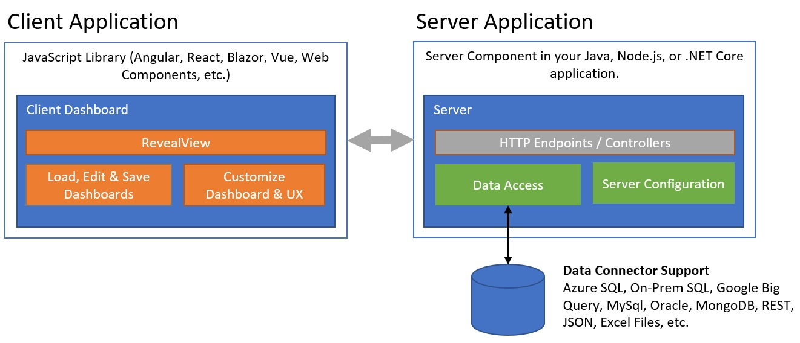

# Reveal の概要

Reveal は、組み込み分析用に構築されたビジネス インテリジェンス ソリューションです。Reveal を使用すると、次のことができます:

- 機能豊かなセルフ サービス ダッシュボードと最新のレポート機能を提供します。
- あらゆる JavaScript フレームワーク (React、Angular、Vue JS、Web Components、Blazor など)、Windows Forms、または WPF アプリケーションで使用できます。
- ブランド エクスペリエンスに合わせて UX をカスタマイズします。
- ほぼすべてのデータ ソースに接続して、ダッシュボードに入力します。
- Java、ASP.NET、または Node.js バックエンドで、任意のクラウド (パブリックまたはプライベート) または独自のオンプレミス サーバーに配置します。

## Reveal のアーキテクチャ

Reveal には、クライアント アプリケーションへのダッシュボードの配信を可能にする 2 つのコア コンポーネントがあります。

- **Reveal クライアント SDK**: Web アプリケーションに統合する必要がある JavaScript ライブラリと CSS ファイルのセット。Reveal クライアント SDK は Web Component として出荷され、任意のクライアント アプリ (Angular、React、Blazor、Vue など) で使用できます。
- **Reveal サーバー SDK**: サーバー アプリケーションに統合するサーバー側コンポーネント。これは現在、ASP.NET (.NET 4.6.2+)、Java、および Node.js 用に出荷されています。

この図は、SDK コンポーネントについて説明しています。  



Reveal クライアントには、クライアントが要求と応答を送受信するサーバーのエンドポイントである baseUrl プロパティがあります。

クライアント アプリは、アプリケーションでダッシュボード描画するために使用される RevealView オブジェクトを作成します。また、既存のダッシュボードを編集したり、新しいダッシュボードを最初から作成したりすることもできます。RevealView には、ユーザーのダッシュボード エクスペリエンスの中心となる[プロパティとイベント](https://help.revealbi.io/api/javascript/latest/classes/revealview.html)があります。メニューの表示と非表示を切り替えたり、チャートのツールチップを有効または無効にしたり、ダッシュボード フィルターを追加または削除したりなどのプロパティを設定できます。 

RevealView オブジェクトは、ダッシュボードまたは資格情報の保存領域を扱いません。ダッシュボードの定義を含むバイナリ コンテンツ (ZIP ファイル形式の .rdash ファイル) は、サーバー アプリによって http リクエストで提供されます。サーバー アプリは、Reveal SDK の既定の保存/読み込みエクスペリエンスを使用するか、ダッシュボードの読み込みと保存の方法をオーバーライドする場所です。

## Reveal でのデータ ソースのサポート

Reveal SDK は、分析ツール、コンテンツ マネージャー、クラウド サービス、CRM、データベース、スプレッドシート、公開データ ソースなど、30 を超えるデータ ソースをサポートしています。データ ソースは、ダッシュボードのどこからデータが取得されるかを定義します。各データ ソースには、接続文字列、ユーザー ID、パスワードなど、データに接続してデータを取得するためにコードで設定した固有のプロパティがあります。

Reveal SDK には、データ ソースに関して 2 つの概念があります。

- データ ソース - これはデータの主要なソースです。たとえば、SQL Server をデータ ソースにすることができます。
  データ ソース項目 - これは、データ ソースから利用できる特定の項目です。例えば、SQL Server の特定のテーブル。
- サポートされているデータ ソースのリストは、この[ヘルプ トピック](https://help.revealbi.io/jp/web/datasources.html)で確認できます。


## 資格情報とセキュリティ

Reveal はデータを保存せず、資格情報も保存しません。認証を必要とするデータベースまたはその他のデータ ソースからデータを要求する場合、アプリケーション コードは、構成ファイルからデータを読み込むか、安全なストレージに格納することにより、資格情報管理を処理します。Reveal は、これらの資格情報の保存と処理を開発者による実装に委任します。

認証および承認 API について説明する 2 つのヘルプ トピックがあります。
-	[認証](https://help.revealbi.io/jp/web/authentication.html) – データ ソースでユーザー名 / パスワードとベアラー トークンの両方の認証資格情報を使用する方法を示します。
-	[ユーザー資格情報](https://help.revealbi.io/jp/web/user-context.html) – アプリケーションの認証済みユーザーの ID を取得し、その情報をカスタム クエリに送信する方法を示します。

たとえば、SQL Server データベースのデータを使用する表示形式の資格情報を解決するには、次のようなコードを使用して接続の詳細を設定します。これらの詳細がどこに保存され、どのように取得されるかは、実装されたサーバー コードによります。

```c#
public class AuthenticationProvider: IRVAuthenticationProvider
{
    public Task<IRVDataSourceCredential> ResolveCredentialsAsync(IRVUserContext userContext, RVDashboardDataSource dataSource)
    {
        IRVDataSourceCredential userCredential = null;
        if (dataSource is RVSqlServerDataSource)
        {
            userCredential = new RVUsernamePasswordDataSourceCredential("sqlserveruser", "password");
        }
        return Task.FromResult<IRVDataSourceCredential>(userCredential);
    }
}
```

SQL Server データ接続を設定する完全なコードを確認するには、この[ヘルプ トピック](https://help.revealbi.io/jp/web/replacing-data-sources/ms-sql-server.html)を参照してください。

## 配置

Reveal SDK を含むアプリケーションには、配置に関する制限はありません。Reveal SDK サーバー側コンポーネントは、既存のアプリケーションまたは新しいアプリケーションに組み込む一連のライブラリ (Windows、Mac OS、および Linux のいずれかで .NET Framework、Java、および Node.js をサポート) であるためです。Reveal サーバー側コンポーネントはアプリケーションのコンテキストに統合されるため、AWS、Microsoft Azure、Google Cloud などのクラウド プロバイダー、または独自のオンプレミス サーバーへの配置が可能です。

Reveal SDK は、SDK コンポーネントの複数のインスタンスが同時に実行される可能性があるマルチテナント アプリケーションに配置することもでき、それぞれがキャッシュ ストレージ、資格情報管理、ダッシュボード処理などの独自のリソースで構成されます。
