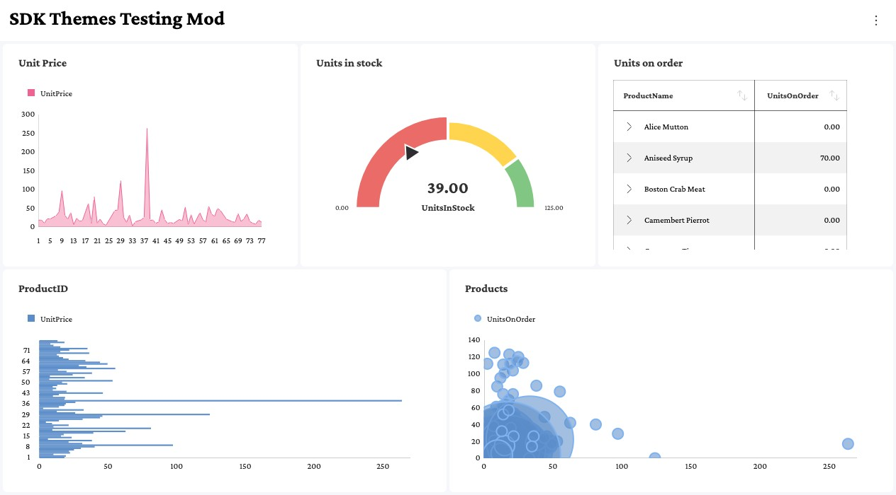

# テーマのフォント

`RevealTheme` には、Reveal SDK が描画するテキスト スタイルごとに 1 つずつ、合計 5 つのフォント プロパティがあります。各プロパティには、`@font-face` ルールまたはユーザーのデバイスにインストールされたフォントとして、ページで使用できるフォント ファミリの名前を指定します。

| プロパティ           | スタイル                  | 使用される場所の例                                              |
| ----------         | -----                  | ---------------------------------------------------------------------      |
| **regularFont**    | 標準 (400)          | チャートのラベル、グリッドのセル、フィルターの値、その他ほとんどのテキスト               |
| **mediumFont**     | ミディアム (500)           | 表示形式エディターのラベルと見出し                           |
| **boldFont**       | 太字 (700)             | ダッシュボードと表示形式のタイトル、グリッドのヘッダー、ゲージの値            |
| **italicFont**     | 斜体 (400 italic)    | 斜体テキストの条件付き書式ルールが適用されたグリッドのセル       |
| **boldItalicFont** | 太字斜体 (700 italic) | 太字斜体テキストの条件付き書式ルールが適用されたグリッドのセル |

## フォント プロパティの解決方法

Reveal は、すべてのフォント プロパティを標準の太さと標準のスタイルで描画します。Reveal 自体が `font-weight: bold` や `font-style: italic` を適用することはなく、プロパティに割り当てられたファミリがそのスタイルを提供することを前提としています。これは定義済みのテーマと同じ仕組みで、定義済みテーマの `boldFont` は `Roboto` を太字の太さで描画したものではなく、`Roboto-Bold` ファミリです。

そのため、フォント プロパティはフォントがどのように描画されるかではなく、どこで使用されるかを表します。`boldFont` に `"Crimson Pro"` のような標準のファミリを割り当てると、タイトルは標準の書体で描画されます。タイトルを太字にするには、太字の書体のみを含むファミリを割り当てるか、標準のファミリを再利用して、ページの `@font-face` ルールから Reveal に太字の書体を導出させます。以下では、この 2 つのパターンについて説明します。

## スタイルごとに専用のフォント ファミリを使用

各プロパティに異なるファミリを割り当てます。各ファミリには、目的のスタイルの書体が 1 つだけ含まれます。

```js
const theme = new RevealTheme();
theme.regularFont = "Crimson Pro";
theme.mediumFont = "Crimson Pro Medium";
theme.boldFont = "Crimson Pro Bold";
theme.italicFont = "Crimson Pro Italic";
theme.boldItalicFont = "Crimson Pro Bold Italic";

RevealSdkSettings.theme = theme;
```

各名前が目的の書体に解決される限り、ファミリの提供元は問いません。セルフホストのフォントの場合は、ファミリごとに 1 つの `@font-face` ルールを宣言します。

```css
@font-face { font-family: "Crimson Pro";             src: url("fonts/CrimsonPro-Regular.woff2"); }
@font-face { font-family: "Crimson Pro Medium";      src: url("fonts/CrimsonPro-Medium.woff2"); }
@font-face { font-family: "Crimson Pro Bold";        src: url("fonts/CrimsonPro-Bold.woff2"); }
@font-face { font-family: "Crimson Pro Italic";      src: url("fonts/CrimsonPro-Italic.woff2"); }
@font-face { font-family: "Crimson Pro Bold Italic"; src: url("fonts/CrimsonPro-BoldItalic.woff2"); }
```

## すべてのスタイルに 1 つのフォント ファミリを使用

すべてのプロパティに同じファミリを割り当てます。スタイル プロパティに `regularFont` とまったく同じ文字列が設定されている場合、Reveal はそのファミリの `@font-face` ルールのうち、プロパティの太さとスタイルに一致するものを探し、その書体でプロパティのテキストを描画します。

```js
const theme = new RevealTheme();
theme.regularFont = "Crimson Pro";
theme.mediumFont = "Crimson Pro";
theme.boldFont = "Crimson Pro";
theme.italicFont = "Crimson Pro";
theme.boldItalicFont = "Crimson Pro";

RevealSdkSettings.theme = theme;
```



:::caution

値は文字列として比較されるため、すべてのプロパティに同一の文字列を割り当てる必要があります。同じファミリを別の書き方で指定した値は、専用のファミリとして扱われます。そのテキストは標準の書体で描画され、警告も記録されません。

```js
theme.regularFont = "Crimson Pro";
theme.boldFont = "'Crimson Pro'";        // 引用符が余分: 同じ文字列ではありません
theme.italicFont = "Crimson Pro, serif"; // フォールバック リスト: 同じ文字列ではありません
```

すべてのプロパティを 1 つの変数から割り当てると、このような不一致を防げます。

:::

各プロパティは、以下の `@font-face` 記述子と照合されます。各太さは単一の値で宣言してください。太さの範囲を宣言しているルールには、[可変フォント](#可変フォント)で説明する追加の手順が必要です。

| プロパティ           | font-weight | font-style |
| ----------         | ----------- | ---------- |
| **mediumFont**     | 500         | normal     |
| **boldFont**       | 700         | normal     |
| **italicFont**     | 400         | italic     |
| **boldItalicFont** | 700         | italic     |

### フォントの書体の宣言

このパターンでは、テーマが使用するすべての太さとスタイルについて、ページで `@font-face` ルールを宣言する必要があります。Google Fonts から読み込む場合は、各太さとスタイルを、範囲 (`200..900`) ではなく太さのリスト (`400;500;700`) として明示的に要求します。

```html
<link href="https://fonts.googleapis.com/css2?family=Crimson+Pro:ital,wght@0,400;0,500;0,700;1,400;1,700&display=swap" rel="stylesheet">
```

セルフホストのフォントの場合は、一致する `font-weight` および `font-style` 記述子を指定してルールを宣言します。

```css
@font-face { font-family: "Crimson Pro"; font-weight: 400; font-style: normal; src: url("fonts/CrimsonPro-Regular.woff2"); }
@font-face { font-family: "Crimson Pro"; font-weight: 500; font-style: normal; src: url("fonts/CrimsonPro-Medium.woff2"); }
@font-face { font-family: "Crimson Pro"; font-weight: 700; font-style: normal; src: url("fonts/CrimsonPro-Bold.woff2"); }
@font-face { font-family: "Crimson Pro"; font-weight: 400; font-style: italic; src: url("fonts/CrimsonPro-Italic.woff2"); }
@font-face { font-family: "Crimson Pro"; font-weight: 700; font-style: italic; src: url("fonts/CrimsonPro-BoldItalic.woff2"); }
```

:::caution

Reveal は、テーマが `RevealSdkSettings.theme` に割り当てられた時点で `@font-face` ルールを読み取ります。テーマを割り当てる前にスタイルシートをページに追加してください。追加しないと、書体が見つかりません。

:::

### 可変フォント

可変フォントは通常、`font-weight: 200 900` のように太さの範囲を指定して宣言されます。Google Fonts に範囲 (`wght@200..900`) を要求した場合も、同じ種類のルールが生成されます。Reveal は `mediumFont`、`boldFont`、`boldItalicFont` に対してこのようなルールを見つけますが、すべてのプロパティを標準の太さで描画するため、テキストは太さ 400 で描画され、標準の書体に見えます。一致する書体は見つかっているため、警告は記録されません。

代わりに、太さごとに 1 つのルールを宣言し、それぞれに単一の `font-weight` 値を指定してください。すべてのルールは同じ可変フォント ファイルを参照できます。

```css
@font-face { font-family: "Crimson Pro"; font-weight: 400; font-style: normal; src: url("fonts/CrimsonPro-VariableFont_wght.woff2"); }
@font-face { font-family: "Crimson Pro"; font-weight: 500; font-style: normal; src: url("fonts/CrimsonPro-VariableFont_wght.woff2"); }
@font-face { font-family: "Crimson Pro"; font-weight: 700; font-style: normal; src: url("fonts/CrimsonPro-VariableFont_wght.woff2"); }
@font-face { font-family: "Crimson Pro"; font-weight: 400; font-style: italic; src: url("fonts/CrimsonPro-Italic-VariableFont_wght.woff2"); }
@font-face { font-family: "Crimson Pro"; font-weight: 700; font-style: italic; src: url("fonts/CrimsonPro-Italic-VariableFont_wght.woff2"); }
```

### フォントの書体が見つからない場合

プロパティに一致する `@font-face` ルールがない場合、そのプロパティのテキストは標準の書体で描画されます。たとえば、Google Fonts から標準の太さのみを要求すると、`boldFont` を設定していても、タイトル、グリッドのヘッダー、ゲージの値は標準のままになります。

```html
<link href="https://fonts.googleapis.com/css2?family=Crimson+Pro:wght@400&display=swap" rel="stylesheet">
```


Reveal は、解決できなかったプロパティごとにブラウザーのコンソールに警告を記録します。警告には、不足している太さとスタイルが示されます。

```
Reveal could not resolve a 700 face for the theme font "Crimson Pro". Text using this style will render with the regular face. Provide an @font-face for that weight/style (e.g. include it in your font stylesheet), or assign a dedicated per-style family to the theme slot.
```

解決するには、不足している太さまたはスタイルをフォントのスタイルシートに追加するか、[スタイルごとに専用のフォント ファミリを使用](#スタイルごとに専用のフォント-ファミリを使用)で説明されているように、そのプロパティに専用のファミリを割り当てます。

## フォントの変更の適用

フォント プロパティは、テーマが `RevealSdkSettings.theme` に割り当てられた時点で有効になります。フォントを適用するのは、この割り当てです。`RevealSdkSettings.theme` を読み取ると現在のテーマ オブジェクトが返されますが、そのオブジェクトのフォント プロパティを変更しても何も適用されません。テキストは以前のフォントで描画されたままになり、警告も記録されません。

```js
// 誤り: この変更は適用されません
RevealSdkSettings.theme.boldFont = "Crimson Pro";
```

テーマのクローンを変更して、それを割り当ててください。

```js
// 正しい例: 割り当てによってフォントが適用されます
const theme = RevealSdkSettings.theme.clone();
theme.regularFont = "Crimson Pro";
theme.boldFont = "Crimson Pro";

RevealSdkSettings.theme = theme;
```

`RevealView.refreshTheme` は、この割り当ての代わりになるものではありません。このメソッドは、最後に割り当てられたテーマでダッシュボードを再読み込みするため、`RevealView` がすでにダッシュボードを表示している場合は、割り当ての後に呼び出してください。

## 制限事項

- CSS Font Loading API (`document.fonts.add(new FontFace(...))`) で登録されたフォントには、Reveal が読み取れる `@font-face` ルールがないため、スタイルを導出できません。そのようなファミリを `regularFont` と共有するプロパティは、標準の書体で描画されます。代わりに CSS で `@font-face` を使用してフォントを宣言するか、スタイルごとに専用のファミリを割り当ててください。
- ファミリの `@font-face` ルールがまったく存在しない場合、Reveal はインストールされたフォントのスタイル名 (`Crimson Pro Bold` など) を試します。これはユーザーのデバイスにフォントがインストールされている場合にのみ機能するため、公開 Web アプリケーションではこの動作に依存しないでください。

:::note

以前のバージョンの Web SDK では、`italicFont` と `boldItalicFont` は受け入れられていましたが、適用されていませんでした。現在は有効になるため、すでにこれらを設定している場合、斜体の条件付き書式スタイルを使用するグリッドのセルは、アップグレード後に外観が変わります。

:::
