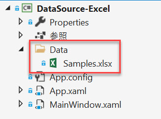

# Excel ファイル データ ソースの追加

**手順 1** - Excel ファイルを含むフォルダーを作成します。



:::info

Visual Studio の [プロパティ ウィンドウ] で、Excel ファイルの [出力ディレクトリにコピー] プロパティを [常にコピーする] または [新しい場合はコピーする] に設定してください。

:::

**手順 2** - `RevealSdkSettings.LocalDataFilesRootFolder` プロパティを**手順 1** で作成したフォルダーの場所に設定します。

```cs
RevealSdkSettings.LocalDataFilesRootFolder = Path.Combine(Environment.CurrentDirectory, "Data");
```

これにより、Reveal SDK は、この場所を使用して、ファイルベースのデータ ソースとして使用されるファイルを読み込むように指示されます。

**手順 3** - `RevealView.DataSourcesRequested` イベントのイベント ハンドラーを追加します。

```html
<rv:RevealView x:Name="_revealView" DataSourcesRequested="RevealView_DataSourcesRequested" />
```

イベント ハンドラーで、2 つのコレクションを定義します。1 つはデータ ソース用で、もう 1 つはデータ ソース項目用です。これらの 2 つのコレクションは、イベント ハンドラー コールバックで必要な `RevealDataSources` オブジェクトへのパラメーターとして使用されます。

```cs
private void RevealView_DataSourcesRequested(object sender, Reveal.Sdk.DataSourcesRequestedEventArgs e)
{
    var dataSources = new List<RVDashboardDataSource>();
    var items = new List<RVDataSourceItem>();

    ...

    e.Callback(new RevealDataSources(dataSources, items, true));
}
```

**手順 4** - `RevealView.DataSourcesRequested` イベントハンドラーで、`RVLocalFileDataSourceItem` オブジェクトの新しいインスタンスを作成します。`Uri` プロパティを、データ ソースとして使用する Excel ファイルのパス (ファイル名を含む) に設定します。

```cs
private void RevealView_DataSourcesRequested(object sender, Reveal.Sdk.DataSourcesRequestedEventArgs e)
{
    var dataSources = new List<RVDashboardDataSource>();
    var items = new List<RVDataSourceItem>();

    var localFileItem = new RVLocalFileDataSourceItem();
    localFileItem.Uri = "local:/Samples.xlsx";

    e.Callback(new RevealDataSources(dataSources, items, true));
}
```

:::caution

Excel ファイル パスの前に `local:/` を付ける必要があります。これは、`RevealSdkSettings.LocalDataFilesRootFolder` をファイル パスのルートとして使用してファイルを読み込むように Reveal SDK に指示するためです。ルート パス内にサブフォルダーがある場合は、これらのサブフォルダーを `Uri` プロパティに含めるようにしてください。

例:
 * サブフォルダーなし - `RVLocalFileDataSourceItem.Uri = "local:/FileName.xlsx"`
 * サブフォルダーあり - `RVLocalFileDataSourceItem.Uri = "local:/SubFolder/FileName.xlsx"`

:::

**手順5** - `RVExcelDataSourceItem` オブジェクトの新しいインスタンスを作成し、前の手順で作成した `RVLocalFileDataSourceItem` インスタンスをオブジェクト コンストラクターの引数として渡します。`Title` プロパティを、Excel ファイル内のデータを説明する文字列に設定します。

最後に、`RVExcelDataSourceItem` オブジェクトをデータ ソース項目コレクションに追加します。

```cs
private void RevealView_DataSourcesRequested(object sender, Reveal.Sdk.DataSourcesRequestedEventArgs e)
{
    var dataSources = new List<RVDashboardDataSource>();
    var items = new List<RVDataSourceItem>();

    var localFileItem = new RVLocalFileDataSourceItem();
    localFileItem.Uri = "local:/Samples.xlsx"; // "local:/" is a required prefix

    var excelDataSourceItem = new RVExcelDataSourceItem(localFileItem);
    excelDataSourceItem.Title = "Local Excel File";
    items.Add(excelDataSourceItem);

    e.Callback(new RevealDataSources(dataSources, items, true));
}
```

アプリケーションが実行されたら、新しい表示形式を作成すると、[データ ソースの選択] ダイアログに新しく作成された Excel ファイル データ ソースが表示されます。


:::info コードを取得する

このサンプルのソース コードは [GitHub](https://github.com/RevealBi/sdk-samples-wpf/tree/master/AddingDataSources/ExcelFile) にあります。

:::