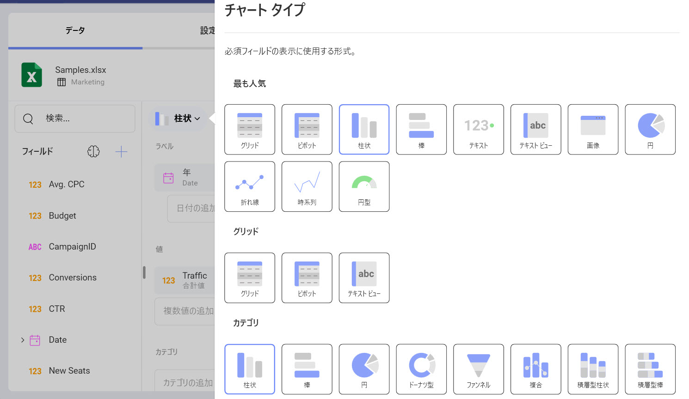

# チャート タイプ

**チャート タイプ**は、ダッシュボードの視覚化として使用できるさまざまなタイプのチャートを表します。可視化を作成または編集する場合、チャート タイプは [チャート タイプ] ドロップダウン メニューから選択します。



Reveal SDK は、さまざまなグループに配置された 37 タイプのチャートを提供します。グループは次のとおりです。

- 最も人気
- グリッド
- カテゴリ
- ゲージ
- マップ
- 散布
- 財務
- 時間
- その他

## チャート タイプのカスタマイズ
カスタム可視化を変更、削除、またはチャート タイプ ドロップダウンに追加するには、`RevealView.ChartTypes` 配列内の項目を変更するだけです。

### チャート タイプを更新
既存のチャート タイプを更新するには、`RevealView.ChartTypes` プロパティでチャート タイプを見つけます。チャート タイプのさまざまなプロパティを変更して、チャート タイプ項目の名前変更、アイコンの変更、または再グループ化を行います。

```cs
var barConfig = _revealView.ChartTypes.First(x => x.ChartType == RVChartType.BarChart);
barConfig.Title = "My Cool Bar";
barConfig.Icon = "https://help.revealbi.io/img/logo.png";
barConfig.Groups = new string[] { "Enterprise Visualizations", "HR", "Some Other Category" };
```

### チャート タイプの削除
削除するチャート タイプ項目を見つけて、それを `ChartTypes` 配列から削除することで、チャート タイプを削除します。

```cs
_revealView.ChartTypes.Remove(_revealView.ChartTypes.FirstOrDefault(x => x.ChartType == RVChartType.Grid));
```

### カスタム チャート タイプの追加
既存のチャート タイプ項目を更新および削除するだけでなく、カスタム可視化を新しいチャート タイプとして [チャート タイプ] ドロップダウンに追加することもできます。

```cs
_revealView.ChartTypes.Add(new RVChartTypeCustomItem("Custom Viz", "https://host/customViz.html")
{
    Icon = "https://help.revealbi.io/img/logo.png",
    Groups = new string[] { "Custom Vizualizations" }
});
```

## デフォルトのチャート タイプを設定する
デフォルトでは、Reveal SDK はデフォルトのチャート タイプとして `ColumnChart` チャートを設定します。デフォルトのチャート タイプを変更するには、`RevealView.DefaultChartType` プロパティを [RVChartType](https://help.revealbi.io/api/wpf/latest/Reveal.Sdk.RVChartType.html) 列挙メンバーの 1 つに設定します。

```cs
_revealView.DefaultChartType = RVChartType.StackedColumnChart;
```

デフォルトのチャート タイプをカスタム可視化に設定する場合は、`RevealView.DefaultCustomChartType` プロパティをカスタム可視化のタイトルに設定する必要があります。

```js
_revealView.DefaultCustomChartType = "Custom Viz";
```

:::info コードの取得

チャート タイプを示すサンプルは、[GitHub](https://github.com/RevealBi/sdk-samples-wpf/tree/master/ChartTypes) で見つけることができます。

:::
