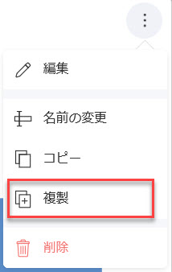

# ダッシュボードの編集

ダッシュボードの編集は主にエンドユーザー向けの機能ですが、開発者がさまざまな編集イベントに応答したり、UI 要素を表示/非表示にして編集エクスペリエンスを制御したり、編集を完全に無効にしたりするのに役立つ API が多数あります。

## プロパティ

### AvailableChartTypes

このプロパティは、表示形式を作成および編集するためにエンドユーザーが使用できるチャート タイプを定義するために使用されます。


`RevealView.AvailableChartTypes` コレクションのチャートタイプのみがエンドユーザーに表示されます。

デフォルトでは、サポートされているすべてのチャートタイプを使用できます。`AvailableChartTypes.Remove` メソッドを使用し、削除する `RVChartType` をパラメーターとして渡すことにより、特定のチャート タイプを削除できます。

このサンプルは、`RVChartType.Indicator` および `RVChartType.IndicatorTarget` (KPI とも呼ばれます) を `RevealView.AvailableChartTypes` から削除します。
```cs
_revealView.AvailableChartTypes.Remove(RVChartType.Indicator);
_revealView.AvailableChartTypes.Remove(RVChartType.IndicatorTarget);
```

少数のチャートタイプを使用する場合は、すべてのチャートタイプを削除して、使用可能にしたいチャートのみを追加する方が簡単な場合があります。これを行うには、必ず `AvailableChartTypes.Clear` メソッドを呼び出してすべてのチャートタイプを削除してから、`AvailableChartTypes.Add` メソッドを使用して、ユーザーが利用できるチャートタイプのみを追加してください。
```cs
_revealView.AvailableChartTypes.Clear();
_revealView.AvailableChartTypes.Add(RVChartType.BarChart);
_revealView.AvailableChartTypes.Add(RVChartType.ColumnChart);
```

`RVChartType` 列挙体の値は次のとおりです:
- AreaChart
- BarChart
- BubbleChart
- BulletGraph
- CandlestickChart
- Choropleth
- ColumnChart
- ComboChart
- DIY
- DoughnutChart
- FunnelChart
- Grid
- Image
- Indicator
- IndicatorTarget
- LabelGauge
- LineChart
- LinearGauge
- OHLC_Chart
- PieChart
- Pivot
- RadialGauge
- RadialLineChart
- ScatterChart
- ScatterMap
- ScriptPython
- ScriptR
- Sparkline
- SplineChart
- SplineAreaChart
- StackedAreaChart
- StackedBarChart
- StackedColumnChart
- StepAreaChart
- StepLineChart
- TextBox
- TextView  
- TimeSeriesChart
- TreeMap

:::info

`AvailableChartTypes.Clear` メソッドを呼び出しただけで、コレクションにチャートタイプを追加しなかった場合、サポートされているすべてのチャートタイプが引き続き使用可能です。

:::

### CanAddCalculatedFields

このプロパティは、表示形式エディターの [計算フィールド] メニュー項目を表示/非表示にします。


```xml
<rv:RevealView x:Name="_revealView" CanAddCalculatedFields="False" />
```

### CanAddDashboardFilter

このプロパティは、ダッシュボードの **[ダッシュボード フィルターの追加]** メニュー項目を表示/非表示にします。


```xml
<rv:RevealView x:Name="_revealView" CanAddDashboardFilter="False" />
```

### CanAddDateFilter

このプロパティは、ダッシュボードの **[日付フィルターの追加]** メニュー項目を表示/非表示にします。


```xml
<rv:RevealView x:Name="_revealView" CanAddDateFilter="False" />
```

### CanAddPostCalculatedFields

このプロパティは、表示形式エディターのフィールド セクションの **F(x)** メニュー項目を表示/非表示にします。


```xml
<rv:RevealView x:Name="_revealView" CanAddPostCalculatedFields="False" />
```

### CanCopyVisualization

このプロパティは、表示形式の **[コピー]** メニュー項目を表示/非表示にします。


```xml
<rv:RevealView x:Name="_revealView" CanCopyVisualization="False" />
```

### CanDuplicateVisualization

このプロパティは、表示形式の **[複製]** メニュー項目を表示/非表示にします。



```xml
<rv:RevealView x:Name="_revealView" CanDuplicateVisualization="False" />
```

### CanEdit

このプロパティは、ダッシュボードの **[編集]** メニュー項目を表示/非表示にします。


```xml
<rv:RevealView x:Name="_revealView" CanEdit="False" />
```

`RevealView.CanEdit` プロパティが `false` に設定されている場合、ダッシュボード編集は完全に無効になります。

### ShowEditDataSource

このプロパティは、表示形式エディターでデータ ソースの **[編集]** メニュー項目を表示/非表示にします。


```xml
<rv:RevealView x:Name="_revealView" ShowEditDataSource="False" />
```

### StartInEditMode

`true` に設定すると、このプロパティは、ダッシュボードが最初に読み込まれたときに `RevealView` を「編集モード」にします。


```xml
<rv:RevealView x:Name="_revealView" StartInEditMode="True" />
```

### StartWithNewVisualization

`true` に設定すると、このプロパティはすぐに [新しい表示形式] ダイアログを起動し、データ ソースを選択するように求めます。


```xml
<rv:RevealView x:Name="_revealView" StartWithNewVisualization="False" />
```

:::info

既存のダッシュボードを読み込んでいて、`RevealView.StartInEditMode` プロパティを `true` に設定していない場合、このプロパティは機能しません。 

:::

## イベント

### VisualizationEditorOpening

表示形式エディターが開く**前**にアプリケーション ロジックを実行したい場合や、条件が満たされるまでエディターが開かないようにしたい場合もあります。これを行うには、`RevealView.VisualizationEditorOpening` イベントにイベント ハンドラーを追加します。

```cs
<rv:RevealView x:Name="_revealView"
               VisualizationEditorOpening="RevealView_VisualizationEditorOpening"/>
```

```cs
private void RevealView_VisualizationEditorOpening(object sender, VisualizationEditorOpeningEventArgs e)
{
            
}
```

`VisualizationEditorOpeningEventArgs` には、次のプロパティが含まれています:
- **Cancel** - イベントをキャンセルするかどうかを示す値を取得または設定します。イベントをキャンセルする必要がある場合は `true`、それ以外の場合は `false` を設定します。
- **IsNewVisualization** - `true` の場合、表示形式は新しく追加された表示形式です。`false` の場合は既存の表示形式です。
- **Visualization** - 編集および/または追加された表示形式です。

:::info

`e.Cancel` を `true` に設定すると、表示形式エディターは開きません。

:::

### VisualizationEditorOpened

表示形式エディターを開いた**後**、既存の表示形式を編集するとき、または新しい表示形式を作成するときに通知を受け取りたい場合は、`RevealView.VisualizationEditorOpened` イベントにイベント ハンドラーを追加できます。

```cs
<rv:RevealView x:Name="_revealView"
               VisualizationEditorOpened="RevealView_VisualizationEditorOpened"/>
```

```cs
private void RevealView_VisualizationEditorOpened(object sender, VisualizationEditorOpenedEventArgs e)
{
            
}
```

`VisualizationEditorOpenedEventArgs` には、次のプロパティが含まれています:
- **IsNewVisualization** - `true` の場合、表示形式は新しく追加された表示形式です。`false` の場合は既存の表示形式です。
- **Visualization** - 編集および/または追加された表示形式です。

### VisualizationEditorClosing

表示形式エディターが閉じる**前**にアプリケーション ロジックを実行したい場合や、条件が満たされるまでエディターが閉じないようにしたい場合もあります。これを行うには、`RevealView.VisualizationEditorClosing` イベントにイベント ハンドラーを追加します。

```xml
<rv:RevealView x:Name="_revealView"
               VisualizationEditorClosing="RevealView_VisualizationEditorClosing" />
```

```cs
private void RevealView_VisualizationEditorClosing(object sender, VisualizationEditorClosingEventArgs e)
{

}
```

`VisualizationEditorClosedEventArgs` には、次のプロパティが含まれています:
- **Cancel** - イベントをキャンセルするかどうかを示す値を取得または設定します。イベントをキャンセルする必要がある場合は `true`、それ以外の場合は `false` を設定します。
- **IsNewVisualization** - `true` の場合、表示形式は新しく追加された表示形式です。`false` の場合は既存の表示形式です。
- **ResetVisualization** - `true` の場合、表示形式を編集前の状態にリセットします。
- **Visualization** - 編集および/または追加された表示形式です。

:::info

`e.Cancel` を `true` に設定すると、表示形式エディターは閉じません。

:::

### VisualizationEditorClosed
エンドユーザーが `RevealView` で単一の表示形式を編集するときはいつでも、エディターが閉じられた**後**に `RevealView.VisualizationEditorClosed` イベントが発生します。これは、既存の表示形式の編集、または新しい表示形式の追加に対応する場合があります。`RevealView.VisualizationEditorClosed` イベントにイベント ハンドラーを追加することで、このイベントに応答できます。

```xml
<rv:RevealView x:Name="_revealView"
               VisualizationEditorClosed="RevealView_VisualizationEditorClosed" />
```

```cs
private void RevealView_VisualizationEditorClosed(object sender, VisualizationEditorClosedEventArgs e)
{

}
```

`VisualizationEditorClosedEventArgs` には、次のプロパティが含まれています:
- **IsCancelled** - 表示形式エディターが **X ボタン** (`false`) または **Check ボタン** (`true`) のどちらで閉じられたかを示します。
- **IsNewVisualization** - `true` の場合、表示形式は新しく追加された表示形式です。`false` の場合は既存の表示形式です。
- **Visualization** - 編集および/または追加された表示形式です。

### Dashboard.PropertyChanged

`RVDashboard.PropertyChanged` イベントにイベント ハンドラーを追加することにより、`RVDashboard` オブジェクトのプロパティ値の変更を通知できます。

```cs
_revealView.Dashboard.PropertyChanged += Dashboard_PropertyChanged;
```

```cs
private void Dashboard_PropertyChanged(object sender, System.ComponentModel.PropertyChangedEventArgs e)
{

}
```

次のプロパティの値を変更すると、`RVDashboard.PropertyChanged` イベントが呼び出されます:
- **DateFilter** - ダッシュボードの日付フィルター。詳細については、[フィルタリング](filtering-dashboards.md#日付フィルター)のトピックを参照ください。
- **HasPendingChanges** - 現在のダッシュボードに変更が加えられている場合は `true` を返します。それ以外の場合は `false` を返します。
- **Title** - `RevealView` に表示されるダッシュボードのタイトルです。

ダッシュボードが変更されると、`RVDashboard.HasPendingChanges` プロパティが更新され、ダッシュボードに加えられた変更のうち、まだ保存またはコミットされていないものがあるかどうかが反映されます。このプロパティを使用して、`RVDashboard.HasPendingChanges`プロパティの値に基づいて有効/無効の状態を更新するようアプリケーション内の UI 要素に通知することができます。これを行うには、`RVDashboard.PropertyChanged` イベントにイベント ハンドラーを追加し、`e.PropertyName` を確認します。プロパティ名が **HasPendingChanges** の場合、ダッシュボードから値を取得し、要件に基づいてロジックを実行できます。

```cs
private void Dashboard_PropertyChanged(object sender, System.ComponentModel.PropertyChangedEventArgs e)
{
    if (e.PropertyName == "HasPendingChanges")
    {
        var hasPendingChanges = ((RVDashboard)sender).HasPendingChanges;
    }
}
```

:::info

`RVDashboard.PropertyChanged` イベントを使用する場合は、新しいダッシュボードを読み込む前、または既存のダッシュボードを破棄する前に、必ずイベントのサブスクライブを解除してください。そうしないと、アプリケーションにメモリ リークが発生する可能性があります。

:::