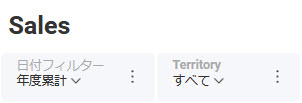
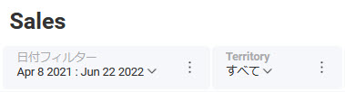
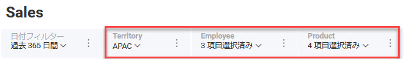

# ダッシュボードのフィルタリング

フィルターはダッシュボードの上部にあり、Reveal SDK を使用して変更できます。


フィルタには次の 2 種類があります:
- Date Filter (日付フィルター)
- ダッシュボード フィルター

## 日付フィルター
**日付フィルター**は、データが関連付けられていないため、特別な種類のフィルターです。選択できる値のリストはありません。代わりに、日付間隔または範囲を選択します。「今日」、「すべての期間」、「前月」 などの事前定義された日付間隔のリストから選択するか、独自のカスタム範囲 （2019 年 1 月 12 日から 2021 年 1 月 12 日まで) を指定できます。

**日付フィルター**は常に最初のフィルターであり、1 つしか存在できません。


### 日付間隔の使用
事前定義された日付間隔のセットを使用してダッシュボードの**日付フィルター**を設定するには、`Dashboard.DateFilter` プロパティを `RVDateDashboardFilter` オブジェクトの新しいインスタンスに設定し、適切なRV `DateFilterType` 値をパラメーターとして使用する必要があります。

例えば, このコード スニペットは、ダッシュボードの日付フィルターを **YearToDate** に設定します。
```cs
_revealView.Dashboard.DateFilter = new RVDateDashboardFilter(RVDateFilterType.YearToDate);
```
ここでは、ダッシュボード UI が Date Filter を **[年度累計]** に更新したことを確認できます。



`RVDateFilterType` の値は次のとおりです:
- AllTime
- CustomRange
- LastMonth
- LastWeek
- LastYear
- MonthToDate
- NextMonth
- NextQuarter
- NextYear
- PreviousMonth
- PreviousQuarter
- PreviousYear
- QuarterToDate
- ThisMonth
- ThisQuarter
- ThisYear
- Today
- TrailingTwelveMonths
- YearToDate
- Yesterday
  
### カスタム日付範囲の使用
カスタムの日付範囲を設定するには、`Dashboard.DateFilter` プロパティを `RVDateDashboardFilter` オブジェクトの新しいインスタンスに設定し、`RVDateFilterType.CustomRange` 値をパラメーターとして使用し、`RVDateRange` (fromDate 引数と toDate 引数を提供する) を 2 番目のパラメーターに指定する必要があります。

この例では、`DateFilter` を過去 75 日間にわたるカスタムの日付範囲に設定します。
```cs
_revealView.Dashboard.DateFilter = new RVDateDashboardFilter(RVDateFilterType.CustomRange,
     new RVDateRange(DateTime.Now.AddDays(-75), DateTime.Now)
));
```

ここでは、ダッシュボード UI が更新され、日付範囲が表示されるように Date Filter が更新されていることがわかります。



:::info Get the Code

日付フィルターを示すサンプルは [GitHub](https://github.com/RevealBi/sdk-samples-wpf/tree/master/FilteringDashboards-Dates) にあります。

:::

## ダッシュボード フィルター

**ダッシュボード フィルター**は、日付フィルターが定義されている場合、日付フィルターの後に表示され、単一のダッシュボードに複数のダッシュボード フィルターを定義できます。この画像には、3 つのダッシュボード フィルター (Territory、Employee、Product) が定義されています。



ダッシュボード フィルターを使用する場合、注意する必要がある主なオブジェクトは `RVDashboardFilter` オブジェクトです。`RVDashboardFilter` オブジェクトは、ダッシュボード用に定義された個々のフィルターを表します。フィルターのタイトル、選択可能な値、現在選択されている値など、フィルターに関する情報が含まれています。

`RVDashboardFilter` オブジェクトには、次のプロパティとメソッドがあります:
- **Id** - フィルターの一意の ID、通常は GUID。
- **Title (1)** - フィルターの名前。ダッシュボード フィルター UI のフィルターのヘッダーとしても使用されます。
- **SelectedValues (3)** -フィルター用に選択された値のコレクション。これらは、UI のフィルター ドロップダウン内のチェックボックスで表されます。
- **GetFilterValuesAsync() (2)** - フィルターで使用可能なすべてのフィルター値のコレクションを返します。これらはドロップダウン リストのオプションとして機能し、適用/選択するフィルター値を選択します。


### すべてのフィルターの取得

ダッシュボード フィルターには、`RVDashboard.Filters` プロパティを使用してアクセスできます。`RVDashboard.Filters` プロパティは、ダッシュボードに定義されているすべてのフィルターを返します。
```cs
var allDashboardFilters = _revealView.Dashboard.Filters;
```

`RVDashboard.Filters` プロパティは、`RVDashboardFilter` オブジェクトの読み取り専用コレクションを返します。

### 特定のフィルターの取得
Reveal SDK は、`RVDashboard.Filters` プロパティをループすることなく、特定のダッシュボード フィルターを取得するための API を提供します。代わりに、`RVDashboard.Filters.getById` または `RVDashboard.Filters.getByTitle` メソッドのいずれかを使用できます。

##### ID で取得

```cs
var territoryFilter = _revealView.Dashboard.Filters.GetById("ddf3fa65-6893-4d8b-73ad-0b28fc1af330");
```

##### Title で取得

```cs
var territoryFilter = _revealView.Dashboard.Filters.GetByTitle("Territory");
```

これらのメソッドは、特定のダッシュボード フィルターを表す `RVDashboardFilter` オブジェクトを返します。

### 利用可能なフィルター値の取得

 ダッシュボード フィルターで使用可能なすべてのフィルター値のコレクションを取得するには、`RVDashboardFilter.GetFilterValuesAsync()` メソッドを使用します。
```cs
var territoryFilter = _revealView.Dashboard.Filters.GetByTitle("Territory");
var filterValues = await territoryFilter.GetFilterValuesAsync();
```
`RVDashboardFilter.GetFilterValuesAsync()` メソッドは、`RVFilter` オブジェクトのコレクションを返します。

`RVFilter` オブジェクトには、次のプロパティがあります:
- **Label** - フィルター ドロップダウン UI に表示されるテキスト。
- **Value** - `RVFilter` オブジェクトの基になる値。

### 選択したフィルター値の取得

ダッシュボード フィルターに対して現在選択されているフィルター値のコレクションを取得するには、`RVDashboardFilter.SelectedValues` プロパティを使用できます。
```cs
var territoryFilter = _revealView.Dashboard.Filters.GetByTitle("Territory");
var selectedFilterValues = territoryFilter.SelectedValues;
```

### 選択したフィルター値の設定

`RVDashboardFilter.SelectedValues` プロパティを使用して、ダッシュボード フィルターの選択された値をプログラムで設定できます。`RVDashboardFilter.SelectedValues` プロパティを `List<object>` の新しいインスタンスに設定するだけです。`List<object>` には、ダッシュボード フィルター内で選択するすべてのフィルター値が含まれている必要があります。

##### 単一の選択したフィルター値の設定

```cs
var territoryFilter = _revealView.Dashboard.Filters.GetByTitle("Territory");
territoryFilter.SelectedValues = new List<object>() { "Japan" };
```

##### 複数の選択したフィルターの設定

```cs
var territoryFilter = _revealView.Dashboard.Filters.GetByTitle("Territory");
territoryFilter.SelectedValues = new List<object>() { "Japan", "India" };
```

### 選択したフィルターのクリア

特定のダッシュボード フィルターに対して選択されているフィルター値をクリアするには、`RVDashboardFilter.selectedValues` プロパティを新しい空の `List<object>` に設定するだけです。

```cs
var territoryFilter = _revealView.Dashboard.Filters.GetByTitle("Territory");
territoryFilter.SelectedValues = new List<object>();
```

:::info Get the Code

[GitHub](https://github.com/RevealBi/sdk-samples-wpf/tree/master/FilteringDashboards) でダッシュボード フィルターのデモ サンプルを見つけることができます。

:::

## フィルターの非表示
カスタム フィルター UI またはその他のカスタム フィルター操作を使用する場合、エンドユーザーがダッシュボードのフィルター処理で混乱しないように、`RevealView` でフィルターを含むパネルを非表示にすることができます。`RevealView.ShowFilters` プロパティを `false` に設定すると、日付とダッシュボードのフィルターを非表示にできます。
```cs
revealView.ShowFilters = false;
```
