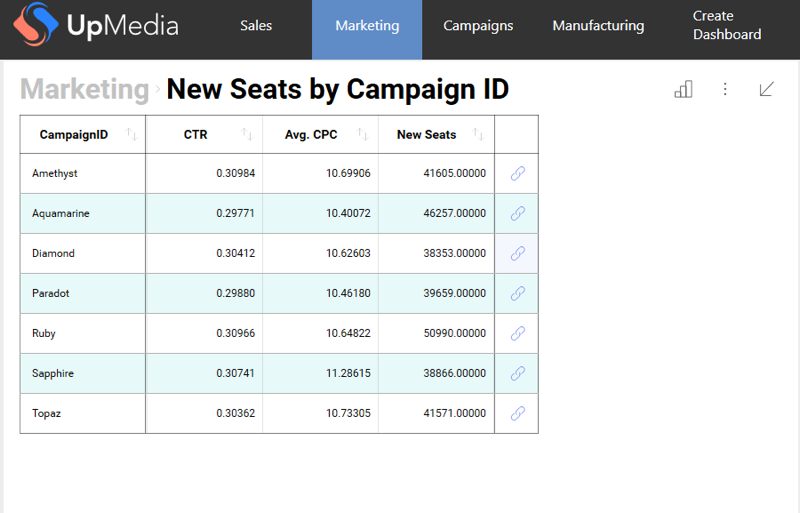
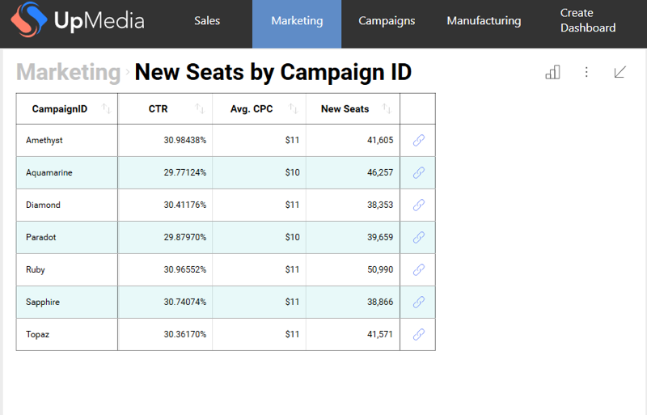
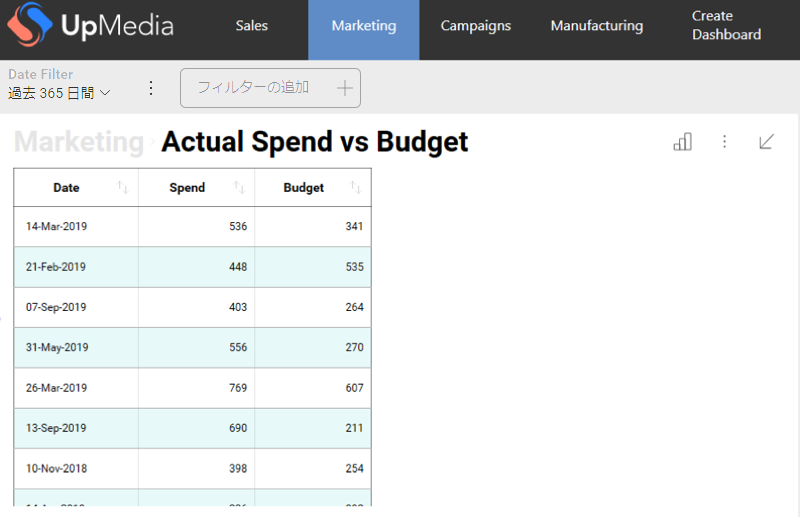
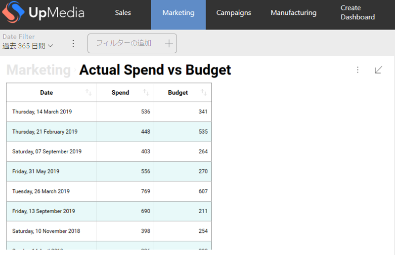

# ダッシュボード データの書式設定
書式設定サービスを使用すると、フィールドの書式設定を無視して、ダッシュボード データを好みに合わせて書式設定できます。

## 書式設定がサポートされる要素

書式設定可能なダッシュボード要素:

  - 数値データ
  - 日付、時間、または日時のデータ
  - 集計される日、時間、または日時のデータ

## 書式設定サービスの使用

この例で使用されるダッシュボードは、**Marketing サンプル** ダッシュボードです。

### 数値データの書式設定の例

以下に、**Marketing サンプル**ダッシュボードの **New Seats by Campaign ID** 表示形式の初期状態を示します。


以下の手順に従って、数値データを書式設定して 5 桁の 10 進数を表示します。

1.  ダッシュボード データの書式を許可するには、**FormattingProvider** プロパティをカスタム実装に設定する必要があります。

    ``` csharp
    RevealSdkSettings.FormattingProvider = new UpMediaFormattingProvider();
    ```

2.  **IRVFormattingProvider** の実装:

    ``` csharp
    public class UpMediaFormattingProvider : IRVFormattingProvider
    {
        public RVBaseFormattingService GetFormattingService()
        {
            return new UpMediaFormattingService();
        }
    }
    ```

3.  **RVBaseFormattingService** の実装で **FormatNumber** メソッドをオーバーライドします:

    ``` csharp
    public class UpMediaFormattingService : RVBaseFormattingService
    {
        public override string FormatNumber(double value, RVNumberFormattingSpec formatting, bool ignoreMkFormatting)
        {
            return string.Format("{0:0.00000}", value);
        }
    }
    ```

アプリを再度実行すると、すべての数値データが 5 桁の 10 進数で数値を表示するように書式設定され、他のすべての書式設定 (フィールドが通貨またはパーセンテージを表すかどうかなど) が無視されることがわかります。



たとえば、パーセンテージを表示するフィールドのみの書式を変更する場合は、数値フィールドのタイプのチェックを追加する必要があります。

``` csharp
public class UpMediaFormattingService : RVBaseFormattingService
{
    public override string FormatNumber(double value, RVNumberFormattingSpec formatting, bool ignoreMkFormatting)
    {
        if (formatting.FormatType == RVDashboardNumberFormattingType.Percent)
        {
            return string.Format("{0:0.00000%}", value);
        }

        return base.FormatNumber(value, formatting, ignoreMkFormatting);
    }
}
```

これで、書式設定されたパーセンテージ フィールドのみができました。



ダッシュボードの他の表示形式を見ると、数値データの書式が変更されていないことがわかります。書式設定はチャートによって制御されるため、フィールドの書式設定を変更するには、フィールドの書式設定を変更する必要があります。[ローカライズ サービス](localizing-dashboards.md)を使用することで、これを実行できます。


### 集計した DateTime (日時) データ書式設定の例

これは、Marketing サンプル (**Actual Spend vs Budget**) の表示形式のうちの 1 つの初期状態です:


以下に、完全な月名を表示するために集約された日付データを表示する方法の例を示します (例: January 2001)。これを行うには、**RVBaseFormattingService** の実装で **FormatAggregatedDate** メソッドをオーバーライドする必要があります。

``` csharp
public class UpMediaFormattingService : RVBaseFormattingService
{
    public override string FormatAggregatedDate(DateTime value, RVDashboardDataType type, RVDashboardDateAggregationType aggregation, RVDateFormattingSpec formatting)
    {
        if (aggregation == RVDashboardDateAggregationType.Month)
        {
            return string.Format("{0:MMMM yyyy}", value);
        }

        return base.FormatAggregatedDate(value, type, aggregation);
    }
}
```

アプリを再度実行すると、更新された日付が表示されます。


### 日時 (非集計) データ書式設定の例

以下に、非集計の日付データを書式設定する方法の例を示します。まず、集計データを除外するために、**Actual Spend vs Budget** 表示形式を**グリッド**に変更します:



日付の表示方法を変更するには、**RVBaseFormattingService** の実装で **FormatNumber** メソッドをオーバーライドする必要があります。
Monday, 01 January 2001 のように、曜日と日付を含む日付を作成します。

``` csharp
public class UpMediaFormattingService : RVBaseFormattingService
{
    public override string FormatDate(DateTime value, RVDashboardDataType type, RVDateFormattingSpec formatting, bool localTimeZone)
    {
        return string.Format("{0:dddd, dd MMMM yyyy}", value);
    }
}
```

また、アプリを再度実行して表示形式をグリッドに変更すると、更新された日付が表示されます (キャッシュのためにデータの更新が必要な場合があります)。


