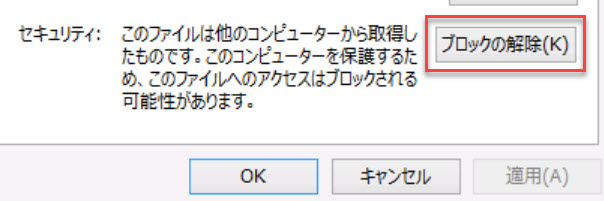
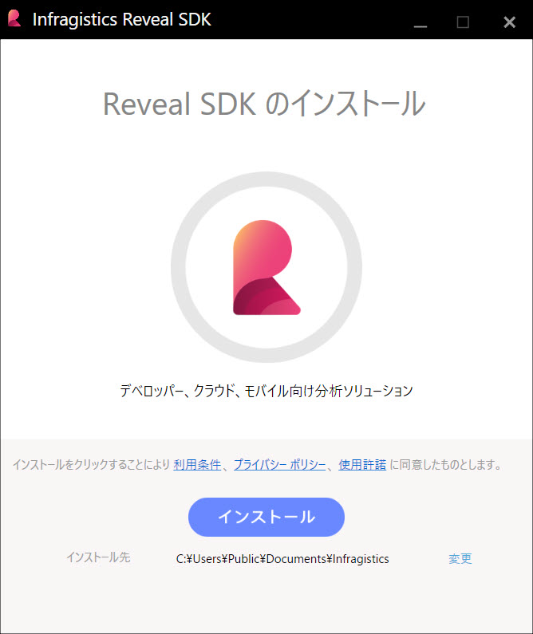

# インストール

## システム要件

- Windows 10 またはそれ以降
- Visual Studio 2019 またはそれ以降
- .NET Framework 4.6.2 またはそれ以降 (.NET Core はサポートされていません。)

## Reveal SDK のインストール

Reveal SDK をインストールするには、Reveal SDK インストーラーをダウンロードして実行する必要があります。以下はインストール方法です。
1. [Reveal Web サイト](https://www.revealbi.io/ja/download-sdk)から Reveal SDK インストーラーをダウンロードします。
2. Web ページの「Reveal SDK を試す」フォームに記入します。
3. Reveal SDK インストーラーをディスクの既知の場所に保存します。

保存したReveal SDK インストーラー zip ファイルを抽出する前にブロックを解除する必要があります。zip ファイルを右クリックして **[プロパティ]** を選択します。ファイルのブロックを解除するチェック ボックスがあるプロパティ ダイアログが表示されます。[**ブロックの解除**] オプションをチェックして [**適用**] をクリックします。



プラットフォーム インストーラー zip ファイルのブロックを解除した後、以下の手順に従ってください。
1. ZIP を現在の場所に解凍します。
2. 解凍した Reveal SDK インストーラー EXE ファイルをダブルクリックして起動します。
3. インストール場所を選択します。
4. インストールを続行するために使用許諾に同意する必要があります。(インストールをクリックすると同意します)



インストールが完了すると、Reveal SDK インストーラーの完了画面が表示されます。この時点で、[SDK サンプルを開く] ボタンをクリックして Reveal SDK サンプルを参照するか、[ヘルプ ドキュメント](https://help.revealbi.io/jp)、コミュニティ [ブログ (英語)](https://www.revealbi.io/blog) や[ビデオ](https://www.youtube.com/revealbi)などを活用できます。


## インストールされる項目

インストールが完了すると、**"%public%\Documents\Infragistics\Reveal\SDK\"** ローカル フォルダーに以下の項目がインストールされます。

- Reveal SDK バイナリ (手動で使用)
- Reveal SDK NuGet パッケージ
- Reveal SDK サンプル

Reveal SDK NuGet パッケージをポイントする Visual Studio に自動的に追加されるローカル NuGet パッケージ ソースもあります。


## ライセンス キーの追加

デフォルトでは、Reveal SDKをインストールすると、**試用版製品**のみが使用されます。**ライセンス製品**のロックを解除するには、アプリケーションでライセンス キーを提供する必要があります。

```cs
RevealSdkSettings.License = "LICENSE_KEY";
```