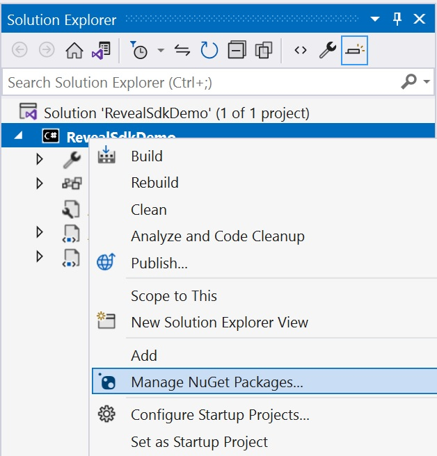
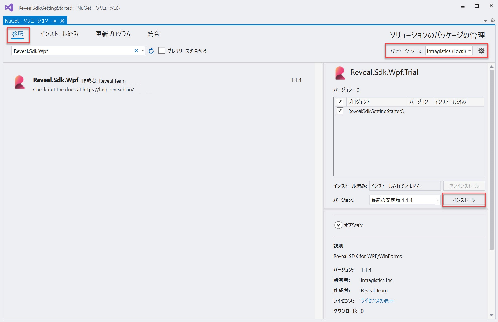

# Reveal SDK のインストール

The steps below describe how to install the Reveal SDK into an existing WPF project.

1 - Right click the Solution, or Project, and select **Manage NuGet Packages** for Solution.

2 - In the package manager dialog, open the **Browse** tab, and install the **Reveal.Sdk.Wpf** NuGet package into the project.

3 - Right-click the project and select **Add -> New Folder**. The folder MUST be named **Dashboards** .

By default, the Reveal SDK uses a convention that will load all dashboards from the **Dashboards** folder. You can change this convention by creating a custom `IRVDashboardProvider`. You can learn more about this in the [Loading Dashboards](loading-dashboards.md) topic.