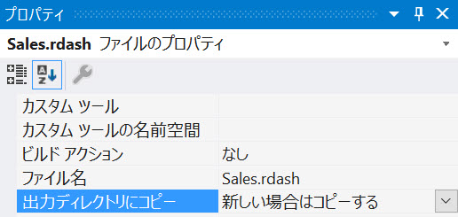
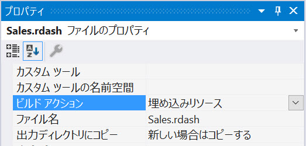

# ダッシュボードの読み込み

アプリケーションに埋め込まれた `RevealView` コントロールに既存の Reveal ダッシュボードを表示する場合は、4 つのオプションから選択できます。
- ファイル パスからダッシュボードを読み込み
- ファイル ストリームからダッシュボードを読み込み
- 埋め込まれたリソースからダッシュボードを読み込み
- json からダッシュボードを読み込み

ダッシュボードを `RevealView` にロードするには、**.rdash** ファイル (.rdash は Reveal によって作成されたダッシュボードのファイル拡張子) を取得し、それを `RVDashboard` オブジェクトとして逆シリアル化し、`RevealView.Dashboard` プロパティを RVDashboard オブジェクト インスタンスに割り当てます。

.rdash ダッシュボード ファイルは次の方法で作成できます:
- ダッシュボードを [Reveal BI Web サイト](https://app.revealbi.io/)から .rdash ファイルとしてエクスポートします。
- ダッシュボードをネイティブの Reveal アプリケーションの 1 つから .rdash ファイルとしてエクスポートします。
- Reveal SDK を使用してアプリケーションで作成されたダッシュボードを保存またはエクスポートします。
- [サンプル ダッシュボード](https://github.com/RevealBi/sdk-samples-wpf/raw/master/SampleDashboards.zip) をダウンロードします。

## ファイル パスから読み込み
ダッシュボード ファイルをアプリケーションと一緒に出荷することは非常に一般的です。これらのファイルは通常、アプリケーションの実行中にディスクからファイルを読み込みできるように、既知のディレクトリのクライアント ディスク ドライブにコピーされます。ファイル パスを使用してこれらのダッシュボードを読み込むには、**.rdash** ファイルへのファイル パスを知っておく必要があります。 

この例では、**Dashboards** と呼ばれる Visual Studio ソリューションにディレクトリを作成しました。このディレクトリには、アプリケーションのすべての .rdash ファイルが含まれます。


各 .rdash ファイルのプロパティで、**[出力ディレクトリにコピー]** の値を **[新しい場合はコピーする]** に設定していることを確認することが重要です。これにより、プロジェクトのビルド時にダッシュボード ファイルがディスクにコピーされます。





最初の手順は、四方込みしたい .rdash ファイルのファイルの場所を取得することです。ダッシュボードへのファイル パスを取得したら、`RVDashboard` の新しいインスタンスを作成し、ファイル パスを `RVDashboard` クラスのコンストラクターに渡します。 

この例では、`Environment.CurrentDirectory` を使用して、アプリケーションの現在の実行ディレクトリを取得しています。次に、`Path.Combine` メソッドを使用して、**Dashboards** ディレクトリにある **Sales.rdash** ダッシュボードの場所を追加します。**Sales.rdash** ダッシュボードへの正しいファイル パスを取得したら、コンストラクター引数としてファイル パスを使用して、`RevealView.Dashboard` プロパティを `RVDashboard` オブジェクトの新しいインスタンスに設定します。
```cs
var filePath = Path.Combine(Environment.CurrentDirectory, "Dashboards/Sales.rdash");
_revealView.Dashboard = new RVDashboard(filePath);
```

`RVDashboard.LoadDashboardAsync` メソッドを使用して、ダッシュボードをファイル パスから `RevealView` に非同期で読み込むこともできます。
```cs
var filePath = Path.Combine(Environment.CurrentDirectory, "Dashboards/Sales.rdash");
_revealView.Dashboard = await RVDashboard.LoadDashboardAsync(filePath);
```

:::info Get the Code

このサンプルのソース コードは [GitHub](https://github.com/RevealBi/sdk-samples-wpf/tree/master/LoadingDashboards-FilePath) にあります。

:::

## ファイル ストリームから読み込み
ファイル ストリームからの Reveal ダッシュボードの読み込みは、ファイル パスからのダッシュボードの読み込みと非常によく似ています。この場合、ダッシュボード ファイルのファイル パスを取得したら、`RVDashboard` オブジェクト インスタンスを作成する前に、それを `FileStream` に読み込みます。

この例では、`File.OpenRead` メソッドを使用して、Sales.rdash ファイルをファイル ストリームに読み込んでいます。次に、コンストラクター引数としてファイル ストリームを渡すことにより、新しい `RVDashboard` オブジェクトを作成し、新しく作成された `RVDashboard` インスタンスを `RevealView.Dashboard` プロパティに割り当てます。

```cs
var filePath = Path.Combine(Environment.CurrentDirectory, "Dashboards/Sales.rdash"); 
using (var stream = File.OpenRead(filePath))
{
    _revealView.Dashboard = new RVDashboard(stream);
}
```

`RVDashboard.LoadDashboardAsync` メソッドを使用して、ダッシュボードをファイル ストリームから `RevealView` に非同期で読み込むこともできます。
```cs
var filePath = Path.Combine(Environment.CurrentDirectory, "Dashboards/Sales.rdash"); 
using (var stream = File.OpenRead(filePath))
{
    _revealView.Dashboard = await RVDashboard.LoadDashboardAsync(stream);
}
```

:::info Get the Code

このサンプルのソース コードは [GitHub](https://github.com/RevealBi/sdk-samples-wpf/tree/master/LoadingDashboards-FileStream) にあります。

:::

## リソースから読み込み
アプリケーションでファイルを配布するためのもう 1 つのオプションは、ファイルをリソースとしてアプリケーションに埋め込むことです。これにより、クライアントのディスク ドライブにファイルが配置されるのではなく、ファイルがアプリケーションのアセンブリに直接埋め込まれます。

Reveal ダッシュボード **.rdash** ファイルをリソースとしてアプリケーションに埋め込むには、Visual Studio でダッシュボード ファイルのプロパティを開き、.rdash ファイルの **[ビルド アクション]** を **[理め込みリソース]** に設定します。





ダッシュボードが**理め込みリソース**として定義されたら、`Assembly.GetManifestResourceStream` メソッドを使用してダッシュボードを読み込むことができます。このメソッドは、`RevealView` に読み込むために使用できる `Stream` オブジェクトを返します。

`Assembly.GetManifestResourceStream` メソッドで指定するリソースの`名前`には、.rdash ファイルの`名前空間`とファイル名が含まれている必要があることに注意してください。

この例では、リソースの名前は、アプリケーションのルート名前空間 LoadingDashboards と、ダッシュボード ファイルを含むディレクトリである Dashboards で始まり、その後に .rdash ファイル Sales.rdash の名前が続きます。  これにより、`LoadingDashboards.Dashboards.Sales.rdash` の完全なリソース名が得られます。

```cs
var resource = Assembly.GetExecutingAssembly().GetManifestResourceStream($"LoadingDashboards.Dashboards.Sales.rdash");
using (resource)
{
    _revealView.Dashboard = new RVDashboard(resource);
}
```

`RVDashboard.LoadDashboardAsync` メソッドを使用して、ダッシュボードをリソース ストリームから `RevealView` に埋め込みリソースとして非同期に読み込むこともできます。
```cs
var resource = Assembly.GetExecutingAssembly().GetManifestResourceStream($"LoadingDashboards.Dashboards.Sales.rdash");
using (resource)
{
    _revealView.Dashboard = await RVDashboard.LoadDashboardAsync(resource);
}
```

:::info Get the Code

このサンプルのソース コードは [GitHub](https://github.com/RevealBi/sdk-samples-wpf/tree/master/LoadingDashboards-FromResource) にあります。

:::

## JSON から読み込み
上級ユーザー、または Reveal ダッシュボードを .rdash ファイルではなく .json ファイルにシリアル化するユーザーの場合、`RVDashboard.LoadFromJsonAsync` メソッドを使用してこれらの JSON ベースのファイルを読み込みできます。

最初の手順は、Reveal ダッシュボードを json 文字列にシリアル化することです。文字列を取得したら、JSON をディスクに保存するか、rdata ストアに保存できます。

Reveal ダッシュボードを JSON にシリアル化するには、`RVDashboard.ExportToJson` メソッドを呼び出すだけです。

```cs
var json = dashboard.ExportToJson();
```

ダッシュボードが JSON 形式にシリアル化されたら、その JSON ファイルをディスクに保存するか、`RevealView` に直接読み込みできます。

ディスクからダッシュボード JSON ファイルを読み込む場合、コードは次のようになります:
```cs
var filePath = Path.Combine(Environment.CurrentDirectory, "Dashboards/Sales.json");
var json = File.ReadAllText(filePath);
```

JSON 文字列を取得したら、`RVDashboard.LoadFromJsonAsync` メソッドの結果を `RevealView.Dashboard` プロパティに設定して、JSON 文字列をメソッド引数として渡すことでダッシュボードを読み込むことができます。
```cs
_revealView.Dashboard = await RVDashboard.LoadFromJsonAsync(json);
```

:::caution

JSON にシリアル化された後に Reveal ダッシュボードのコンテンツを操作または変更すると、ダッシュボードの完全性が損なわれ、ダッシュボードのコンテンツに取り返しのつかない損傷が生じる可能性があります。これにより、エラーやダッシュボードの読み込みの失敗により、アプリケーションで実行時に例外がスローされる可能性があります。

:::

:::info Get the Code

このサンプルのソース コードは [GitHub](https://github.com/RevealBi/sdk-samples-wpf/tree/master/LoadingDashboards-FromJson) にあります。

:::