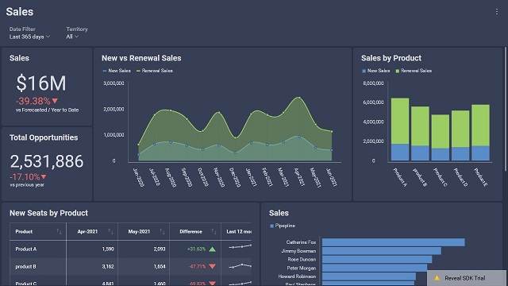

# ダッシュボードのテーマ設定

## 定義済みのテーマ

Reveal SDK には、適用できる 4 つの定義済みテーマが付属しています。

| テーマ              | RevealView                              |
| -----              | :--------:                              |
| **Mountain Light** |   |
| **Mountain Dark**  |    |
| **Ocean Light**    |      |
| **Ocean Dark**     |       |

## テーマの適用

定義済みのテーマを適用するには、`RevealSdkSetting.Theme` プロパティを優先テーマのインスタンスに割り当てる必要があります。

##### Mountain Light

```cs
RevealSdkSettings.Theme = new MountainLightTheme();
```

##### Mountain Dark

```cs
RevealSdkSettings.Theme = new MountainDarkTheme();
```

##### Ocean Light

```cs
RevealSdkSettings.Theme = new OceanLightTheme();
```

##### Ocean Dark

```cs
RevealSdkSettings.Theme = new OceanDarkTheme();
```

:::info

`RevealSdkSetting.Theme` プロパティは静的プロパティであり、アプリケーション内の `RevealView` のすべてのインスタンスに適用されます。

:::

## カスタム テーマ

Reveal SDK を既存のアプリケーションに埋め込む場合、ダッシュボードがアプリケーションのルックアンドフィールと一致していることが重要です。定義済みの Reveal SDK テーマのいずれかがアプリケーションのテーマと一致しない場合は、アプリケーションのルックアンドフィールにより近いカスタム テーマを作成できます。

テーマは、`RevealTheme` タイプのクラスです。これにより、Reveal SDK UI コントロールのさまざまな要素の色とフォントを定義できます。

`RevealTheme` には次のプロパティがあります:

| 名前                             | タイプ                    | 説明                                                                                                    |
| ----                             |-----                    | -----------                                                                                                    |
| **ChartColors**                  | リスト               | 表示形式でシリーズを示すために使用される色。色の数に制限はありません。すべての色が表示形式で使用されると、Reveal はこれらの色の新しい色合いを自動生成します。これにより、色が重複せず、各値に独自の色が設定されます。            |
| **AccentColor**                  | 色                   | Reveal のデフォルトのアクセント色は、[+ ダッシュボード] ボタンやその他のインタラクティブなアクションで確認することができる青の色合いです。アプリケーションで使用するのと同じアクセント色に一致するように色を変更できます。                                                                    |
| **DashboardBackgroundColor**     | 色                   | ダッシュボードの背景色を設定します。これはメインの背景色です。                                |
| **VisualizationBackgroundColor** | 色                   | 表示形式の背景色を設定します。これは二番目のな背景色です。                         |
| **ConditionalFormatting**        | RVConditionalFormatting | 条件付き書式を使用するときに設定できる境界のデフォルトの色を変更します。                        |
| **RegularFont**                  | FontFamily              | 通常のフォント スタイルを設定します。                                                                                   |
| **BoldFont**                     | FontFamily              | 太字のフォント スタイルを設定します。                                                                                      |
| **MediumFont**                   | FontFamily              |  中のフォントスタイルを設定します。                                                                                    |
| **FontColor**                    | 色                   | フォントの色を設定します。                                                                                    |
| **HighlightColor**               | 色                   | 特定のダッシュボード シナリオ (予測および外れ値の統計関数) の強調色を設定します。     |
| **UseRoundedCorners**            | ブール値                    | ボタン、ツールチップ、コンテナ、表示形式などの隅が丸められています。false に設定すると、コーナーは四角になります。                                                                                                                                                                        |

:::info

テーマのプロパティを更新するとき、または実行時に新しいテーマを適用するときは、テーマの変更を `RevealView` に適用するために、`RevealView.RefreshTheme()` を呼び出す必要があります。

:::

### 既存のテーマのクローン

既存のテーマの値に基づいてテーマを作成する場合は、変更を加える前に現在の `RevealTheme` のクローンを作成できます。  テーマのクローンを作成するには、`RevealTheme.Clone()` メソッドを使用するだけです。テーマのクローンを作成したら、テーマのプロパティを設定して、新しいテーマとして使用できます。

```cs
var clonedTheme = RevealSdkSettings.Theme.Clone();

clonedTheme.FontColor = Colors.DarkBlue;
clonedTheme.AccentColor = Colors.Green;
clonedTheme.DashboardBackgroundColor = Colors.LightYellow;
clonedTheme.VisualizationBackgroundColor = Colors.LightGray;

clonedTheme.ChartColors.Clear();
clonedTheme.ChartColors.Add(Color.FromRgb(192, 80, 77));
clonedTheme.ChartColors.Add(Color.FromRgb(101, 197, 235));
clonedTheme.ChartColors.Add(Color.FromRgb(232, 77, 137));

RevealSdkSettings.Theme = clonedTheme;

_revealView.RefreshTheme();
```

### カスタム テーマの作成

より保守しやすく、再利用と共有が容易なテーマが必要な場合は、カスタム テーマを作成することをお勧めします。カスタム テーマを作成する場合は、`RevealTheme` を派生するクラスを作成します。

`MyUglyTheme` というカスタム テーマの例を次に示します:
```cs
public class MyUglyTheme : RevealTheme
{
    public MyUglyTheme()
    {
        RegularFont = new FontFamily(new Uri("pack://application:,,,/Fonts/"), "./#Wingdings 2");
        MediumFont = new FontFamily(new Uri("pack://application:,,,/Fonts/"), "./#Lucida Calligraphy");
        BoldFont = new FontFamily(new Uri("pack://application:,,,/Fonts/"), "./#CF Crack and");

        FontColor = Colors.DarkRed;
        AccentColor = Color.FromRgb(192, 80, 77);
        DashboardBackgroundColor = Colors.Black;
        VisualizationBackgroundColor = Color.FromRgb(153, 255, 255);

        ChartColors.Clear();
        ChartColors.Add(Color.FromRgb(192, 80, 77));
        ChartColors.Add(Color.FromRgb(101, 197, 235));
        ChartColors.Add(Color.FromRgb(232, 77, 137));

        UseRoundedCorners = false;
    }
}
```

カスタム テーマ クラスを作成したら、テーマを適用できます。

```cs
RevealSdkSettings.Theme = new MyUglyTheme();
_revealView.RefreshTheme();
```

:::info コードを取得する

このサンプルのソース コードは [GitHub](https://github.com/RevealBi/sdk-samples-wpf/tree/master/ThemingDashboards) にあります。

:::