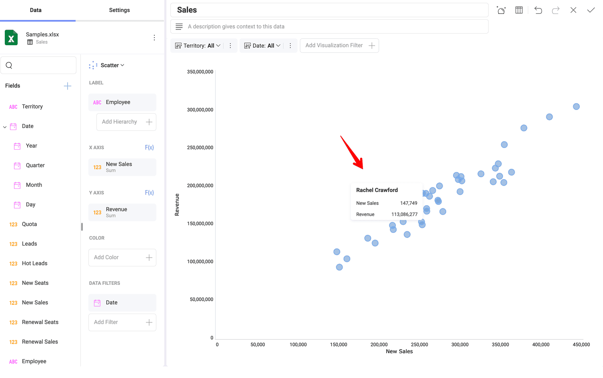

# 散布図・バブル チャート

## 散布図とは?

散布図は、X (水平) 軸と Y (垂直) 軸に沿ってデータ ポイントをプロットすることにより、2 つの定量的計測間の関係を表すために使用されます。データに大量の値のセットが含まれている場合に、パターンを示すのに特に役立ちます。

## バブル チャートとは?

バブル チャートは散布図のバリエーションで、データ ポイントがバブルに置き換えられます。散布図と同様に、バブル チャートは、2 つの定量的計測と、バブルのサイズで表される 3 番目の定量的計測間の関係を表します。

## 散布図チャートを作成する方法

上記の例では、散布図の表示形式は、特定の各**従業員**によって産み出された**新規販売**の数量と**収益**の関係を示しています。

散布図を作成するには:

1.  **[チャート タイプ]** メニューで **[散布図]** の表示形式を選択します。

2.  **[X 軸]** と **[Y 軸]** の数値フィールドを選択して、データ ポイントの位置を決定します。

3.  **[ラベル]** のカテゴリ値を選択します。

すべてのデータ ポイントには独自の**ツールチップ**があり、クリックすると表示されます。

この例では、ツールチップは、データ ポイントが表す特定の従業員に関する情報と、チャートに含まれるそれらの量的なデータを提供します。

## バブル チャートを作成する方法

1 つの色だけを使用して基本的なバブル チャートを作成するには、次の操作が必要です。

1.  **[チャート タイプ]** のリストから **[バブル]** チャートを選択します。

2.  **[X 軸]** と **[Y 軸]** の数値フィールドを選択します。

    上記の例では、バブルの位置は、*Number of Inpatients* と *Length of Stay* の長さとの相関関係によって決定されます。

3.  **[ラベル]** のカテゴリ値を選択します。

    示されているチャートの各バブルは、神経科、心臓科、外科などの**部門**を表しています。

4.  **バブル半径**の数値フィールドを選択します。

    例から、各バブルのサイズは各 *Division* の *Treatment Costs* の合計に依存することがわかります。チャート上部の凡例は、チャートの**バブル半径**フィールドの最小値と最大値を示しています。

バブルをクリックすると、各バブルの特定のデータを示す**ツールチップ**も表示されます。チャートで要素が重複している場合は、小さいバブルをクリックまたはタップしてツールチップを表示します。

## 散布図とバブル チャートへの色分類の追加

[カテゴリ] フィールドを散布図またはバブル チャートに追加できます。このフィールドの値に応じて、バブルまたは散布ポイントに異なる色が付けられます。

上記の例では、*Date* フィールドがカラーボックスに適用されています。色分類を追加すると、部門の数値情報が *2017*、*2018*、*2019* のいずれを参照しているかに応じて、バブルに異なる色が割り当てられます。

これにより、バブル チャートの表示形式でより多くのバブルが表示されるようになりました。

## 散布図とバブル チャートの設定

**[設定]**:

  - **表示形式のスタイルを変更する**。

    表示形式の **[タイトル]** または **[凡例]** を表示するかどうかを選択できます。**[開始色]** を選択すると、データ ポイント/バブルの色が定義されます。色分類を使用するために複数の色が必要な場合、**[開始色]** から順番に適用されます。

  - **[X 軸] と [Y 軸] の [リニア] スケールまたは [対数] スケールのいずれかを選択する**。

    対数の場合、値のスケールは通常のリニア スケールを使用する代わりに大きさを使用するリニア スケール以外で計算されます。

    X 軸に対数スケールを使用する場合、散布図の水平軸は常に値軸であるため、一般的に、散布図は折れ線チャートよりも適切な選択です。

  - **チャートの [最小値] および [最大値] を設定できる**。

    デフォルトで [最小値] は 0 に設定され、[最大値] は使用されるデータによって設定されます。
