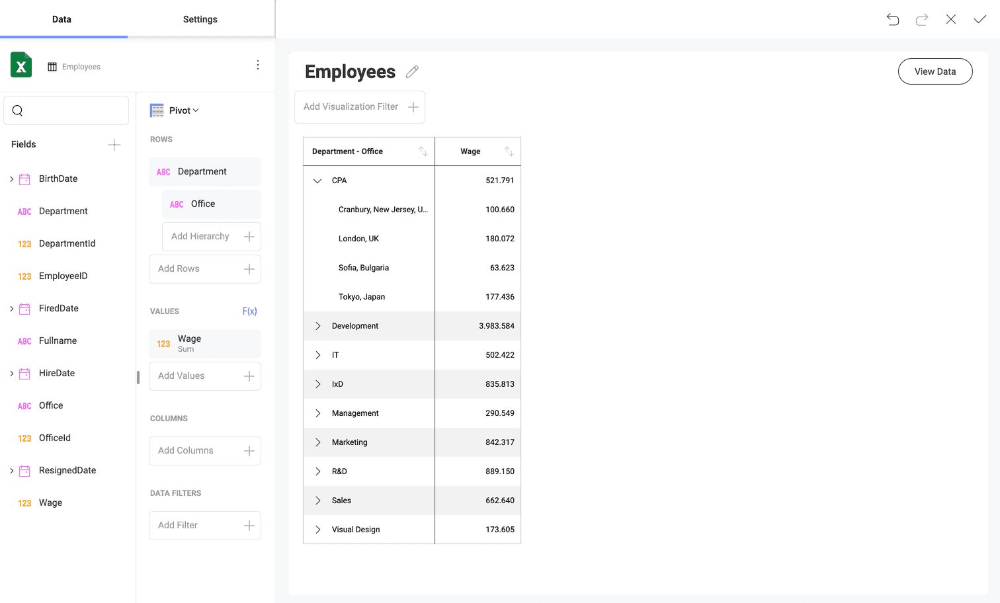

# アドホック階層

Reveal は年月日の日付フィールドの階層を自動的に作成しますが、他のタイプのフィールドでは発生しません。アドホック階層により、ユーザーはチャート、ゲージ、およびグリッドビューでデータを分析でき、データエディターの **[行]** プレースホルダーにあるフィールドを使用して新しい階層を作成できます。

この機能は、Analysis Services などの多次元データ ソースではなく、プレーン データ ソース (SQLテーブル、Excelスプレッドシート、CSVファイルなど) に適用されます。これらの場合、階層はサーバー側で定義され、Reveal は**展開**および**ドリル**操作をサポートします。

:::note
アドホック階層は、テキスト、円形、画像、グリッド、テキスト ビュー チャートでは**サポートされていません**。
:::
## アドホック階層の有効化

アドホック階層を有効にするには、データ エディターの **[行]** プレースホルダーの *[階層の追加]* にフィールドをドラッグアンドドロップします。これを設定するとデータ テーブルの構成および動作が変わります。

上記のスクリーンショットのように、単一の列が複数の列を置き換えます。スクリーンショットに示されている例では、ドリルアップおよびドリルダウンできるだけでなく、各部署を展開してオフィサーを表示することもできます。

## サポートされている可視化

アドホック階層は、**以下のものを除く**すべての表示形式に追加できます。

  - 円形ゲージ

  - グリッド チャート

  - テキスト ゲージ

  - テキスト ビュー

  - 画像チャート
