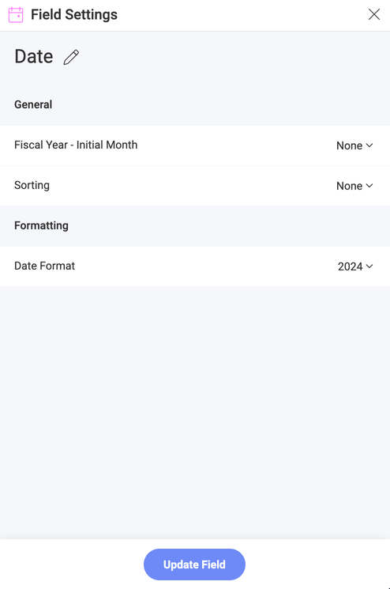
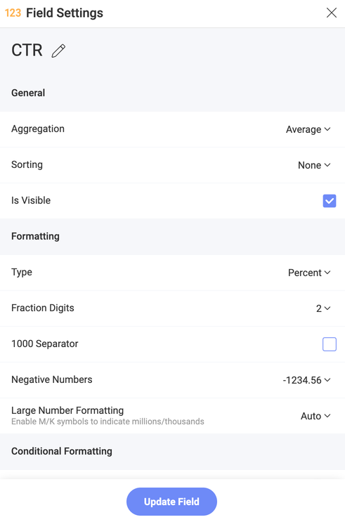

# フィールド設定

このセクションでは、並べ替え、フィルター処理、データの集計などデータセットへの変換を適用するためのさまざまなオプションについて説明します。

データにフォーマットまたはフィルターを適用するには、対応するプレースホルダー (**カテゴリ**、**列**、**ラベル**、**行**、および**値**) で変更する特定のフィールドを選択する必要があります。フィールドには 3 つのタイプがあり、それぞれに独自のフォーマットおよびフィルター オプションがあります:

- [日付フィールド](#日付フィールド)
- [数値フィールド](#数値フィールド) 
- [文字列フィールド](#文字列フィールド)

:::note 
データ エディターの**値**プレースホルダーにドロップされたすべてのフィールドは、数値としてフォーマットされます。
:::

## 日付フィールド

  - **ラベル名の変更**: 表示のみを目的としてフィールド名を変更します。フィールドは常に計算フィールド式で元の名前によって参照されます。名前を変更すると、ラベルを完全に消去し元の値に戻ります。

  - **年度の最初の月**: 12 か月の期間が暦年と同じでない場合は、会計年度を使用して、期間の最初の月を選択できます。

  - **並べ替え**: 日付を昇順または降順で並べ替えます。

  - **日付書式**: 日付と時刻書式の定義済みリストから選択して、日付/時刻の値を表示します。

### 日付フィールド階層

日付フィールドの集計は、[フィールド] セクションに階層リストとして表示されます。日付フィールドの精度に応じて、[年]、[四半期]、[月]、[日]、および [分] を見つけることができます。

ピボット エディターに日付フィールドをドラッグアンドドロップすると、すべての階層が自動的に表示されます  (以下を参照)。

さらに、特定の階層レベルをドラッグすると、以下に示すように、そのレベルのデータのみが表示されます。

## 数値フィールド

  - **ラベル名の変更**: 表示のみを目的としてフィールド名を変更します。フィールドは常に計算フィールド式で元の名前によって参照されます。名前を変更すると、ラベルを完全に消去し元の値に戻ります。

  - **集計**: 数値を Reveal で処理する方法 (合計、カウント、平均) を構成します。

  - **並べ替え**: 数値を昇順または降順で並べ替えます。

  - **表示状態**: このフィールドのデータを現在の表示形式で使用するかどうかを選択します。

  - **タイプ**: 数値の形式をパーセンテージ、通貨、または単純な数値のいずれにするかを定義します。**[通貨]** を選択すると、通貨の種類 (ドル、ユーロ、ポンド、円) を選択するオプションが表示されます。

  - **分数桁**: 表示する小数点以下の桁数を選択します。

  - **負の数**: 括弧内に負の数を囲む、またはマイナス (-) を頭に付けるかどうかを選択します。

  - **大きな数値の書式設定**: 中央のペインの表示形式プレビューに 100 万 を M、千を K で表示します。

  - **桁区切り**: 桁区切り記号を表示するかどうかを選択します。

  - [**条件付き書式**](conditional-formatting.md): これを有効にすると、値に基づいて各セルに異なるフォーマットを提供できます。たとえば、フィールドの下位 50% 範囲内の値は、問題を通知する赤色のアドナーで色を付けることができます。3 つまでの範囲に (一般的には、上部、中央、そして下部の範囲に使用) スタイル規則を設定することができますが制限、比較のタイプ、色、およびインジケーター シンボルをカスタマイズできます。 

## 文字列フィールド

  - **ラベル名の変更**: 表示のみを目的としてフィールド名を変更します。フィールドは常に計算フィールド式で元の名前によって参照されます。名前を変更すると、ラベルを完全に消去し元の値に戻ります。

  - **並べ替え**: 日付を昇順または降順で並べ替えます。
