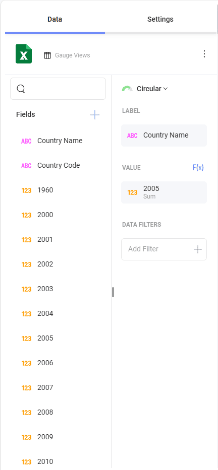
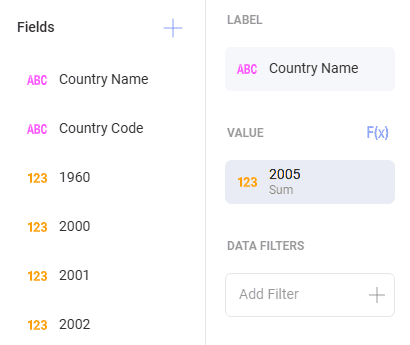
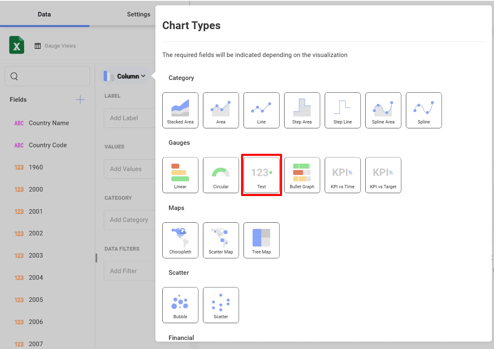
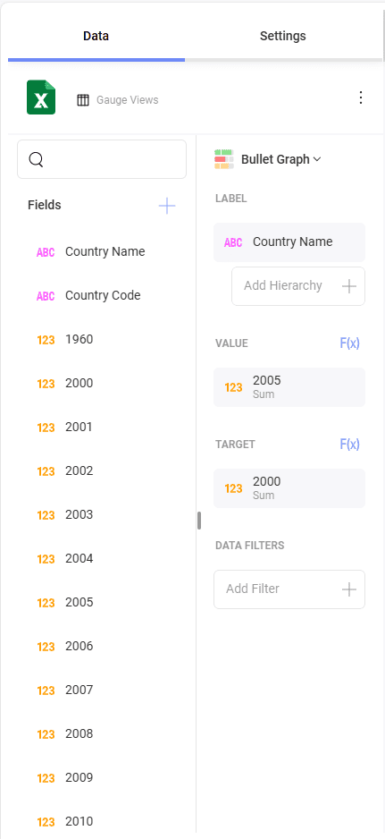
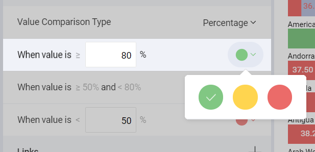

# ゲージで表示形式を作成する方法

このチュートリアルは、サンプル スプレッドシートを使用して**ゲージ**の表示形式を作成する方法を説明します。

## 重要なコンセプト

ゲージ チャートは、2 つのレイアウトから選択できます。

  - **しきい値の構成**。ゲージのしきい値の構成ではゲージの最大値と最小値を設定できます。デフォルトで最小値に設定されますが、特定のデータを除外するために変更できます。

  - **バンド構成**。バンドの構成は 3 つの範囲を設定できます (より大きい、中間、より小さい) です。データ ソースに基づく範囲でデフォルトの値を上書きします。

## サンプル データ ソース

このチュートリアルでは、<a href="/data/Reveal_Visualization_Tutorials.xlsx" download>Reveal Visualization Tutorials</a> の「Gauge Views」シートを使用します。

## リニア ゲージを作成する方法

1. オーバーフロー メニューで **[編集]** を選択します。
   
   

2. 右上隅にある **[+ 表示形式]** ボタンを選択します。

                                         

3. データ ソースのリストからデータ ソースを選択します。

   
         
4. **Gauge Views** シートを選択します。
  
   
         
5. **表示形式ピッカー**を開き、**リニア**表示形式を選択します。デフォルトで、表示形式のタイプは**柱状**に設定されています。 

   

6. たとえば、このリニア ゲージは国別で平均寿命を表します。*Country Name* フィールドを **[ラベル]** へ、年フィールドの 1 つを **[値]** へドラッグアンドドロップします。
  
                            

## 円形ゲージを作成する方法

1. オーバーフロー メニューで **[編集]** を選択します。
   
   

2. 右上隅にある **[+ 表示形式]** ボタンを選択します。

                                         

3. データ ソースのリストからデータ ソースを選択します。

                                          

4. **Gauge Views** シートを選択します。
  
   
         
5. **表示形式ピッカー**を開き、**円型**表示形式を選択します。デフォルトで、表示形式のタイプは**柱状**に設定されています。 

   

6. たとえば、このリニア ゲージは国別で平均寿命を表します。*Country Name* フィールドを **[ラベル]** へ、年フィールドの 1 つを **[値]** へドラッグアンドドロップします。
  
    

円形ゲージは、特に平均値と値の合計の表示に適しています。[値] に表示されるフィールドの集計を変更する手順:

|                                              |                                                                            |                                                                                           |
| -------------------------------------------- | -------------------------------------------------------------------------- | ----------------------------------------------------------------------------------------- |
| 1\. **[値] のフィールド設定にアクセスする** |  | **[値]** のフィールドを選択してアクセスします。                                                  |
| 2\. **別の集計を選択する**       |          | **[集計]** のドロップダウンを展開し、別のオプションを選択します (平均値など)。 |

## テキスト ゲージを作成する方法

1. オーバーフロー メニューで **[編集]** を選択します。
   
   

2. 右上隅にある **[+ 表示形式]** ボタンを選択します。

                                         

3. データ ソースのリストからデータ ソースを選択します。

                                          

4. **Gauge Views** シートを選択します。
  
   
         
5. **表示形式ピッカー**を開き、**テキスト**の表示形式を選択します。デフォルトで、表示形式のタイプは**柱状**に設定されています。 

   

6. 例えば、このテキスト ゲージは国別平均寿命を表します。年フィールドの 1 つを **[値]** にドラッグアンドドロップし、*Country Name* フィールドを **[データ フィルター]** にドラッグアンドドロップします。次に、フィールドを選択して、必要な特定の国を選択します。

   

上記の [テキスト ゲージのサンプル] は平均値の集計を使用します。

## ブレット グラフを作成する方法

1. オーバーフロー メニューで **[編集]** を選択します。
   
   

2. 右上隅にある **[+ 表示形式]** ボタンを選択します。

                                         

3. データ ソースのリストからデータ ソースを選択します。

                                          

4. **Gauge Views** シートを選択します。
  
   
         
5. **表示形式ピッカー**を開き、**ブレット グラフ**を選択します。デフォルトで、表示形式のタイプは**柱状**に設定されています。 

   

6. 例えば、このブレット グラフ は国別平均寿命を表します。*Country Name* フィールドを **[ラベル]** へ、年フィールドの 1 つを **[値]** へ、別の年フィールドを **[ターゲット]** へドラッグアンドドロップします。

   

## ゲージの化でしきい値を追加する方法

しきい値を使用すると、ゲージの最小値と最大値を設定できます。[重要なコンセプト](#重要なコンセプト)で述べたように、特定のデータを除外するように変更できます。以下は作業手順です。

|                                                |                                                                        |                                                                                                                                       |
| ---------------------------------------------- | ---------------------------------------------------------------------- | ------------------------------------------------------------------------------------------------------------------------------------- |
| 1\. **設定を変更する**                        |  | 表示形式エディターの **[設定]** セクションに移動します。                                                                           |
| 2\. **制限のデフォルトの選択を変更する** |          | 最大値または最小値 (または両方) 値を設定するかどうかに基づいて、チャートの開始値または終了値を入力します。 |

## バンドの色の変更

以下は、バンド ([より大きい]、[中間] および [より小さい]) の色を変更するための手順です。

|                                    |                                                                        |                                                                          |
| ---------------------------------- | ---------------------------------------------------------------------- | ------------------------------------------------------------------------ |
| 1\. **設定を変更する**            |  | 表示形式エディターの **[設定]** セクションに移動します。              |
| 2\. **色のドロップダウンを表示する** |      | 色を変更する範囲のドロップダウンを展開します。バンドの色として、Reveal の 3 つの事前定義された色のいずれかを選択します。|

