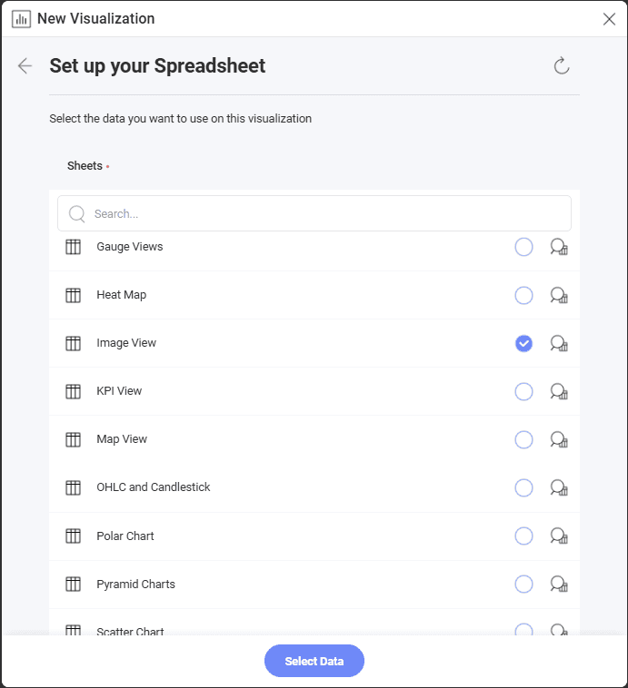

# 画像チャートを作成する方法

このチュートリアルでは、サンプル スプレッドシートを使用して**画像**の表示形式を作成する方法を説明します。

## 重要なコンセプト

[表示形式] セクションに述べたように、画像チャートは URL へ要求を送信して、埋め込みのブラウザーで結果を表示します。したがって、データ ソースに以下の項目が必要です:

  - ウィジェットに表示されるウェブ リソースへのリンク。

  - リンクを**データセットの最初の行**に含みます。

## サンプル データ ソース

このチュートリアルでは、<a href="/data/Reveal_Visualization_Tutorials.xlsx" download>Reveal Visualization Tutorials</a> の「Image Chart」シートを使用します。

 1. オーバーフロー メニューで **[編集]** を選択します。
   
    

 2. 右上隅にある **[+ 表示形式]** ボタンを選択します。

     

 3. データ ソースのリストからデータ ソースを選択します。

    

 4. データ ソースを設定したら、*Image View* シートを選択します。                                

    

 5. デフォルトで、表示形式のタイプは**柱状**に設定されています。**[画像]** オプションを選択します。

       
                                                      
 6. 使用可能なフィールドのいずれかを **[URL]** にドラッグします。

                                                          
