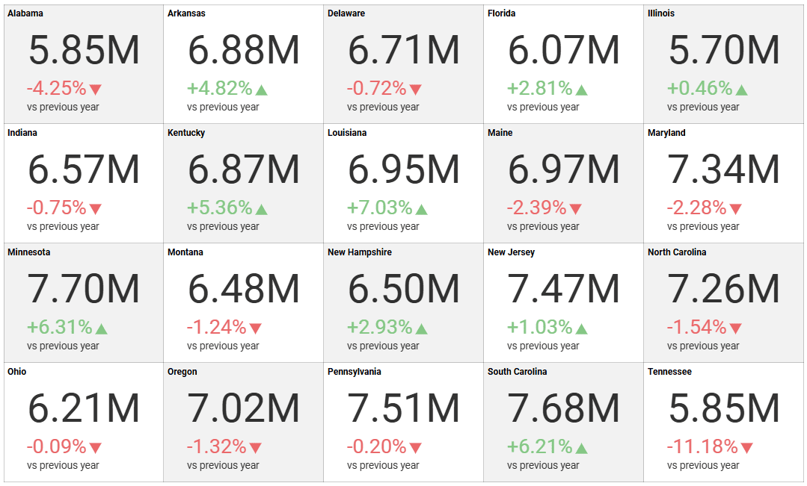

# KPI ゲージを作成

このチュートリアルでは、サンプル スプレッドシートを使用して KPI ゲージの表示形式を作成する方法を説明します。

| | |
|:---:|:---:|
|    [KPI ゲージ](#kpi-ゲージの作成) |    [複数の KPI ゲージ](#1-つの表示形式で複数の-kpi-ゲージを作成する方法) |
|    [月ごとの KPI ゲージ](#日付比較タイプの変更) |    [値とパーセンテージの違いがある KPI ゲージ](#kpi-ゲージの差分ラベルの変更) |
|    [値が減少したときに緑色のマーカーが付いた KPI ゲージ](#差分マーカーの色の変更) | |

## 重要なコンセプト

KPI ゲージは、特定の期間内のパフォーマンスとその変動を表示するためのものです。作成するには、次のものが必要です:

  - データエディターの **[日付]** プレースホルダーにドロップする **1 つのフィールド**。

  - **[値]** にドロップする **1 つのフィールド**。

## サンプル データ ソース

このチュートリアルでは、<a href="/data/Reveal_Visualization_Tutorials.xlsx" download>Reveal Visualization Tutorials</a> の「KPI View」シートを使用します。

## KPI ゲージの作成

1. オーバーフロー メニューで **[編集]** を選択します。

                                         

2. 右上隅にある **[+ 表示形式]** ボタンを選択します。

                                         

3. データ ソースのリストからデータ ソースを選択します。

                                             

4. **KPI View** シートを選択します。 

   

5. **表示形式ピッカー**を開き、**KPI vs Time** を選択します。デフォルトで、表示形式のタイプは**柱状**に設定されています。 

   

6. *Date* フィールドを [日付] に、*Sales* フィールドを [値] に、*State* フィールドを [カテゴリ] にドラッグアンドドロップします。

   

## 1 つの表示形式で複数の KPI ゲージを作成する方法

1 つの表示形式で複数の KPI を作成するには、データ エディターの**カテゴリ** プレースホルダーにフィールドを追加する必要があります。

1. オーバーフロー メニューで **[編集]** を選択します。

   

2. 右上隅にある **[+ 表示形式]** ボタンを選択します。

   

3. データ ソースのリストからデータ ソースを選択します。

   

4. **KPI View** シートを選択します。 
  
   
         
5. **表示形式ピッカー**を開き、**KPI vs Time** を選択します。デフォルトで、表示形式のタイプは**柱状**に設定されています。 

   

6.  *Date* フィールドを [日付] に、*Sales* フィールドを [値] に、*State* フィールドを [カテゴリ] にドラッグアンドドロップします。          
  

## 日付比較タイプの変更

デフォルトでは、KPI ゲージの日付タイプは前年比になります。[タイプ] フィールドを変更することでこれを変更できます。以下は変更手順です。

|                                  |                                                                        |                                                                                                                                                |
| -------------------------------- | ---------------------------------------------------------------------- | ---------------------------------------------------------------------------------------------------------------------------------------------- |
| 1\. **設定メニューにアクセスする** |  | 表示形式エディターの **[設定]** セクションに移動します。                                                                                    |
| 2\. **タイプを変更する**          |      | デフォルトでは、日付のタイプは **[今年と前年]** に設定されます。**[期間]** の横にあるドロップダウンを選択し、選択を **[今月と先月]** に変更します。 |

## KPI ゲージの差分ラベルの変更

|                                  |                                                                                            |                                                                                                                                                                         |
| -------------------------------- | ------------------------------------------------------------------------------------------ | ----------------------------------------------------------------------------------------------------------------------------------------------------------------------- |
| 1\. **設定メニューにアクセスする** |                      | 表示形式エディターの **[設定]** セクションに移動します。                                                                                                             |
| 2\. **タイプを変更する**          |  | デフォルトで、差分ラベルは**パーセンテージ**に設定されています。 **[差異の表示]** の横のドロップダウンを選択し、選択を **[値とパーセンテージ]** に変更します。 |

## 差分マーカーの色の変更

デフォルトでは、KPI ゲージのマーカーの色は、正の値の場合は緑、負の値の場合は赤に設定されます。ただし、減少をプラスとして表現したい場合もあります。以下は設定方法です。

|                                  |                                                                                                          |                                                                                                                                                             |
| -------------------------------- | -------------------------------------------------------------------------------------------------------- | ----------------------------------------------------------------------------------------------------------------------------------------------------------- |
| 1\. **設定メニューにアクセスする** |                                    | 表示形式エディターの **[設定]** セクションに移動します。                                                                                                 |
| 2\. **タイプを変更する**          |  | デフォルトでは、マーカーの色は緑に設定されます。**[値の増加を表す色]** の横のドロップダウンを選択し、選択を **[赤色]** に変更します。 |
