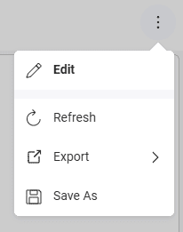
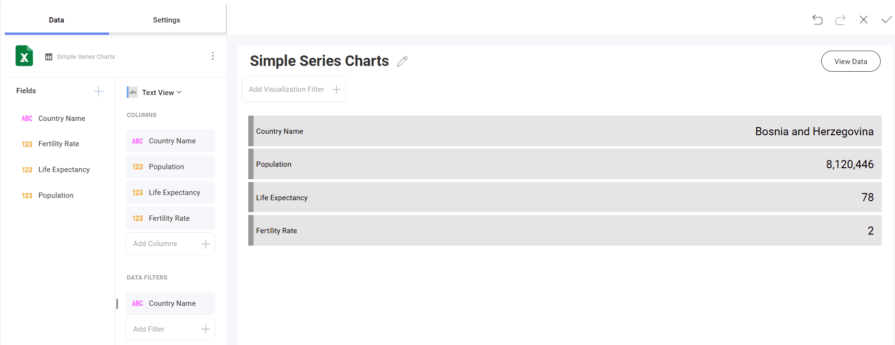

# テキスト ビューを作成する方法

このチュートリアルはサンプル スプレッドシートを使用し**テキスト ビュー**を作成する方法を説明します。

## 重要なコンセプト

テキストビューではキーと値のパターンで情報が表示されますが、**列のラベルとペアになっているデータの最初の行のみが表示されます**。ただし、フィルターを追加して、必要な行が Reveal 表示されるようにすることができます。

## サンプル データ ソース

このチュートリアルでは、<a href="/data/Reveal_Visualization_Tutorials.xlsx" download>Reveal Visualization Tutorials</a> の「Simple Series Charts」シートを使用します。

## テキスト ビューを作成する方法

 1. オーバーフロー メニューで **[編集]** を選択します。
   
   

2. 右上隅にある **[+ 表示形式]** ボタンを選択します。

                                         

3. データ ソースのリストからデータ ソースを選択します。

   

4. **Simple Series Charts** シートを選択します。
  
   

5. **表示形式ピッカー**を開き、**テキスト ビュー**を選択します。デフォルトで、表示形式のタイプは**柱状**に設定されています。  

   

6. たとえば、上記のテキスト ビューには、特定の国の人口、平均余命および出生率が表示されます。*Country Name*、*Population*、*Life Expectancy*、*Fertility Rate* を [列] にドラッグアンドドロップします。

      

   以下は結果です。
      

## 選択された行を変更する

デフォルトで、テキスト ビューはシートの最初の行を表示されます。これを変更するためにフィルターを適用できます。たとえば、テキスト ビューに行 9 (ボスニア・ヘルツェゴビナ) を表示させます。

1. *Country Name* フィールドを **[データ フィルター]** にドラッグ アンド ドロップします。
 
    

2. [フィルター タイプ] を選択してドロップダウン メニューを有効にし、**[値の選択]** を選択します。
 
     

3. デフォルトでは、すべての値が選択済です。**[すべて]** ボックスのチェックを外し、**Bosnia and Herzegovina** のみを選択します。次に、**[フィルターの作成]** を選択します。 

     

   更新されたデータが表示されます:

     
   