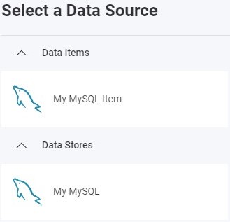

import Tabs from '@theme/Tabs';
import TabItem from '@theme/TabItem';

# MySQL データ ソースの追加

:::danger 重大な変更

現在、Reveal SDK は、Reveal SDK core パッケージからデータ ソースを分離する過程にあります。プロジェクトの継続的な機能を確保するために、プロジェクトに追加のパッケージをインストールすることが必要になる場合があります。詳細については、[サポートされるデータ ソース](web/datasources.md#サポートされるデータ-ソース) トピックを参照してください。

:::

## クライアント側

**手順 1** - `RevealView.onDataSourcesRequested` イベントのイベント ハンドラーを追加します。

```js
var revealView = new $.ig.RevealView("#revealView");
revealView.onDataSourcesRequested = (callback) => {
    //add code here
    callback(new $.ig.RevealDataSources([], [], false));
};
```

**手順 2** - `RevealView.onDataSourcesRequested` イベント ハンドラーで、`RVMySqlDataSource` オブジェクトの新しいインスタンスを作成します。`Host`、`Database`、`Port`、および `Title` プロパティを、MySQL サーバーに対応する値に設定します。`RVMySqlDataSource` オブジェクトを作成したら、それをデータ ソース コレクションに追加します。

```js
revealView.onDataSourcesRequested = (callback) => {
    var mySqlDataSource = new $.ig.RVMySqlDataSource();
    mySqlDataSource.host = "your-db-host";
    mySqlDataSource.database = "your-db-name";
    mySqlDataSource.port = 1234;
    mySqlDataSource.title = "My MySQL";

    callback(new $.ig.RevealDataSources([mySqlDataSource], [], false));
};
```

アプリケーションが実行されたら、新しい可視化を作成すると、新しく作成された MySQL データ ソースが [データ ソースの選択] ダイアログに表示されます。


**手順 3** - `RVMySqlDataSourceItem` オブジェクトの新しいインスタンスを作成して、新しいデータ ソース項目を追加します。データベース テーブルに対応する `Id`、`Title`、および `Table` プロパティを設定します。`RVMySqlDataSourceItem` オブジェクトを作成したら、それをデータ ソース項目コレクションに追加します。

```js
revealView.onDataSourcesRequested = (callback) => {
    var mySqlDataSource = new $.ig.RVMySqlDataSource();
    mySqlDataSource.host = "your-db-host";
    mySqlDataSource.database = "your-db-name";
    mySqlDataSource.port = 1234;
    mySqlDataSource.title = "My MySQL";

    var mySqlDsi = new $.ig.RVMySqlDataSourceItem(mySqlDataSource);
    mySqlDsi.id = "MyMySqlDataSourceItem";
    mySqlDsi.title = "My MySQL Item";
    mySqlDsi.table = "TableName";    

    callback(new $.ig.RevealDataSources([mySqlDataSource], [mySqlDsi], false));
};
```

アプリケーションが実行されたら、新しい可視化を作成すると、新しく作成された MySQL データ ソース項目が [データ ソースの選択] ダイアログに表示されます。



## サーバー側

**手順 1** - クライアントでデータ ソースとデータ ソース項目を作成しますが、接続情報は指定しません。`id`、`title`、および/または `subtitle` のみを入力してください。

```js
var revealView = new $.ig.RevealView("#revealView");
revealView.onDataSourcesRequested = (callback) => {

    var mySqlDataSource = new $.ig.RVMySqlDataSource();
    mySqlDataSource.id = "MyMySqlDataSource";
    mySqlDataSource.title = "My MySQL";

    var mySqlDataSourceItem = new $.ig.RVMySqlDataSourceItem(mySqlDataSource);
    mySqlDataSourceItem.id = "MyMySqlDataSourceItem";
    mySqlDataSourceItem.title = "My MySQL Item";

    callback(new $.ig.RevealDataSources([mySqlDataSource], [mySqlDataSourceItem], true));
};
```

**手順 2** - データ ソース プロバイダーを作成します。この例では、クライアントで定義された **MySQL** データベースに接続するための接続情報を提供しています。これを実現するために、使用しているデータ ソース/項目のタイプを決定し、オブジェクトで使用可能なプロパティを設定します。

<Tabs groupId="code" queryString>
  <TabItem value="aspnet" label="ASP.NET" default>

```cs
public class DataSourceProvider : IRVDataSourceProvider
{
    public Task<RVDataSourceItem> ChangeDataSourceItemAsync(IRVUserContext userContext, string dashboardId,
        RVDataSourceItem dataSourceItem)
    {
        if (dataSourceItem is RVMySqlDataSourceItem mySqlDataSourceItem)
        {
            //update underlying data source
            ChangeDataSourceAsync(userContext, mySqlDataSourceItem.DataSource);

            //only change the table if we have selected our custom data source item
            if (mySqlDataSourceItem.Id == "MyMySqlDataSourceItem")
            {
                mySqlDataSourceItem.Table = "orders";
            }
        }

        return Task.FromResult(dataSourceItem);
    }

    public Task<RVDashboardDataSource> ChangeDataSourceAsync(IRVUserContext userContext,
        RVDashboardDataSource dataSource)
    {
        if (dataSource is RVMySqlDataSource mySqlDataSource)
        {
            mySqlDataSource.Host = "localhost";
            mySqlDataSource.Database = "database";
        }

        return Task.FromResult(dataSource);
    }
}
```

  </TabItem>

  <TabItem value="java" label="Java">

```java
public class DataSourceProvider implements IRVDataSourceProvider {
    public RVDataSourceItem changeDataSourceItem(IRVUserContext userContext, String dashboardsID, RVDataSourceItem dataSourceItem) {

        if (dataSourceItem instanceof RVMySqlDataSourceItem mySqlDataSourceItem) {

            //update underlying data source
            changeDataSource(userContext, dataSourceItem.getDataSource());

            //only change the table if we have selected our custom data source item
            if (Objects.equals(dataSourceItem.getId(), "MyMySqlDataSourceItem")) {
                mySqlDataSourceItem.setTable("orders");
            }
        }
        return dataSourceItem;
    }

    public RVDashboardDataSource changeDataSource(IRVUserContext userContext, RVDashboardDataSource dataSource) {

        if (dataSource instanceof RVMySqlDataSource mySqlDataSource) {
            mySqlDataSource.setHost("localhost");
            mySqlDataSource.setDatabase("database");
        }
        return dataSource;
    }
}
```

  </TabItem>

  <TabItem value="node" label="Node.js">

```js
const dataSourceItemProvider = async (userContext, dataSourceItem) => {
    if (dataSourceItem instanceof reveal.RVMySqlDataSourceItem) {

        //update underlying data source
        dataSourceProvider(userContext, dataSourceItem.dataSource);

        //only change the table if we have selected our data source item
        if (dataSourceItem.id === "MyMySqlDataSourceItem") {
            dataSourceItem.table = "orders";
        }
    }
    return dataSourceItem;
}

const dataSourceProvider = async (userContext, dataSource) => {
    if (dataSource instanceof reveal.RVMySqlDataSource) {
        dataSource.host = "localhost";
        dataSource.database = "database";
    }
    return dataSource;
}
```

  </TabItem>

  <TabItem value="node-ts" label="Node.js - TS">    

```ts
const dataSourceItemProvider = async (userContext: IRVUserContext | null, dataSourceItem: RVDataSourceItem) => {
    if (dataSourceItem instanceof RVMySqlDataSourceItem) {

        //update underlying data source
        dataSourceProvider(userContext, dataSourceItem.dataSource);

        //only change the table if we have selected our data source item
        if (dataSourceItem.id === "MyMySqlDataSourceItem") {
            dataSourceItem.table = "orders";
        }
    }
    return dataSourceItem;
}

const dataSourceProvider = async (userContext: IRVUserContext | null, dataSource: RVDashboardDataSource) => {
    if (dataSource instanceof RVMySqlDataSource) {
        dataSource.host = "localhost";
        dataSource.database = "database";
    }
    return dataSource;
}
```

  </TabItem>

</Tabs>

:::info コードの取得

このサンプルのソース コードは [GitHub](https://github.com/RevealBi/sdk-samples-javascript/tree/main/DataSources/MySQL) にあります。

:::