# ダッシュボードの編集

ダッシュボードの編集は主にエンドユーザー機能ですが、開発者がさまざまな編集イベントに応答したり、UI 要素を表示/非表示にして編集エクスペリエンスを制御したり、編集を完全に無効にしたりするのに役立つ API が多数あります。

## プロパティ

### canAddCalculatedFields

このプロパティは、表示形式エディターの **[計算フィールド]** メニュー項目を表示/非表示にします。

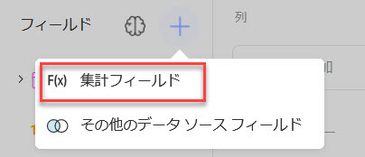

```js
revealView.canAddCalculatedFields = false;
```

### canAddDashboardFilter

このプロパティは、ダッシュボードの **[ダッシュボード フィルターの追加]** メニュー項目を表示/非表示にします。

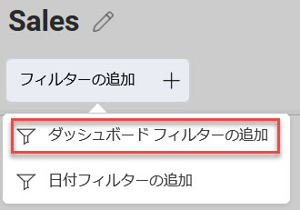

```js
revealView.canAddDashboardFilter = false;
```

### canAddDateFilter

このプロパティは、ダッシュボードの **[日付フィルターの追加]** メニュー項目を表示/非表示にします。

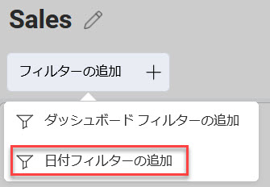

```js
revealView.canAddDateFilter = false;
```

### canAddPostCalculatedFields

このプロパティは、表示形式視覚化エディターのフィールド セクションの **F(x)** メニュー項目を表示/非表示にします。

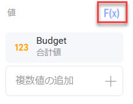

```js
revealView.canAddPostCalculatedFields = false;
```

### canAddVisualization

このプロパティは、編集モードのときにダッシュボードの **[+ 追加]** ボタンを表示/非表示にします。

```js
revealView.canAddVisualization = false;
```

### canChangeVisualizationBackgroundColor

このプロパティを使用すると、表示形式エディターの **[設定]** タブで表示形式の背景色を指定できます。

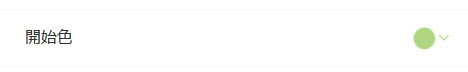

```js
revealView.canChangeVisualizationBackgroundColor = true;
```

このプロパティを使用する場合は、次の依存関係をクライアント アプリケーションにインストールする必要があります:

- Spectrum v 1.8.0 以降

``` html
<link href="https://cdnjs.cloudflare.com/ajax/libs/spectrum/1.8.0/spectrum.min.css" rel="stylesheet" type="text/css" >
<script src="https://cdnjs.cloudflare.com/ajax/libs/spectrum/1.8.0/spectrum.min.js"></script>
```

### canCopyVisualization

このプロパティは、表示形式の **[コピー]** メニュー項目を表示/非表示にします。


```js
revealView.canCopyVisualization = false;
```

### canDuplicateVisualization

このプロパティは、表示形式の **[複製]** メニュー項目を表示/非表示にします。


```js
revealView.canDuplicateVisualization = false;
```

### canEdit

このプロパティは、ダッシュボードの **[編集]** メニュー項目を表示/非表示にします。

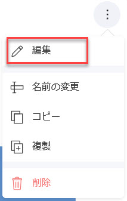

```js
revealView.canEdit = false;
```

`RevealView.canEdit` プロパティが `false` に設定されている場合、ダッシュボード編集は完全に無効になります。

### canMaximizeVisualization

このプロパティは、表示形式の**最大化**ボタンを表示/非表示にします。

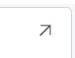

```js
revealView.canMaximizeVisualization = false;
```

### canSaveAs

このプロパティは、ダッシュボード メニューの **[名前を付けて保存]** ボタンを表示/非表示にします。


```js
revealView.canSaveAs = false;
```

### showChangeDataSource

このプロパティは、表示形式エディターの [データ] タブにある **[データ ソースの変更]** ボタンを表示/非表示にします。


```js
revealView.showChangeDataSource = false;
```

### showEditDataSource

このプロパティは、表示形式エディターでデータ ソースの **[編集]** メニュー項目を表示/非表示にします。


```js
revealView.showEditDataSource = false;
```

### showExportImage

このプロパティは、エクスポート メニューから **[画像]** 項目を表示/非表示にします。


```js
revealView.showExportImage = false;
```

### showExportToExcel

このプロパティは、エクスポート メニューから **[Excel]** 項目を表示/非表示にします。

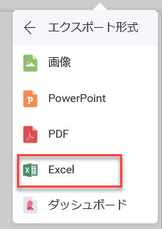

```js
revealView.showExportToExcel = false;
```

### showExportToPDF

このプロパティは、エクスポート メニューから **[PDF]** 項目を表示/非表示にします。

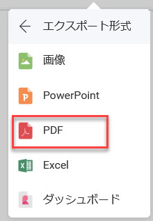

```js
revealView.showExportToPDF = false;
```

### showExportToPowerPoint

このプロパティは、エクスポート メニューから **[PowerPoint]** 項目を表示/非表示にします。


```js
revealView.showExportToPowerPoint = false;
```

### showFilters

このプロパティは、ダッシュボード フィルターを表示/非表示にします。

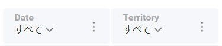

```js
revealView.showFilters = false;
```

### showHeader

このプロパティは、ダッシュボードのタイトルとダッシュボード メニューを含むダッシュボード ヘッダー全体を表示/非表示にします。

```js
revealView.showHeader = false;
```

### showMenu

このプロパティは、`RevealView` の右上隅に配置されているダッシュボード メニューを表示/非表示にします。

```js
revealView.showMenu = false;
```

### showRefresh

このプロパティは、ダッシュボード メニューの **[更新]** ボタンを表示/非表示にします。


```js
revealView.showRefresh = false;
```

### startInEditMode

`true` に設定すると、このプロパティは、ダッシュボードが最初に読み込まれたときに `RevealView` を「編集モード」にします。

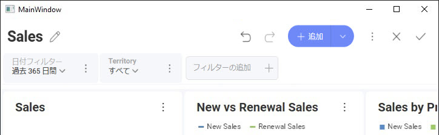

```js
revealView.startInEditMode = false;
```

### startWithNewVisualization

`true` に設定すると、このプロパティはすぐに [新しい表示形式] ダイアログを起動し、データ ソースを選択するように求めます。

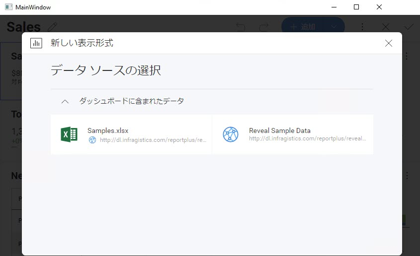

```js
revealView.startWithNewVisualization = false;
```

:::info

既存のダッシュボードを読み込んでいて、`RevealView.startInEditMode` プロパティを `true` に設定していない場合、このプロパティは機能しません。

:::

## Events

### onVisualizationEditorOpening

表示形式エディターが開く**前**にアプリケーション ロジックを実行したい場合や、条件が満たされるまでエディターが開かないようにしたい場合もあります。これを行うには、イベント ハンドラーを `RevealView.onVisualizationEditorOpening` イベントに追加します。

```js
revealView.onVisualizationEditorOpening = function (args) {
    if(args.isNewVisualization == false){ //the user is trying to edit an existing visualization
        args.cancel = true; //prevent it
    }
};
```

`VisualizationEditorOpeningArgs` には、次のプロパティが含まれています:
- **cancel** - イベントをキャンセルするかどうかを示す値を取得または設定します。イベントをキャンセルする必要がある場合は `true`。それ以外の場合は `false`。
- **isNewVisualization** - `true` の場合、表示形式は新しく追加された表示形式です。`false` の場合、それは既存の表示形式です。
- **visualization** - 編集および/または追加された表示形式

:::info

`VisualizationEditorOpeningArgs.cancel` を `true` に設定すると、表示形式視覚化エディターは開きません。

:::

### onVisualizationEditorOpened

表示形式エディターを開いた**後**、既存の表示形式を編集するとき、または新しい表示形式を作成するときに通知を受け取りたい場合は、`RevealView.onVisualizationEditorOpened` イベントにイベント ハンドラーを追加できます。

```js
revealView.onVisualizationEditorOpened = function (args) {
    if(args.isNewVisualization == false) { 
        //the user is editing an existing visualization
    }
};
```

`VisualizationEditorOpenedEventArgs` には、次のプロパティが含まれています:
- **isNewVisualization** - `true` の場合、表示形式は新しく追加された表示形式です。`false` の場合、それは既存の表示形式です。
- **visualization** - 編集および/または追加された表示形式

### onVisualizationEditorClosing

表示形式エディターが閉じる**前**にアプリケーション ロジックを実行したい場合や、条件が満たされるまでエディターが閉じないようにしたい場合もあります。これを行うには、`RevealView.onVisualizationEditorClosing` イベントにイベント ハンドラーを追加します。

```js
revealView.onVisualizationEditorClosing = function (args) {
    if(args.isNewVisualization == false) {  //the user is editing
         args.resetVisualization = true; //puts the widget to the state when it was when the user started editing it
    }
};
```

`VisualizationEditorClosingArgs` には、次のプロパティが含まれています:
- **cancel** - イベントをキャンセルするかどうかを示す値を取得または設定します。イベントをキャンセルする必要がある場合は `true`。それ以外の場合は `false`。
- **isNewVisualization** - `true` の場合、表示形式は新しく追加された表示形式です。`false` の場合、それは既存の表示形式です。
- **resetVisualization** - `true` の場合、表示形式を編集前の状態にリセットします。
- **visualization** - 編集および/または追加された表示形式

:::info

`VisualizationEditorClosingArgs.cancel` を `true` に設定すると、表示形式視覚化エディターは閉じません。

:::

### onVisualizationEditorClosed
エンドユーザーが `RevealView` で単一の表示形式を編集するときはいつでも、エディターが閉じられた**後**に `RevealView.onVisualizationEditorClosed` イベントが発生します。これは、既存の表示形式の編集、または新しい表示形式の追加に対応する場合があります。`RevealView.onVisualizationEditorClosed` イベントにイベント ハンドラーを追加することで、このイベントに応答できます。

```js
revealView.onVisualizationEditorClosed = function (args) {
    if(args.isNewVisualization == false) { 
    }
};
```

`VisualizationEditorClosedEventArgs` には、次のプロパティが含まれています:
- **isCancelled** - 表示形式エディターが **X ボタン** (`false`) または **Check ボタン** (`true`) のどちらで閉じられたかを決定します。
- **isNewVisualization** - `true` の場合、表示形式は新しく追加された表示形式です。`false` の場合、それは既存の表示形式視覚化です。
- **visualization** - 編集および/または追加された表示形式
