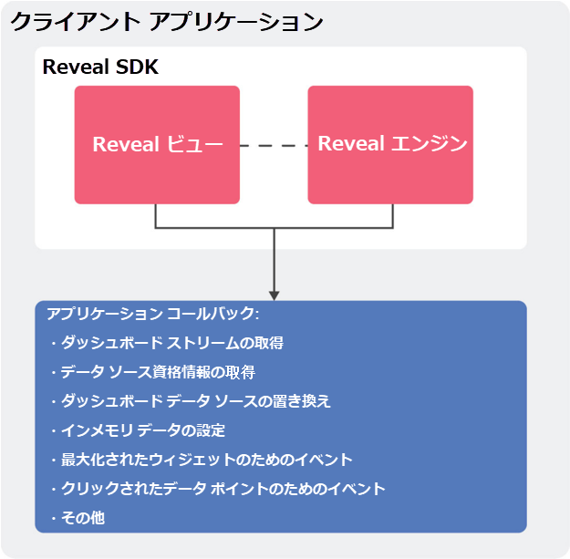

## Desktop SDK の使用

Reveal を別のアプリケーション (Windows WPF、Windows フォーム、iOS、または Android) に埋め込むと、Reveal SDK はアプリに統合されたライブラリまたはフレームワークとして提供されます (統合手順はプラットフォームごとに異なります)。

### RevealView コンポーネント

内包アプリは、レンダリングするダッシュボードで構成された RevealView オブジェクトを作成します。このビューは内包アプリに表示され、一連のコールバックを使用してダッシュボードのレンダリング方法と使用されるデータをカスタマイズできます。

RevealView コンポーネントはレンダリングおよびデータ変換機能を Reveal Engine を通じて自動的に提供しますが、ダッシュボードまたは資格情報の保管は処理しません。
ダッシュボードの定義を保持するバイナリ コンテンツ (.rdashファイル) は、内包アプリケーションによって提供される必要があります。これにより、コンテナ アプリケーションは、ダッシュボードの使用方法やエンドユーザーによる共有方法を処理できます (たとえば、ダッシュボードは内部サーバーからダウンロードしたり、アプリケーションのバイナリにリソースとしてまとめたり、ファイルシステムに保存したりできます)。

### 資格情報の詳細

データベース (または認証を必要とするその他のデータソース) からデータを取得する場合、通常、内包アプリは既にこれらの資格情報を構成ファイルからロードするか、安全な記憶域に保存することによって処理します。これは、Reveal がこれらの資格情報の保管と処理をコンテナに委任するためです。必要に応じて、アプリは内部の認証情報を返すか、ユーザーに入力を求めるかを決定します。
