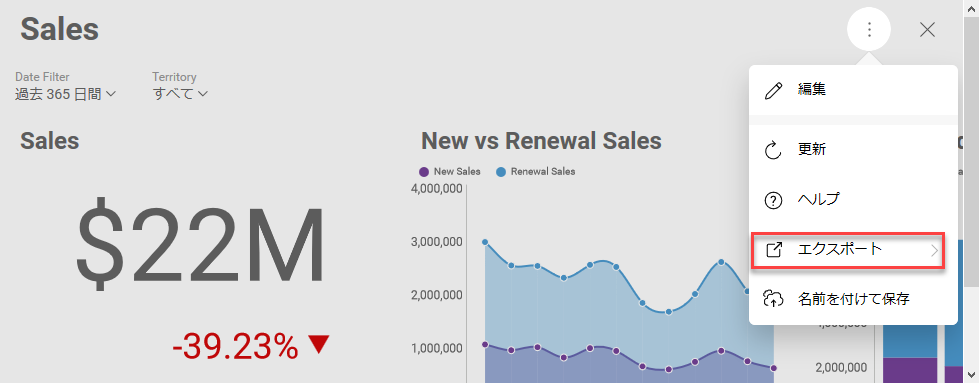

## ダッシュボードまたは可視化データをエクスポートする

### 概要

ダッシュボードまたは特定の可視化の画像を生成してそれをエクスポートする場合は、以下のオプションがあります。

- **画像**として;
- **PDF** として;
- **PowerPoint** プレゼンテーションとして;
- **Excel** データ形式として;

ダッシュボードまたは視覚化を有効するには、次のことができます。

  - [RevealView](＃enable-export-revealview) のエクスポート設定を使用するか、

  - **画像**としてエクスポートする場合は、コードによってエクスポートを開始します [RevealView 以外](#programmatically-initiated-export)。


### 前提条件

画像へのエクスポート機能を使用するには、 [CefSharp.Wpf NuGet package (\>= 57.0.0)](~/jp/developer/general/setup-configuration-desktop.md) への参照をプロジェクトに追加する必要があります。

<a name='enable-export-revealview'></a>

### エクスポート設定を有効にする

ユーザーがダッシュボードから画像、ドキュメント、プレゼンテーションを生成できるようにするためにはダッシュボードを読み込む際に関連するプロパティをtrueに設定してください。

- __RevealSettings.ShowExportImage__-**画像**としてエクスポートする場合;

- __RevealSettings.ShowExportToPDF](api-reference__ - **PDF** ドキュメントとしてエクスポートする場合;

- __RevealSettings.ShowExportToPowerpoint__ - **PowerPoint** プレゼンテーションとしてエクスポートする場合;

- __RevealSettings.ShowExportToExcel__ - **Excel** データ形式でエクスポートする場合;

これにより、ダッシュボードが開かれたとき、または特定の可視化が最大化されたときに、オーバーフロー メニューで [エクスポート] ボタンが使用可能になります。



ユーザーが [エクスポート] ボタンをクリックすると、利用可能なエクスポートオプションを選択できます。

#### 画像エクスポートオプションを使用する場合の詳細

ユーザーが [エクスポート] ボタンをクリックすると、[画像としてエクスポート] ダイアログが開きます。ユーザーは 2 つのオプションから選択することができます。[クリップボードへコピー] と [画像としてエクスポート]。

右下の [画像としてエクスポート] ボタンをクリックすると、RevealView は __ImageExported__ イベントを発生します。 __ImageExportedEventArgs__ の __ImageProperty__ で画像にアクセスするには、イベント ハンドラーを通してこのイベントにすでにサブスクライブしている必要があります。

以下は ImageExported イベント ハンドラーのサンプル実装です。

``` csharp
private void RevealView_ImageExported(object sender, ImageExportedEventArgs e)
{
  var image = e.Image;
  if (image == null) return;
  // save to disk just to open it with some app
  var imageFile = Path.GetTempFileName() + ".png";
  using (var fileStream = new FileStream(imageFile, FileMode.Create))

  {
    BitmapEncoder encoder = new PngBitmapEncoder();
    encoder.Frames.Add(BitmapFrame.Create(image));
    encoder.Save(fileStream);
  }

  System.Diagnostics.Process.Start(imageFile);
}
```

ImageExported イベント引数の他のプロパティは、__CloseExportDialog__ です。デフォルト値は true です。false に設定した場合、イベント ハンドラーの呼び出しが終了した後に Export Image ダイアログは閉じられません。

エンドユーザーに保存ダイアログを表示してイメージの保存場所を選択できるようなシナリオでは、CloseExportDialog を false に設定すると便利な場合があります。ユーザーが場所とファイル名を選択せず​​に保存ダイアログを閉じた場合は、ExportImage ダイアログを開いたままにしておくことをお勧めします。

<a name='programmatically-initiated-export'></a>

### コードによって開始されたエクスポート

コードで RevealView の画像を取得するには、link:rvui.wpf~infragistics.sdk.revealview~toimage __ToImage__ メソッドを呼び出す必要があります。このメソッドを呼び出しても [画像としてエクスポート] ダイアログは表示されません。これにより、ユーザーが RevealView の外側にあるボタンをクリックしたときにスクリーンショットを取得できます。このメソッドは、RevealView コンポーネントが画面に表示されていると同じスクリーンショットを作成します。

ToImage メソッドの呼び出し時にユーザーがダイアログを開いている場合、ダッシュボードと一緒にそのダイアログのスクリーンショットが取得されます。

